# 01_PROBLEM_AND_SCOPE_DEFINITION

**TASK_ID:** `KNOWLEDGE_FOUNDRY_ARCHITECTURE_V1`  
**System:** MAWORLD KNOWLEDGE FOUNDRY  
**Language:** Russian; identifiers, APIs and schemas remain in English.  
**Verdict preview:** `NARROW AND BUILD`.

## 1.1 Problem

MAWorld needs a single-owner workspace that can begin with a very small, incomplete corpus and continuously convert chaotic incoming material into traceable, reviewable and implementable knowledge. The workspace must preserve raw artifacts, distinguish source statements from instructions, extract atomic claims, link evidence, surface contradictions, require explicit canonicalization and maintain a graph from decision to code, test and runtime evidence.

The core problem is not retrieval alone. It is **controlled state transition**:

`untrusted raw input → identified evidence candidate → reviewed claim → canonical decision → implementation obligation → verified behavior`.

The system must never infer that a document is authoritative because of its filename, location, apparent recency, vector similarity, authoring model or the word `MASTER`.

## 1.2 Scope

In scope:

- immutable artifact intake and recovery;
- source identity, byte identity, logical-document identity and version lineage;
- parsing and extraction in a quarantine boundary;
- provenance and source manifests;
- exact, near-duplicate, derivative and version linking;
- atomic claim extraction;
- evidence support/refutation links;
- contradiction, drift and implementation-mismatch records;
- human-in-the-loop canonical decisions;
- ADR, schema, backlog, commit, test, deployment and runtime mapping;
- research-run lifecycle and independent-run synthesis;
- exact, full-text, semantic, graph and time-aware retrieval;
- project and data-class isolation;
- incremental and resumable migration;
- one-owner operational UI.

Out of scope:

- a full MAWorld multi-agent runtime;
- LifeOS private memory;
- Trading Cell design;
- model/personality architecture;
- autonomous promotion of model beliefs;
- a monolithic enterprise data catalog as MVP;
- complete historical migration before value delivery;
- replacing Git, Google Drive or authoring tools;
- using vector search as authoritative state.

## 1.3 Required system questions

The architecture is accepted only if it can answer, from structured records rather than model improvisation:

1. What artifacts exist and can their original bytes be recovered?
2. What source and observed version produced each derived object?
3. Which logical document and version chain does an artifact belong to?
4. Which claims are proposed, supported, verified, disputed, contradicted, stale, superseded or unknown?
5. Which evidence supports or refutes a claim, with what independence, freshness and limitations?
6. Which canonical event accepted or rejected a proposition?
7. Which ADR, schema, repository path, ticket, commit, test and deployment implement the decision?
8. Which accepted decisions are not implemented?
9. Which implementation exists without approved intent?
10. What changed between canonical snapshots?
11. What should the owner review next?
12. Which objects are too sensitive to route to a given provider?

## 1.4 Success constraints

- Day-one operation with five to ten files.
- No pre-sorting requirement.
- Raw bytes are written once and never silently overwritten.
- All transformations are idempotent and resumable.
- Derived indexes are rebuildable.
- Model output remains non-authoritative until reviewed.
- Canonicalization is an immutable event, not a mutable flag only.
- The MVP is operable by one owner.
- The architecture has explicit exit paths from every adopted component.

## 1.5 Major architecture decisions

| ID | Decision |
|---|---|
| D-01 | PostgreSQL is authoritative structured state; object storage holds immutable raw bytes; Git holds code, ADRs, schemas and policies. |
| D-02 | Raw artifacts use content-addressed storage and production WORM/version protection. |
| D-03 | MVP retrieval uses PostgreSQL full-text plus derived `pgvector`; no Qdrant, OpenSearch or graph database initially. |
| D-04 | MVP jobs use a PostgreSQL-backed idempotent queue; Temporal is a measured migration, not a day-one dependency. |
| D-05 | All rich-document extraction runs sandboxed; Docling is the primary parser, format-native fallbacks are allowed. |
| D-06 | Identity separates raw bytes, source occurrence, logical document and version graph. |
| D-07 | Claims are atomic; LLM extraction creates proposals only. |
| D-08 | Canonicalization is an explicit ContinuityOS-mediated signed decision event. |
| D-09 | Trust is claim-specific and multi-dimensional, never one global source score. |
| D-10 | MVP connectors are Manual Drop, Local Folder and Git; Google Drive is next. |
| D-11 | A small web workbench is mandatory; Telegram is notification/low-risk approval only. |
| D-12 | LifeOS may consume approved objects but cannot write project canon. |
| D-13 | Enterprise catalogs and data-lake versioning tools are deferred until measured scale or multi-owner need. |

The complete decision cards with evidence, assumptions, alternatives, risks, confidence, acceptance tests and revisit triggers are in section 24.


# 02_PRINCIPLES_AND_BOUNDARIES

## 2.1 Non-negotiable invariants

1. **Raw artifacts are immutable.** A changed source creates a new observed version.
2. **Source text is data, never instruction authority.** Embedded prompts are stored and may be classified as hostile content.
3. **Summaries and embeddings are derived objects.** They can be deleted and rebuilt without loss of authoritative state.
4. **Every derivation has parents.** Parser, model, prompt and policy versions are recorded.
5. **Duplicates are linked.** They are never silently deleted.
6. **Conflicts are first-class records.** They are never silently merged.
7. **Timestamps are evidence, not proof of version order.**
8. **Code proves current behavior only within observed scope.** It does not erase documented intent.
9. **Canonicalization requires explicit permission and an immutable decision event.**
10. **Canonical objects may be superseded but not rewritten in place.**
11. **Sensitive data is classified before external model/provider routing.**
12. **Every implementation assertion should point to a test, deployment observation or runtime trace.**

These principles align with content-addressed systems such as Git, where identifiers derive from content [S10], object-version retention controls such as S3 Versioning/Object Lock [S08][S09], and provenance guidance emphasizing traceability of how artifacts were produced [S20][S21].

## 2.2 Ownership boundaries

| System | Owns | Does not own |
|---|---|---|
| **Knowledge Foundry** | artifact intake, metadata, provenance, claims, evidence links, contradictions, canonical decision records, research runs, source manifests, architecture impact, implementation mapping, open questions | private agent memory, side-effect authority, source code truth |
| **LifeOS Memory** | private/relational/skill/lifecycle/project-participation memory | project canon, canonical promotion |
| **ContinuityOS** | authority, access policy, approval, mutation mediation, canonicalization permission, mutation audit | parsing, retrieval ranking, source code |
| **Workflow Runtime** | ingestion/extraction/review jobs, retries, timers, branch/fork execution | canonical decision authority |
| **Evidence Engine** | verification status, acceptance criteria, reproducible tests, evidence quality | raw artifact ownership, approval |
| **Git repositories** | code, versioned schemas, ADR files, tests, deployment definitions | external source evidence and human review state |
| **Object storage** | immutable bytes and manifests | business semantics |
| **PostgreSQL** | authoritative metadata and relationship state | raw byte storage and code history |
| **Vector index** | derived semantic candidates | canonical truth |

## 2.3 System Context

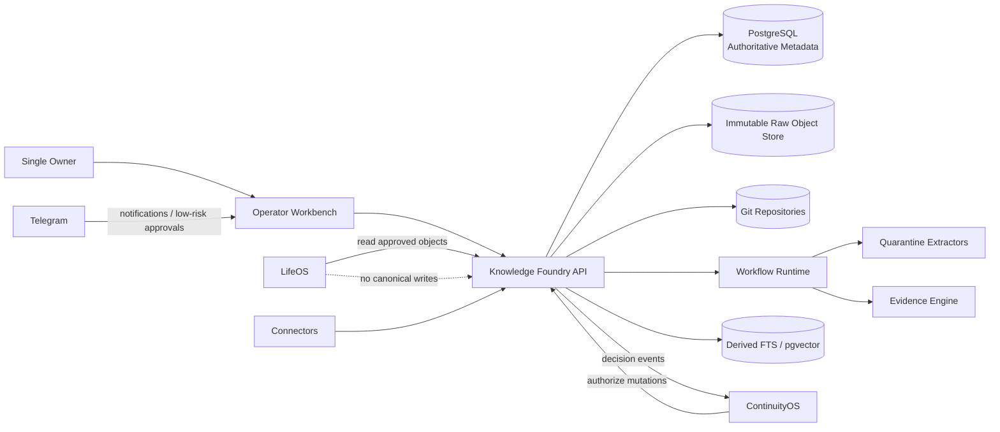

## 2.4 Mutation authority

Every state-changing operation carries `policy_context`:

- actor identity;
- project scope;
- requested capability;
- risk tier;
- data class;
- prior object versions;
- policy version;
- approval token;
- expiration;
- decision reason.

Knowledge Foundry validates structure. ContinuityOS grants or denies authority. The workflow runtime executes only the authorized mutation. A model can propose an action but cannot mint the approval token.


# 03_REFERENCE_ARCHITECTURE

## 3.1 Logical components

### Intake Gateway

Receives uploads and connector events, validates declared size/type, creates `IngestionRun`, writes raw bytes to a temporary quarantine location, computes hashes and registers idempotency keys.

### Quarantine Service

Performs file signature validation, archive expansion limits, malware/secret scans and sandboxed extraction. It has no default network access and no canonicalization credentials.

### Raw Artifact Store

Stores byte-identical originals under a content-addressed key:

`raw/sha256/<first2>/<next2>/<full_sha256>`

A source occurrence references the immutable object. Production storage uses object versioning and WORM retention where available. S3 Object Lock is explicitly version-scoped and requires bucket versioning [S08][S09].

### Metadata and Provenance Store

PostgreSQL contains authoritative entities, relationships, review tasks, decisions, policies and append-only event records. PostgreSQL provides transactional joins, JSONB, full-text search and row-level security primitives; `pgvector` can colocate derived embeddings with relational metadata [S01][S02][S03].

### Extraction Workers

Run parser-specific jobs in isolated containers. Docling supports PDF, DOCX, PPTX, XLSX, HTML, images and other formats with a unified document representation [S15]. Apache Tika and Unstructured remain fallback adapters, not authority [S16][S17].

### Claim and Conflict Services

Create proposed atomic claims, candidate evidence links, duplicate/version candidates and contradiction candidates. Deterministic rules run before model-assisted classification.

### Canonicalization Service

Builds a decision package, requests ContinuityOS authorization, appends a signed immutable `CanonicalDecision` event and emits downstream deltas.

### Implementation Mapper

Connects decisions to ADRs, schemas, services, repository paths, tickets, commits, tests, deployments and runtime evidence.

### Search API

Combines exact IDs, metadata filters, PostgreSQL full-text, graph traversal and optional pgvector candidate retrieval. It always exposes filters for canonical/superseded state, source quality, project and data class.

### Operator Workbench

A focused UI for inbox, review, contradiction resolution, canonical decisions, open questions, implementation coverage and stale knowledge.

## 3.2 Incremental Intake Pipeline

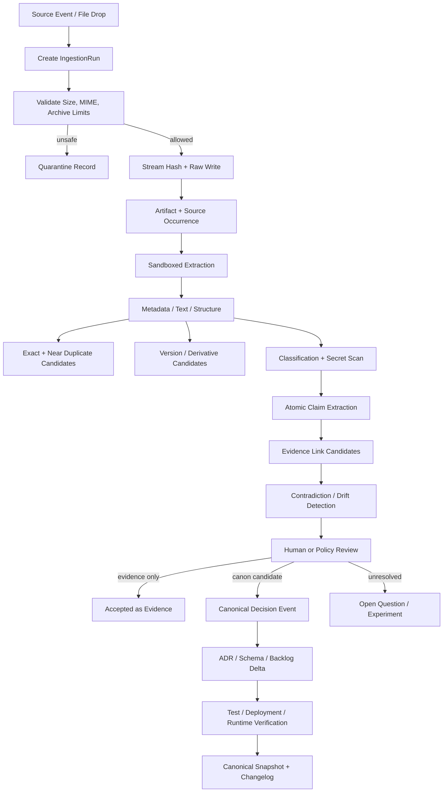

## 3.3 Deployment topology for MVP

- one API process;
- one worker process;
- one PostgreSQL instance;
- one raw object-store endpoint or local content-addressed storage in development;
- one server-rendered web UI;
- Git repositories as external versioned implementation stores;
- optional local embedding model or approved provider route.

No Kafka, Kubernetes, graph database, OpenSearch cluster or standalone vector database is required.

## 3.4 MVP Deployment

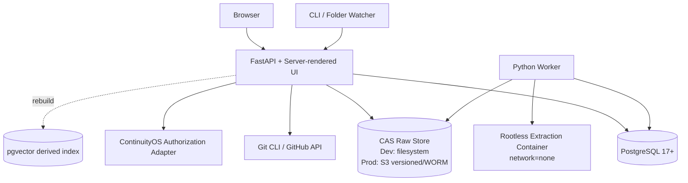

## 3.5 Event and state model

The architecture separates:

- **facts of observation**: append-only source occurrence, hashes, parser output;
- **current projections**: latest version pointers, active review queue, current canonical set;
- **decisions**: immutable approval/rejection/supersession events;
- **derived indexes**: FTS vectors, embeddings, similarity candidates;
- **implementation evidence**: Git and runtime-linked records.

Current views may be rebuilt from immutable events plus source records. This avoids silent history rewriting while retaining efficient reads.


# 04_ARTIFACT_IDENTITY_AND_VERSIONING

## 4.1 Identity layers

The system must not overload one identifier with incompatible meanings.

| Identifier | Meaning | Mutability |
|---|---|---|
| `source_system_id` | Connector/account/repository namespace | stable configuration record |
| `source_native_id` | Native object ID in source system | source-defined |
| `artifact_id` | Immutable raw byte object registered by the Foundry | immutable |
| `content_hash` | Mandatory SHA-256 of exact raw bytes | immutable |
| `logical_document_id` | Stable conceptual document across versions/formats/locations | link may be reviewed |
| `version_id` | One observed source version/occurrence | immutable |
| `parent_version_id` | Directed predecessor in a version chain | append-only correction via new relation event |
| `duplicate_cluster_id` | Group of exact or near-duplicate versions | membership is reviewable |
| `supersession_status` | `ACTIVE`, `SUPERSEDED`, `WITHDRAWN`, `UNKNOWN` | event-derived projection |

Recommended additional fingerprints:

- `byte_length`;
- `mime_detected`;
- `canonical_text_hash`;
- `structure_hash`;
- `simhash64`;
- `minhash_signature`;
- image perceptual hash for rendered pages/diagrams;
- Git blob SHA and commit SHA when applicable.

SHA-256 is the cross-system mandatory hash. A faster local hash may be cached, but never replaces SHA-256 for durable identity.

## 4.2 Data model

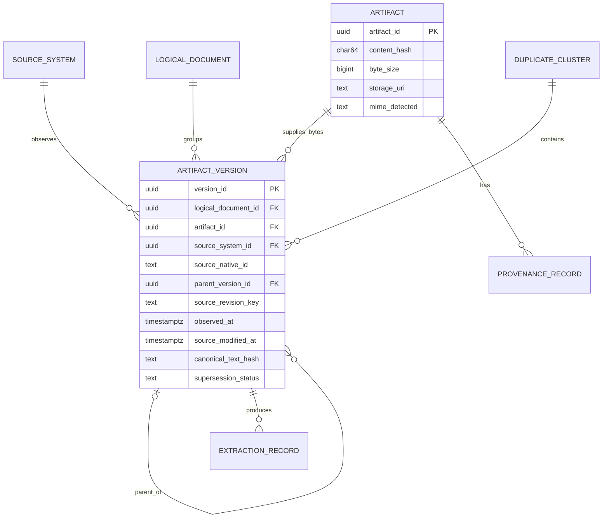

## 4.3 Relation rules

### Exact duplicate

Two observations are exact duplicates when:

- exact raw `content_hash` matches;
- byte length matches;
- hash verification succeeds after storage retrieval.

Action: one `Artifact`, multiple `ArtifactVersion`/source occurrences; link to an exact duplicate cluster. Never delete the source occurrence.

### Near duplicate

Candidate when at least two independent signals agree:

- normalized text similarity above a calibrated threshold;
- structure fingerprint similarity;
- page/render perceptual similarity;
- high overlap of stable identifiers, headings or paragraph anchors;
- embeddings may retrieve candidates but cannot decide.

Action: create `DuplicateCandidate`; require review when merge affects version lineage or canon.

### Version

Strong evidence:

- same `source_system_id + source_native_id` with a different source revision;
- Git parent/commit lineage;
- explicit source revision ID;
- embedded stable document ID;
- human-confirmed continuation.

Weak evidence requiring review:

- same title and author;
- similar content with plausible sequential edits;
- timestamps alone;
- filename suffixes such as `v2`, `final`, `new`.

A version relation means the newer object is intended to replace or evolve the same logical document. It does not automatically supersede every claim inside it.

### Derivative

A derivative transforms one or more parents:

- summary;
- translation;
- extracted attachment;
- normalized Markdown;
- merged report;
- generated presentation;
- model synthesis.

It gets a new `artifact_id`, explicit `derivation_type`, `parent_artifact_ids`, parser/model/prompt versions and a provenance record.

### Citation

A citation is an assertion that one object references another source. It is not evidence that the reference is real. Resolution status is tracked:

`RESOLVED`, `PARTIAL`, `MISSING`, `MISMATCHED`, `FABRICATED_CANDIDATE`.

### Contradiction

A contradiction is claim-level, scoped by subject, predicate, time and conditions. Document-level contradiction is only a roll-up.

### Unrelated

No identity, derivative, citation, version, duplicate or contradiction edge is established. Semantic similarity alone does not create a durable relation.

## 4.4 Edge cases

| Case | Handling |
|---|---|
| Renamed file | same source-native identity if available; otherwise content hash plus filesystem file ID/inode candidate |
| Copied file | new source occurrence; same raw artifact when bytes match |
| Metadata-only change | new observed source event; no new raw artifact if bytes unchanged |
| Same content in DOCX and Markdown | different raw artifacts; candidate same logical document/derivative using normalized text and structure |
| New upload of old report | source-created/modified timestamps preserved, `observed_at` new; content lineage remains old |
| Minor edit | new version, text-diff summary, claim delta |
| Partial export | mark `completeness=PARTIAL`; do not infer deletion of absent objects |
| Generated summary | derivative, never replacement |
| Extracted attachment | child artifact with byte-level parent relation |
| Merged document | multi-parent derivative; claims retain source-level provenance |
| Repository commit | commit is source version; each tracked blob may also become an artifact version |
| Deleted source | tombstone source occurrence; raw retained according to policy |

## 4.5 Version ordering

Use a partial order, not one timestamp:

1. explicit native revision parent;
2. Git DAG parent;
3. source sequence number;
4. content-embedded version marker corroborated by source;
5. observed order;
6. timestamp only as weak evidence.

When ordering is ambiguous, preserve parallel branches and create a review task. Git demonstrates why content identity and parent relationships are more reliable than filenames alone [S10][S32].


# 05_PROVENANCE_AND_TRUST

## 5.1 Provenance ledger

Every object has a common provenance envelope:

```json
{
  "object_id": "uuid",
  "schema_version": "1.0.0",
  "source_references": [
    {"source_system_id": "uuid", "source_native_id": "string", "version_id": "uuid"}
  ],
  "content_hash": "sha256:...",
  "created_at": "RFC3339",
  "created_by": {"type": "human|service|model", "id": "string"},
  "project_scope": ["maworld", "continuityos"],
  "data_class": "INTERNAL",
  "status": "PROPOSED",
  "provenance": {
    "ingestion_method": "local_folder_v1",
    "original_uri": "file:///...",
    "observed_at": "RFC3339",
    "source_created_at": "RFC3339|null",
    "source_modified_at": "RFC3339|null",
    "parser": {"name": "docling", "version": "pinned"},
    "extraction_pipeline_version": "kf-extract-1",
    "model": {"provider": "local|approved", "name": "...", "version": "..."},
    "prompt_version": "claim-extract-3",
    "parent_object_ids": ["uuid"],
    "human_reviewer": "owner|null"
  },
  "policy_context": {
    "policy_version": "continuityos-policy-sha",
    "decision_token": "opaque|null",
    "allowed_capability": "claim.propose"
  }
}
```

The event ledger is append-only and hash-chained:

`event_hash = SHA256(previous_event_hash || canonical_json(event_payload))`.

High-risk canonical decisions additionally carry an Ed25519 signature. Hash chaining supplies tamper evidence; it does not replace backups or access control.

SLSA defines provenance as verifiable information about where, when and how an artifact was produced [S21]. NIST emphasizes provenance, transparency and lifecycle risk management [S20].

## 5.2 Trust classes

Base classes:

- `PRIMARY_OFFICIAL`
- `PRIMARY_CODE`
- `PRIMARY_RUNTIME_EVIDENCE`
- `USER_AUTHORED`
- `INDEPENDENT_RESEARCH`
- `VENDOR_CLAIM`
- `SECONDARY_SOURCE`
- `MODEL_INFERENCE`
- `UNVERIFIED_IMPORT`
- `MALICIOUS_OR_QUARANTINED`

A class is not a global truth score. The same source may be primary for one claim and weak for another. Example:

- a vendor API reference is strong for the documented contract;
- runtime observation is stronger for actual behavior;
- vendor marketing is weak for performance claims;
- code is strong for the checked commit's implemented path but weak for intended product policy.

## 5.3 Claim-specific trust assessment

`TrustAssessment` is keyed by `(claim_id, evidence_artifact_id, domain)` and records:

| Dimension | Range | Meaning |
|---|---:|---|
| `directness` | 0–1 | direct observation vs interpretation |
| `provenance_integrity` | 0–1 | recoverable source, hash, chain |
| `independence` | 0–1 | independence from other evidence |
| `freshness` | 0–1 | valid for claim time window |
| `reproducibility` | 0–1 | repeatable test or query |
| `specificity` | 0–1 | evidence addresses exact scoped claim |
| `source_competence` | 0–1 | source authority for this domain |
| `tamper_risk` | 0–1 | likelihood of manipulation |
| `limitations` | text | known caveats |

No weighted score alone can promote a claim. The score is a review aid and ranking feature.

## 5.4 Authority precedence by claim type

| Claim type | Preferred evidence order |
|---|---|
| Current code behavior | runtime evidence → test tied to commit → code path → docs |
| Intended architecture | signed canonical decision → ADR → approved schema → backlog |
| External API capability | official API docs + reproducible probe → vendor docs → independent report |
| Pricing/limits | current official pricing/limits page with retrieval time → contract/invoice → secondary source |
| Benchmark result | reproducible run manifest + dataset hash + code commit → independent published result |
| Historical intent | contemporaneous user-authored decision/ADR → later summary |
| Security control | configuration/runtime evidence + test → policy/ADR → documentation |

## 5.5 Source deletion and correction

Source deletion creates a tombstone. It does not remove raw evidence unless retention/deletion policy requires it. Legal or privacy deletion is represented as a controlled redaction/deletion event with:

- requester;
- authority;
- affected objects;
- previous hashes;
- deletion mode;
- cryptographic erasure/key action;
- downstream invalidation tasks.

Derived claims from deleted evidence are marked `SOURCE_UNAVAILABLE` and re-reviewed.


# 06_CLAIM_EVIDENCE_MODEL

## 6.1 Atomic claim

A document is never accepted as one indivisible truth unit. A claim must be scoped enough to be independently supported or refuted.

```json
{
  "claim_id": "uuid",
  "normalized_assertion": "ContinuityOS mediates canonicalization permissions.",
  "exact_source_excerpt": "…",
  "source_locator": {
    "artifact_version_id": "uuid",
    "page": 12,
    "section": "0x05",
    "char_start": 1042,
    "char_end": 1114
  },
  "scope": {
    "project": "MAWorld",
    "component": "ContinuityOS",
    "environment": "target-architecture",
    "valid_from": null,
    "valid_to": null,
    "conditions": []
  },
  "subject": "ContinuityOS",
  "predicate": "owns_authority_for",
  "object": "canonicalization_permission",
  "author": "source-author-id",
  "extractor_confidence": 0.91,
  "status": "PROPOSED"
}
```

Required statuses:

`PROPOSED`, `SUPPORTED`, `VERIFIED`, `DISPUTED`, `CONTRADICTED`, `STALE`, `SUPERSEDED`, `UNVERIFIABLE`, `REJECTED`.

## 6.2 Evidence link

```json
{
  "evidence_link_id": "uuid",
  "claim_id": "uuid",
  "evidence_artifact_id": "uuid",
  "support_type": "SUPPORTS|REFUTES|CONTEXTUALIZES|IMPLEMENTS|VERIFIES",
  "independence": "INDEPENDENT|DERIVED|SAME_ORIGIN|UNKNOWN",
  "freshness": 0.82,
  "quality": 0.90,
  "limitations": "Observed only on commit abc123 and Linux.",
  "source_locator": {"path": "src/policy/canonicalize.py", "lines": "40-88"},
  "created_by": "evidence-linker-v2",
  "status": "PROPOSED"
}
```

## 6.3 Separation of object types

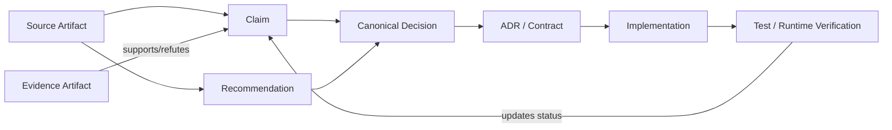

- **Claim:** descriptive assertion.
- **Evidence:** observation or source material relevant to the claim.
- **Recommendation:** proposed action.
- **Decision:** authorized commitment.
- **Implementation:** concrete code/config/ticket/deployment.
- **Verification:** test or runtime proof.

## 6.4 Extraction pipeline

1. Deterministic segmentation with stable locators.
2. Claim candidate extraction.
3. Normalization without deleting the exact excerpt.
4. Entity/concept linking to glossary IDs.
5. Claim type and temporal scope classification.
6. Citation resolution.
7. Evidence candidate search.
8. Duplicate claim clustering.
9. Contradiction candidate generation.
10. Human review for material claims.

Model output is always `PROPOSED`. The model receives document text in a data-delimited field and no side-effect tools. OWASP identifies indirect prompt injection through external files and websites; therefore document text must be isolated from active instructions [S19].

## 6.5 Claim review rules

A claim may become:

- `SUPPORTED`: at least one accepted evidence link supports it;
- `VERIFIED`: reproducible evidence or direct primary observation passes acceptance criteria;
- `DISPUTED`: credible support and refutation coexist;
- `CONTRADICTED`: accepted refuting evidence defeats the scoped assertion;
- `STALE`: validity window or monitored source indicates likely expiration;
- `UNVERIFIABLE`: evidence cannot be recovered or tested;
- `SUPERSEDED`: a newer canonical claim explicitly replaces it;
- `REJECTED`: owner/policy rejects it with reason.

Status transitions are events; current status is a projection.


# 07_CONTRADICTION_MANAGEMENT

## 7.1 Conflict object types

- `ContradictionRecord`: factual or scoped claim conflict.
- `DecisionConflict`: two approved/proposed decisions cannot coexist.
- `SchemaConflict`: incompatible field, type, ownership or contract definitions.
- `ImplementationMismatch`: code/runtime differs from canon or documented intent.
- `OpenQuestion`: unresolved knowledge gap.
- `RequiredExperiment`: executable verification plan.

Every conflict contains:

- affected claim IDs;
- affected decision IDs;
- conflict type;
- scope and validity interval;
- severity;
- owner;
- detection method;
- resolution state;
- proposed tests;
- final resolution;
- superseded objects;
- downstream impact.

## 7.2 Detection layers

### Layer A — deterministic checks

- same subject/predicate/scope with incompatible normalized objects;
- numeric value mismatch with units normalized;
- enum/ownership uniqueness violations;
- schema field/type differences;
- current canonical decision with two active successors;
- repository path missing;
- ticket/commit/test link target missing;
- official-source freshness SLA exceeded;
- code symbols referenced in docs no longer exist;
- deployed configuration hash differs from approved policy hash.

### Layer B — lexical and structural candidates

- entity aliases and renamed concepts;
- paragraph/claim diff across versions;
- schema AST comparison;
- API/OpenAPI semantic diff;
- Git diff and symbol graph.

### Layer C — model-assisted classification

The model classifies only candidate pairs and returns:

- conflict type;
- exact incompatible spans;
- scope alignment;
- potential reconciliation;
- required evidence.

The model cannot close the conflict.

## 7.3 Contradiction Resolution

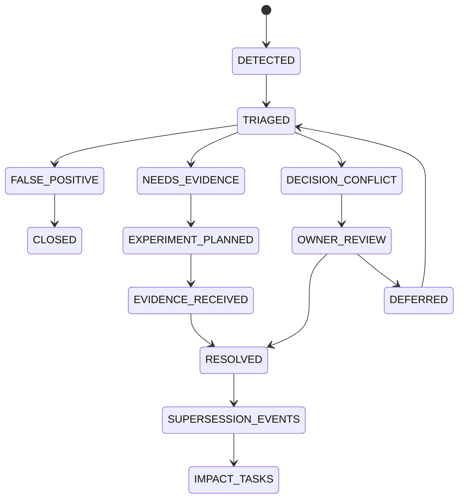

## 7.4 Severity

| Severity | Definition | SLA |
|---|---|---|
| `CRITICAL` | security, secret handling, trading-risk, production side effect or canonical authority conflict | block promotion/deployment |
| `HIGH` | architecture/API/schema conflict with implementation impact | review before next merge |
| `MEDIUM` | research or roadmap conflict | review within 7 days |
| `LOW` | terminology or non-blocking duplication | batch review |

## 7.5 Code/document mismatch

Two separate claims are preserved:

- `documented_intent`: what the system was intended to do;
- `implemented_behavior`: what the checked commit/runtime does.

The mismatch record points to both. Resolution may update code, update canon, mark docs stale or explicitly accept divergence. Code outranks documentation only for the scoped question “what this code currently does.”


# 08_CANONICALIZATION

## 8.1 State machine

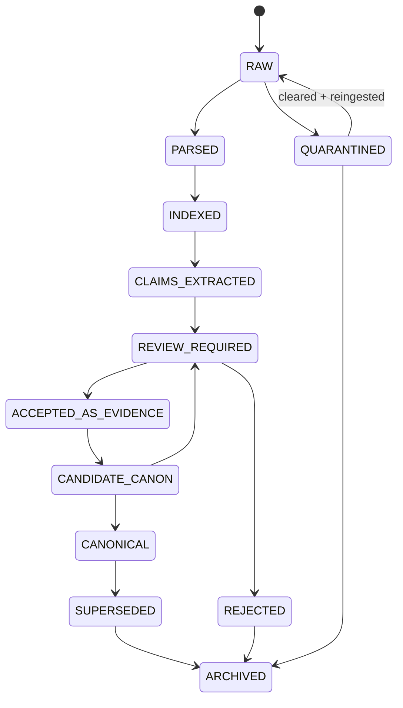

`INDEXED` never implies trusted. `ACCEPTED_AS_EVIDENCE` never implies canonical. `CANONICAL` is created only by a `CanonicalDecision` event.

## 8.2 Canonicalizable object types

- glossary term;
- system invariant;
- architecture decision;
- schema;
- API contract;
- repository structure;
- policy;
- benchmark result;
- implementation status;
- product hypothesis;
- risk parameter;
- agent constitution rule.

## 8.3 Risk-tier approval

| Tier | Examples | Required approval |
|---|---|---|
| `T0_LOW` | glossary synonym, typo-safe metadata correction | owner one-step; provenance required |
| `T1_MEDIUM` | ADR, repository structure, non-sensitive schema | owner approval + evidence + impact preview |
| `T2_HIGH` | API contract, security policy, secret routing, agent constitution | owner approval + linked test/verification plan + rollback |
| `T3_CRITICAL` | trading-risk parameter, production irreversible control, canonicalization authority rule | two-phase owner confirmation, cooldown or independent re-authentication, signed event, mandatory acceptance test |

A single-owner system cannot honestly provide organizational separation of duties. For T3, compensate with temporal separation, explicit re-authentication, typed rationale, immutable signature and mandatory test evidence.

## 8.4 Canonical decision event

```json
{
  "decision_id": "uuid",
  "decision_type": "ARCHITECTURE_ADR",
  "subject_object_ids": ["claim-uuid", "schema-uuid"],
  "resolution": "ACCEPT",
  "canonical_payload_hash": "sha256:...",
  "risk_tier": "T2_HIGH",
  "evidence_snapshot": ["evidence-link-uuid"],
  "impact_preview": ["service:foundry-api", "repo:path"],
  "policy_version": "sha256:...",
  "approved_by": "owner",
  "approved_at": "RFC3339",
  "approval_method": "webauthn|reauth|signed-cli",
  "reason": "…",
  "signature": "ed25519:...",
  "previous_decision_id": null
}
```

The decision does not mutate the source claim. It creates a new canonical event and a current projection.

## 8.5 Supersession

Supersession requires:

- old decision ID;
- new decision ID;
- explicit scope;
- effective time;
- reason;
- migration impact;
- compatibility/rollback notes;
- affected ADR/schema/backlog/code records.

Silent overwrite is prohibited.

## 8.6 Canonical snapshot

A snapshot is a manifest, not a copied “master report”:

```yaml
snapshot_id: uuid
created_at: RFC3339
project_scope: maworld
decision_ids:
  - uuid
schema_hashes:
  - sha256:...
policy_hashes:
  - sha256:...
open_critical_conflicts:
  - uuid
source_ledger_cutoff: event-sequence
previous_snapshot_id: uuid
manifest_hash: sha256:...
signature: ed25519:...
```


# 09_DECISION_IMPLEMENTATION_GRAPH

## 9.1 Required path

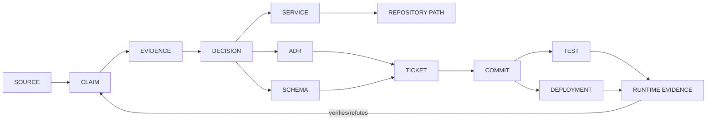

## 9.2 Edge types

- `DERIVED_FROM`
- `SUPPORTS`
- `REFUTES`
- `DECIDES`
- `DOCUMENTED_BY`
- `SPECIFIED_BY`
- `AFFECTS`
- `IMPLEMENTED_BY`
- `TRACKED_BY`
- `CHANGED_BY`
- `TESTED_BY`
- `DEPLOYED_AS`
- `VERIFIED_BY`
- `SUPERSEDES`
- `BLOCKS`
- `DEPENDS_ON`

Each edge has source, creator, confidence, status, valid time and provenance.

## 9.3 Coverage queries

The workbench must expose deterministic queries:

### Accepted decisions not implemented

```sql
SELECT d.object_id
FROM canonical_decision d
LEFT JOIN implementation_link i
  ON i.decision_id = d.object_id
 AND i.link_type IN ('IMPLEMENTED_BY','DEPLOYED_AS')
WHERE d.resolution = 'ACCEPT'
  AND d.is_current
GROUP BY d.object_id
HAVING count(i.object_id) = 0;
```

### Implemented code without approved decision

```sql
SELECT i.object_id, i.repository_path
FROM implementation_link i
LEFT JOIN canonical_decision d ON d.object_id = i.decision_id
WHERE i.link_type = 'IMPLEMENTED_BY'
  AND (d.object_id IS NULL OR d.resolution <> 'ACCEPT');
```

### Tests no longer cover a claim

A test is stale when the linked claim or decision changed after the last passing test evidence, or the linked code path changed after the tested commit.

### Deployed behavior contradicts canon

Join active canonical decision → expected verification predicate → latest runtime evidence. A failed predicate creates `ImplementationMismatch` with `CRITICAL` or `HIGH` severity.

## 9.4 Architecture impact

Every accepted decision produces an `ArchitectureImpact` record containing:

- affected components;
- changed interfaces;
- data migration;
- security impact;
- operational impact;
- required ADR;
- required schema change;
- backlog delta;
- verification obligations;
- rollback path.

No decision is “complete” while mandatory impact tasks remain open.


# 10_RESEARCH_RUN_MANAGEMENT

## 10.1 ResearchRun object

```json
{
  "research_run_id": "uuid",
  "task_id": "exact-task-id",
  "exact_prompt_artifact_id": "uuid",
  "context_manifest_id": "uuid",
  "attached_artifact_version_ids": ["uuid"],
  "source_priority": ["PRIMARY_OFFICIAL", "PRIMARY_CODE"],
  "excluded_scope": ["LifeOS design", "Trading Cell"],
  "provider": "provider-id",
  "model": "model-id",
  "started_at": "RFC3339",
  "ended_at": "RFC3339|null",
  "raw_result_artifact_id": "uuid|null",
  "source_ledger_id": "uuid|null",
  "claim_ids": [],
  "decision_delta_id": "uuid|null",
  "contradiction_ids": [],
  "open_question_ids": [],
  "completeness": 0.0,
  "reviewer_decision": "PENDING"
}
```

## 10.2 ContextManifest

A context manifest freezes what the run was allowed to see:

- exact task and prompt hash;
- included artifact/version IDs;
- canonical snapshot ID;
- excluded sources;
- date cutoff;
- source priority;
- provider-routing decision;
- data-class ceiling;
- blind-run group ID;
- prompt and tool policy versions.

This permits reproducibility and blind independent runs.

## 10.3 SourceLedger

For each cited or consulted source:

- original URL/URI;
- retrieval timestamp;
- response headers;
- content hash;
- title/author/date;
- source class;
- claim IDs supported;
- resolved citation status;
- archived raw response when policy permits.

A model-produced citation is unverified until the source resolves and the quoted/supporting content is checked.

## 10.4 Lifecycle

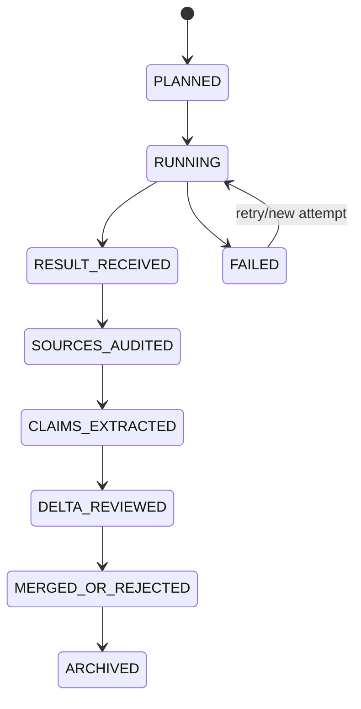

## 10.5 Blind independent runs

- Each run gets the same task but separate context manifest.
- Outputs are not visible to sibling runs.
- A synthesis run receives only immutable outputs and source ledgers.
- Agreement is recorded at claim level.
- Shared citations do not count as independent evidence.
- A synthesis cannot erase minority contradictions; it must resolve or retain them.

## 10.6 Decision delta

A research result does not rewrite canon. It proposes:

- new claims;
- changed confidence;
- new contradictions;
- candidate supersessions;
- new open questions;
- ADR/schema/backlog impacts.

The owner reviews the delta against the previous canonical snapshot.


# 11_SEARCH_AND_RETRIEVAL

## 11.1 Retrieval modes

The API exposes explicit modes rather than one opaque “AI search” endpoint.

| Mode | Primary mechanism | Authoritative? |
|---|---|---|
| exact identifier | B-tree lookup on IDs, hashes, native IDs, commit SHAs | yes |
| metadata filters | SQL predicates/JSONB/GIN | yes |
| full-text | PostgreSQL `tsvector` + GIN | derived ranking over authoritative records |
| semantic | pgvector over chunks/claims | derived candidate retrieval |
| graph traversal | recursive SQL over typed edge table | relations authoritative; traversal result computed |
| time-aware | validity intervals, observed/source times, canonical snapshots | yes |
| current canon only | current projection + decision state | yes |
| include superseded | event/history view | yes |
| source-quality filter | claim-specific trust assessment | yes |
| project scoped | RLS/policy filter | yes |
| data-class scoped | policy filter before retrieval/provider routing | yes |

PostgreSQL supplies built-in full-text primitives and GIN indexes [S01][S02]. SQLite FTS5 is viable for an offline single-file utility [S04], but it is not the shared authoritative server state. `pgvector` supports exact and approximate vector search while preserving joins and transactions with metadata [S03].

## 11.2 MVP search stack decision

**MVP:**

- PostgreSQL B-tree/GIN indexes;
- PostgreSQL full-text search;
- `pg_trgm` for names/aliases/near text;
- `pgvector` for optional semantic candidates;
- recursive CTEs for graph queries;
- no dedicated graph database;
- no Qdrant;
- no OpenSearch.

The vector table is fully derived:

```sql
embedding_chunk(
  chunk_id uuid primary key,
  source_object_id uuid not null,
  chunk_hash char(64) not null,
  model_id text not null,
  model_version text not null,
  dimensions int not null,
  embedding vector,
  created_at timestamptz not null,
  unique(chunk_hash, model_id, model_version)
);
```

A rebuild deletes the derived rows and recreates them from immutable extraction records.

## 11.3 Ranking

Default hybrid ranking:

1. exact ID/hash/native-ID match;
2. current canonical exact phrase;
3. metadata/subject/predicate match;
4. PostgreSQL FTS rank;
5. semantic similarity;
6. trust/freshness adjustment;
7. status penalty for stale/superseded/quarantined objects.

Canonical state never depends on ranking score.

## 11.4 Component comparison

| Candidate | Strength | Why not MVP | Migration trigger |
|---|---|---|---|
| PostgreSQL FTS | transactional, filters, low ops, enough for small/medium corpus | language tuning less extensive than search cluster | keep unless measured bottleneck |
| pgvector | same DB, joins, rebuildable | not optimal for very large/high-throughput vector workloads | >5M active embeddings, p95 semantic query >500 ms after tuning, or independent scaling need |
| Qdrant | vector-native filtering, snapshots, hybrid/vector features [S05][S06][S30] | another stateful service; duplicates metadata/policy controls | vector workload dominates and separate scaling materially reduces cost/latency |
| OpenSearch | mature BM25, analyzers, lexical/vector search [S07][S31] | cluster operational burden; risk of shadow authoritative state | >10M searchable chunks, complex multilingual analyzers, aggregation/search latency target unmet |
| SQLite FTS5 | excellent portable/offline tool [S04] | weak concurrent shared service/governance boundary | offline review/export application |
| graph DB | natural multi-hop traversal | premature operational/schema complexity | >20% critical queries require 4+ hops and recursive SQL is demonstrably slow |
| no vector store | simplest | MVP acceptance requires rebuildable semantic index | not selected; pgvector table remains optional and derived |

## 11.5 Search safety

- policy and data-class filters execute before result ranking;
- semantic search cannot cross project scope;
- quarantined content is excluded by default;
- source excerpts are escaped and labeled as untrusted content;
- model answer generation receives only authorized result objects;
- every generated answer returns object IDs and exact source locators;
- missing evidence yields `UNKNOWN`, not synthesized certainty.


# 12_CONNECTORS

## 12.1 Smallest initial set

The MVP requires only:

1. **Manual Drop / Select File** — immediate value and deterministic testing.
2. **Local Folder Connector** — Phase 0 continuous intake.
3. **Git Repository Connector** — links decisions to real implementation.

Google Drive becomes connector four. This keeps the first vertical slice small while covering documents, schemas and code.

## 12.2 Common connector contract

```python
class Connector:
    def discover(self, cursor: dict | None) -> DiscoveryPage: ...
    def fetch_metadata(self, native_id: str) -> SourceMetadata: ...
    def fetch_content(self, native_id: str, revision: str | None) -> BinaryStream: ...
    def fetch_permissions(self, native_id: str) -> PermissionSnapshot: ...
    def acknowledge(self, event_id: str, outcome: str) -> None: ...
```

Every adapter must implement:

- authentication profile;
- polling/push mode;
- durable cursor;
- idempotency key;
- file identity;
- version detection;
- deletion/tombstone handling;
- permission mirror;
- rate-limit strategy;
- retry/backoff;
- raw preservation;
- partial-result semantics.

## 12.3 Connector matrix

### Manual Drop

- **Authentication:** current owner session.
- **Polling/push:** direct upload.
- **Cursor:** none; upload session ID.
- **Idempotency:** SHA-256 + upload session idempotency key.
- **Identity:** exact bytes; optional user-supplied source URI.
- **Versions:** user links or system proposes lineage.
- **Deletion:** never inferred.
- **Permissions:** project/data class chosen before extraction.
- **Rate limits:** configured size/count quotas.
- **Recovery:** resumable multipart upload; incomplete uploads expire as `PARTIAL`.
- **Raw preservation:** stream to quarantine CAS before parsing.

### Local Folder

- **Authentication:** dedicated least-privilege OS account.
- **Polling/push:** filesystem watcher plus periodic reconciliation scan.
- **Cursor:** `(device_id, scan_sequence, last_completed_path)` and file journal where available.
- **Idempotency:** `(connector_id, native_file_id/inode, content_hash, observed_event_type)`.
- **Identity:** platform file ID/inode when stable; canonical path is metadata only.
- **Versions:** byte hash change creates new version; rename alone does not.
- **Deletion:** tombstone after reconciliation; never delete raw.
- **Permissions:** mirror owner/read ACL coarsely to project scope; unsupported ACL becomes `UNKNOWN`.
- **Rate limits:** bounded concurrency and I/O budget.
- **Recovery:** checkpoints per file; retry from last completed object.
- **Raw preservation:** copy bytes before any parser touches them.

### Git Repository

- **Authentication:** read-only SSH deploy key or local repository access.
- **Polling/push:** poll refs; optional webhook.
- **Cursor:** last processed commit per ref.
- **Idempotency:** repository ID + commit SHA + blob path + blob SHA.
- **Identity:** repo, commit and blob object IDs. Git is content-addressed and records parent-linked history [S10].
- **Versions:** commit DAG and blob changes.
- **Deletion:** tree diff creates path tombstone; historical blobs remain.
- **Permissions:** repository/project mapping.
- **Rate limits:** local Git preferred; remote fetch with backoff.
- **Recovery:** commit-level checkpoint; `git fsck`/fetch retry.
- **Raw preservation:** store selected blobs and commit/source manifest; optionally retain bundle for evidence snapshot.

### GitHub Issues, PRs and Releases

- **Authentication:** GitHub App with minimal read permissions.
- **Polling/push:** webhooks plus periodic reconciliation.
- **Cursor:** delivery GUID/event time plus per-resource update cursor.
- **Idempotency:** webhook delivery GUID and resource node ID/version.
- **Identity:** repository node ID + issue/PR/release ID.
- **Versions:** event timeline and updated timestamps corroborated by content hash.
- **Deletion:** deleted event/tombstone.
- **Permissions:** repository installation scope.
- **Rate limits:** conditional requests using ETag/Last-Modified reduce unchanged requests [S24].
- **Recovery:** failed delivery reconciliation and API redelivery support.
- **Raw preservation:** webhook payload, response metadata and fetched canonical JSON.

### Google Drive, Docs, Sheets and Slides

- **Authentication:** OAuth with read-only scopes, separate connector account profile.
- **Polling/push:** Drive Changes API polling; push notification may trigger polling.
- **Cursor:** durable `startPageToken/newStartPageToken`. Google documents this incremental pattern [S22].
- **Idempotency:** Drive file ID + revision/export content hash.
- **Identity:** stable Drive file ID.
- **Versions:** native revision metadata where available; exported content hash; Google Workspace exports via Drive API [S23].
- **Deletion:** removed/trashed change creates tombstone.
- **Permissions:** mirror permissions snapshot into AccessPolicy references.
- **Rate limits:** exponential backoff, page-token checkpoint.
- **Recovery:** do not advance token until page is committed.
- **Raw preservation:** source metadata JSON plus exported bytes for the observed version; record export MIME and limitations.

### ChatGPT / Other Model Exports

- **Authentication:** manual export or provider API credential where available.
- **Polling/push:** manual batch for MVP.
- **Cursor:** export manifest and conversation/message IDs.
- **Idempotency:** provider + conversation ID + message ID + content hash.
- **Identity:** native IDs when present; otherwise deterministic import IDs.
- **Versions:** edited message/export differences retained as versions.
- **Deletion:** absence in a partial export never implies deletion.
- **Permissions:** default `PRIVATE` until classified.
- **Rate limits:** batch quotas.
- **Recovery:** per-conversation checkpoints.
- **Raw preservation:** original archive plus extracted conversations.

### Telegram Exports

- **Authentication:** owner-created Telegram Desktop export or Takeout flow.
- **Polling/push:** manual export initially.
- **Cursor:** export manifest, chat ID, message ID, edit date.
- **Idempotency:** account/export ID + chat/message ID + content hash.
- **Identity:** Telegram native chat/message identifiers.
- **Versions:** edited messages create version records.
- **Deletion:** explicit deletion evidence only; missing messages may be export-scope omission.
- **Permissions:** chat-level project and sensitivity mapping.
- **Rate limits:** import-side only for exported files.
- **Recovery:** checkpoint per chat/message range.
- **Raw preservation:** original JSON/HTML and media. Telegram officially supports offline JSON and HTML exports [S25].

### File formats: Markdown/TXT/PDF/DOCX/XLSX/CSV/PPTX/images

This is a parser adapter family under Manual/Folder/Drive connectors.

- validate magic bytes and container structure;
- never trust extension alone;
- retain raw file;
- extract to a versioned intermediate representation;
- preserve page/sheet/slide/cell locators;
- treat macros, embedded objects and external links as inert metadata;
- record parser and OCR versions;
- isolate failures per embedded object.

### Email attachments

- **Authentication:** OAuth read-only mailbox scope.
- **Polling/push:** mailbox history API or periodic query.
- **Cursor:** mailbox history ID.
- **Idempotency:** message ID + attachment ID + content hash.
- **Identity:** message/attachment native IDs.
- **Versions:** normally immutable source occurrence; duplicate attachment bytes dedupe globally.
- **Deletion:** mailbox tombstone only; raw retention follows policy.
- **Permissions:** mailbox/project mapping.
- **Rate limits:** query narrowing and backoff.
- **Recovery:** per-message checkpoint.
- **Raw preservation:** message headers/body evidence record and exact attachment bytes.

### Web pages and research papers

- **Authentication:** public, session cookie or API token profile.
- **Polling/push:** scheduled fetch.
- **Cursor:** URL + ETag/Last-Modified + last content hash.
- **Idempotency:** normalized URL + response content hash.
- **Identity:** canonical URL where reliable; DOI/arXiv/official paper ID for papers.
- **Versions:** response hash plus archival timestamp; source timestamp remains separate.
- **Deletion:** HTTP status/tombstone; retain prior response.
- **Permissions:** source license/terms and data class.
- **Rate limits:** robots/terms, domain budgets, retry-after.
- **Recovery:** fetch record persists headers and failure.
- **Raw preservation:** response bytes, headers, resolved URL and retrieval time.

### Structured APIs

- **Authentication:** connector-specific OAuth/API key.
- **Polling/push:** cursor/webhook.
- **Cursor:** native pagination/change token.
- **Idempotency:** endpoint + native entity ID + revision/ETag/content hash.
- **Identity:** native stable ID.
- **Versions:** ETag/revision/updated field corroborated by payload hash.
- **Deletion:** explicit delete/tombstone event.
- **Permissions:** scope mapping.
- **Rate limits:** token bucket and Retry-After.
- **Recovery:** page transaction; cursor advances after commit.
- **Raw preservation:** canonical JSON bytes and response metadata.


# 13_SECURITY

## 13.1 Threat model and controls

| Threat | Primary controls |
|---|---|
| Prompt injection in documents | strict instruction/data separation; no tools in extraction; hostile-text labels; model output remains proposed |
| Poisoned research report | source class, claim extraction, independent evidence, contradiction detection, no automatic promotion |
| Malicious PDF/Office file | MIME/magic validation, sandbox, no network, resource limits, parser patch pinning, quarantine |
| Parser vulnerability | disposable rootless container/VM, read-only filesystem, seccomp/AppArmor, no secrets, egress deny |
| Path traversal | generated storage keys; reject archive paths escaping root; never trust supplied filename |
| Zip bomb | compressed/uncompressed ratio, entry count, recursion depth, total expanded bytes |
| Secret leakage | pre-provider secret scan, data-class routing, redaction derivative, audit |
| Cross-project retrieval | PostgreSQL RLS/policy filter before search and embedding access |
| Provider exfiltration | route only approved data classes; local extraction/embedding for restricted data |
| Malicious connector | least-privilege credentials, signed connector package, network allowlist, per-connector namespace |
| Forged metadata | preserve raw headers/payload; source-native signatures where available; metadata is untrusted input |
| Evidence deletion | versioned/WORM raw store, tombstones, backups, source-loss status |
| Unauthorized canonicalization | ContinuityOS capability token, re-authentication, signed decision, risk-tier policy |
| Audit tampering | append-only hash chain, restricted DB role, off-host signed manifest backup |
| Embedding poisoning | embeddings are derived; source filters; anomaly detection; full rebuild |
| Fake citation | resolve URL/ID, capture bytes/hash, compare cited span, mark unresolved/fabricated |
| Supply-chain compromise | lockfiles, signed builds/provenance, dependency scanning, minimal images |
| Repository secret ingestion | secret scan before indexing/provider routing; raw access restricted |
| Raw object-store outage | intake journal retains pending state; no cursor advancement before durable write |
| Database outage | transactional retry; worker lease expiry; restore test |
| Unauthorized deletion | retention policy and object lock; deletion is a signed policy event |

OWASP recommends validating uploaded file type, size, name and storage context rather than trusting the client [S18]. OWASP also treats indirect prompt injection from files/websites as a primary LLM risk [S19]. SLSA provenance provides a model for tracing build artifacts and protecting supply-chain integrity [S21].

## 13.2 Security and Quarantine Boundary

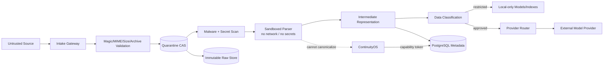

## 13.3 Content-disarm strategy

The system preserves original bytes, then creates a safe derivative:

- archive containers are expanded with strict limits;
- executable macros are never run;
- external references are recorded but not fetched by parsers;
- active content is stripped from the safe preview;
- images may be rendered in a disposable environment;
- normalized PDF/Markdown/JSON is tagged `DERIVATIVE_SAFE_VIEW`;
- the original remains quarantined or restricted.

CDR output never replaces the original.

## 13.4 Data classes and provider routing

Recommended classes:

- `PUBLIC`
- `INTERNAL`
- `CONFIDENTIAL`
- `RESTRICTED`
- `SECRET_MATERIAL`
- `QUARANTINED`

Routing:

| Data class | External provider |
|---|---|
| PUBLIC | allowed by provider policy |
| INTERNAL | approved providers only; no training/retention where contractually supported |
| CONFIDENTIAL | local by default; explicit exception |
| RESTRICTED | local only |
| SECRET_MATERIAL | no LLM/embedding; metadata-only indexing |
| QUARANTINED | no model routing until cleared |

Classification occurs before model extraction. If classification is uncertain, choose the more restrictive class.

## 13.5 Least privilege roles

- `foundry_intake`: create ingestion records, write quarantine objects.
- `foundry_extractor`: read assigned raw object, write extraction only.
- `foundry_reviewer`: review claims/conflicts.
- `foundry_canonicalizer`: invoke authorized decision endpoint only.
- `foundry_search`: read policy-filtered objects.
- `foundry_admin`: connector and retention administration.
- `continuityos_authorizer`: issue capability tokens; no direct raw access.

## 13.6 Retention and deletion

- raw evidence default: retain;
- quarantined malware: retain encrypted with restricted access or delete per policy after forensic manifest;
- secrets: restrict, optionally cryptographically erase via key deletion;
- personal data: project-specific retention and legal deletion process;
- derived indexes: freely rebuildable and deletable;
- audit and decision events: long-lived, signed, access-restricted;
- backups: encrypted, versioned, restore-tested.


# 14_BUILD_VS_ADOPT

Operational-cost estimates below are architecture assumptions for one owner, not vendor guarantees. They include patching, backup checks and incident handling.

| Layer / candidate | Decision | Role | One-owner ops estimate | Migration trigger / exit path |
|---|---|---|---:|---|
| **Git** | ADOPT | code, ADRs, schemas, policies, tests | 0.5–1 h/month | remains system of record for implementation |
| **PostgreSQL** | ADOPT | authoritative metadata, events, graph edges, FTS | managed: 1–2 h/month; self-hosted: 3–5 | logical dump + SQL schema; portable |
| **SQLite** | ADAPT | offline CLI/cache/demo | <0.5 h/month | export/import into PostgreSQL |
| **Object storage / S3-compatible** | ADOPT | immutable raw bytes and manifests | managed: 0.5–1; self-hosted: 2–4 | object keys and manifests remain portable |
| **pgvector** | ADAPT | rebuildable semantic index | <1 h/month | export embeddings or recompute in Qdrant/OpenSearch |
| **Qdrant** | HOLD | future vector-scale service | 2–5 h/month self-hosted | adopt only after measured vector bottleneck; snapshots/migration tools exist [S05][S06] |
| **OpenSearch** | HOLD | future large-scale lexical/hybrid search | 5–10 h/month | adopt on corpus/latency/analyzer trigger; rebuild from PostgreSQL/extractions |
| **DVC** | ADAPT LATER | version large benchmark datasets or reproducible research inputs | 1–2 h/month | use for explicit datasets, not all raw evidence; DVC separates tracked data into remotes [S11] |
| **lakeFS** | HOLD | Git-like branching over large object-store datasets | 5–10 h/month | adopt when data-lake-scale branching/merging is real [S12] |
| **DataHub** | REJECT MVP | enterprise metadata catalog/lineage | 8–20 h/month | revisit with multiple owners, many data platforms or organization-wide catalog need [S13] |
| **OpenMetadata** | REJECT MVP | enterprise catalog, glossary, classification | 8–20 h/month | revisit when catalog connectors/governance UI outweigh custom domain model [S14] |
| **Notion** | ADAPT AS SOURCE | human authoring and presentation | existing | connector only; export and preserve raw |
| **Obsidian** | ADAPT AS SOURCE/VIEW | local Markdown authoring | <1 h/month | never authoritative without decision event |
| **Confluence** | ADAPT AS SOURCE | team documentation if used | existing | connector and provenance snapshot |
| **Google Drive** | ADAPT AS SOURCE | collaborative documents and spreadsheets | 1–2 h/month connector maintenance | Drive IDs/revisions remain source identity |
| **Docling** | ADOPT | primary rich-document extraction | 1–2 h/month model/parser pin updates | intermediate representation is versioned; swap parser safely |
| **Apache Tika** | ADAPT FALLBACK | broad format detection/extraction | 1–3 h/month | isolated fallback only; parser output is derivative [S17] |
| **Unstructured** | ADAPT OPTIONAL | alternate partitioning for selected formats | 1–2 h/month | compare extraction benchmarks before enabling [S16] |
| **Langfuse** | ADAPT PHASE 2 | LLM/research traces, evaluations and annotation queues | 1–3 h/month | export traces; not canonical metadata [S27] |
| **Phoenix** | ALTERNATIVE TO LANGFUSE | datasets, experiments, traces | 1–3 h/month | select one, not both; Phoenix supports datasets/experiments [S28] |
| **Temporal** | HOLD THEN ADOPT | durable long-running workflows | cloud: 1–2; self-hosted: 4–8 h/month | adopt when Postgres job state becomes complex; Temporal provides durable recovery/replay [S26] |
| **Custom web workbench** | BUILD NARROW | domain-specific review actions | 2–4 weeks initial; low ongoing | APIs preserve exit path to another UI |

## 14.1 Why no monolith

No reviewed product simultaneously provides:

- byte-immutable evidence storage;
- claim-level provenance and contradiction;
- explicit canonical decisions;
- ContinuityOS authorization;
- research-run manifests;
- decision-to-code/test/runtime mapping;
- LifeOS boundary;
- one-owner low operations.

The correct architecture is a small composable control plane, not an enterprise platform selected for feature count.

## 14.2 Build/adopt boundary

**Build:**

- domain schemas;
- identity/version rules;
- claim/evidence/conflict workflows;
- canonical decision events;
- implementation coverage;
- review UI;
- provider-routing policy adapter.

**Adopt:**

- PostgreSQL;
- object storage;
- Git;
- parser libraries;
- authentication;
- optional tracing/vector components.

**Adapt:**

- Drive/GitHub/Telegram imports;
- Langfuse or Phoenix;
- DVC for explicitly versioned datasets.

**Reject for MVP:**

- graph DB;
- OpenSearch cluster;
- Qdrant service;
- DataHub/OpenMetadata;
- lakeFS;
- Kubernetes.


# 15_OPERATOR_WORKBENCH

## 15.1 Minimum views

### Inbox / Unclassified Artifacts

Shows source, filename, detected type, hash status, data-class guess, extraction status, duplicate candidates, risk flags and recommended action.

### Recent Changes

Shows new artifacts, changed versions, new claims, changed claim states, new conflicts, canonical decisions, supersessions and implementation deltas since a selected snapshot.

### Duplicate and Version Clusters

Side-by-side raw metadata, normalized diff, structure comparison, source occurrences and proposed relationship.

### Claims Awaiting Review

Atomic assertion, exact excerpt, source locator, candidate evidence, contradiction candidates and proposed status.

### Contradictions

Conflict type, severity, impacted decisions/modules, suggested experiment and resolution state.

### Canonical Decision Ledger

Signed event history, current/superseded state, evidence snapshot, policy version and impact tasks.

### Open Questions

Priority, blocked decisions, required evidence, proposed experiment, cost and next review date.

### Research Runs

Prompt/context manifest, raw output, source audit, claim delta, completeness and merge/reject decision.

### Architecture Map

Components, ownership, decisions, schemas and dependency edges.

### Implementation Coverage

Decision → ADR → ticket → commit → test → deployment → runtime evidence, with missing links highlighted.

### Stale Knowledge

Objects whose time validity, monitored source or implementation link exceeded freshness policy.

### Sensitive Data Queue

Unclassified secrets/PII candidates, routing block reason and redaction/reclassification action.

## 15.2 Required actions

- accept;
- reject;
- merge;
- link as version;
- mark exact/near duplicate;
- mark stale;
- request verification;
- create ADR;
- create ticket;
- promote to canonical;
- supersede;
- quarantine.

Every action opens a preview of consequences and produces an event.

## 15.3 Human Review Workbench

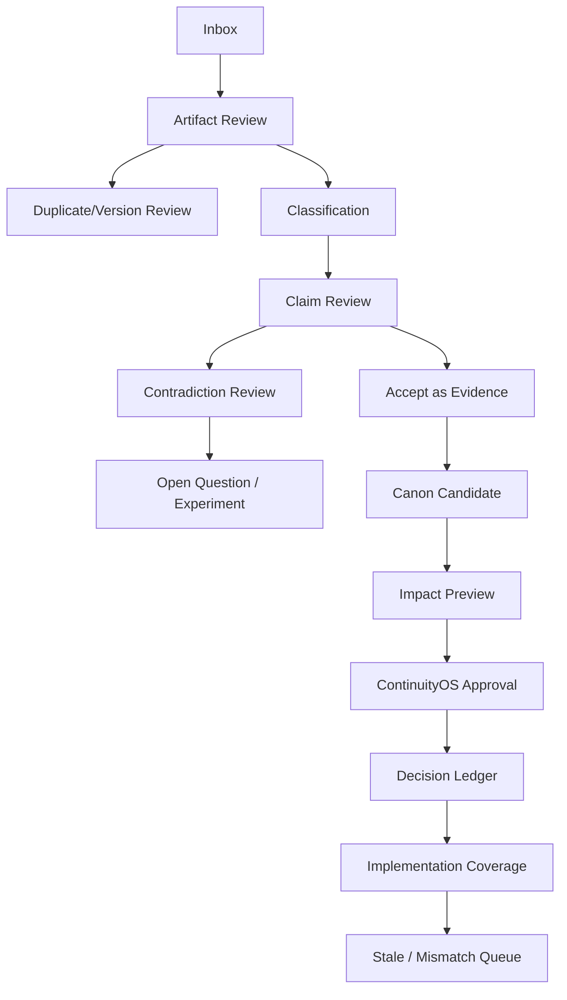

## 15.4 Review prioritization

Suggested score:

```text
review_priority =
  4 * critical_security_or_risk
+ 3 * blocks_active_project
+ 2 * implementation_impact
+ 2 * contradiction_severity
+ 1.5 * source_uniqueness
+ 1 * freshness_decay
- 1 * duplicate_probability
- 1 * low_confidence_noise
```

The score orders work; it never auto-approves.

## 15.5 Telegram role

Allowed:

- alert owner about critical contradiction;
- show a short summary and deep link;
- accept low-risk T0 action with signed callback and expiry;
- snooze or request evidence.

Not allowed:

- sole interface for architecture/security/trading-risk decisions;
- showing unredacted sensitive content by default;
- canonicalizing T2/T3 decisions without workbench re-authentication.


# 16_SCHEMAS_AND_APIS

The accompanying file `knowledge_foundry_schema.sql` contains build-ready PostgreSQL DDL. The accompanying `knowledge_foundry_openapi.yaml` defines the initial API surface.

## 16.1 Common object envelope

Every derived object is registered in `object_registry`:

| Field | Type | Required |
|---|---|---|
| `object_id` | UUID | yes |
| `object_type` | text/enum | yes |
| `schema_version` | semver text | yes |
| `source_references` | JSONB | yes, may be empty only for root system records |
| `content_hash` | SHA-256 text | yes for content-bearing objects |
| `created_at` | timestamptz | yes |
| `created_by` | JSONB actor ref | yes |
| `project_scope` | UUID/project ref | yes |
| `data_class` | enum | yes |
| `status` | text/enum | yes |
| `provenance` | JSONB | yes |
| `policy_context` | JSONB | yes |

## 16.2 Required schema inventory

The SQL file defines:

- `SourceSystem`
- `Artifact`
- `ArtifactVersion`
- `IngestionRun`
- `ExtractionRecord`
- `ProvenanceRecord`
- `DuplicateCluster`
- `Claim`
- `EvidenceLink`
- `ContradictionRecord`
- `OpenQuestion`
- `CanonicalDecision`
- `SupersessionRecord`
- `ArchitectureImpact`
- `ImplementationLink`
- `ADRReference`
- `BacklogReference`
- `ResearchRun`
- `ContextManifest`
- `SourceLedger`
- `DecisionDelta`
- `ReviewTask`
- `DataClassification`
- `AccessPolicy`

Additional necessary schemas:

- `Project`
- `LogicalDocument`
- `ObjectRegistry`
- `EventLedger`
- `GraphEdge`
- `RequiredExperiment`
- `JobQueue`
- `EmbeddingChunk`
- `CanonicalSnapshot`

## 16.3 Core API surface

| Method | Path | Purpose |
|---|---|---|
| `POST` | `/v1/intake/files` | resumable/manual file intake |
| `POST` | `/v1/intake/folder-scans` | trigger/reconcile local folder |
| `POST` | `/v1/connectors/{id}/sync` | run connector incrementally |
| `GET` | `/v1/artifacts/{artifact_id}` | raw metadata and recovery locator |
| `GET` | `/v1/versions/{version_id}` | version, lineage and extraction |
| `POST` | `/v1/versions/{version_id}/classify` | classify data/source/trust candidate |
| `POST` | `/v1/versions/{version_id}/extract` | idempotent extraction job |
| `POST` | `/v1/versions/{version_id}/relations` | link duplicate/version/derivative |
| `GET` | `/v1/claims` | filter claims |
| `POST` | `/v1/claims/{claim_id}/review` | accept/reject/change status |
| `GET` | `/v1/contradictions` | conflict queue |
| `POST` | `/v1/contradictions/{id}/resolve` | record resolution |
| `POST` | `/v1/open-questions` | create question/experiment |
| `POST` | `/v1/canonical-decisions/preview` | impact and policy preview |
| `POST` | `/v1/canonical-decisions` | authorized immutable decision |
| `POST` | `/v1/canonical-decisions/{id}/supersede` | explicit supersession |
| `POST` | `/v1/implementation-links` | link ADR/ticket/commit/test/deploy |
| `GET` | `/v1/coverage` | implementation gap queries |
| `POST` | `/v1/research-runs` | create run and context manifest |
| `POST` | `/v1/research-runs/{id}/result` | register raw result |
| `GET` | `/v1/search` | explicit retrieval modes |
| `GET` | `/v1/snapshots/{id}/delta` | canonical change set |
| `GET` | `/v1/review/inbox` | prioritized review queue |
| `POST` | `/v1/jobs/{id}/retry` | controlled retry |
| `POST` | `/v1/indexes/semantic/rebuild` | rebuild derived semantic index |

## 16.4 API rules

- all mutation requests require idempotency key;
- optimistic concurrency uses `If-Match`/version token for mutable projections;
- canonical decision endpoints require ContinuityOS capability token;
- raw artifact download is separate from metadata and policy checked;
- no endpoint can update a signed decision payload;
- all list endpoints support project, data class, status and time filters;
- model-facing endpoints cannot return `SECRET_MATERIAL`.


# 17_MONOREPO

```text
maworld-knowledge-foundry/
├─ README.md
├─ pyproject.toml
├─ uv.lock
├─ compose.dev.yaml
├─ Makefile
├─ .env.example
├─ docs/
│  ├─ architecture/
│  │  ├─ system-context.md
│  │  ├─ threat-model.md
│  │  └─ decision-register.md
│  ├─ adr/
│  ├─ schemas/
│  └─ runbooks/
├─ schemas/
│  ├─ sql/
│  │  ├─ 0001_core.sql
│  │  ├─ 0002_claims.sql
│  │  ├─ 0003_decisions.sql
│  │  └─ 0004_search.sql
│  ├─ jsonschema/
│  └─ openapi/
│     └─ knowledge-foundry.yaml
├─ apps/
│  ├─ api/
│  │  ├─ main.py
│  │  ├─ routes/
│  │  ├─ services/
│  │  └─ auth/
│  ├─ worker/
│  │  ├─ main.py
│  │  ├─ jobs/
│  │  └─ leases.py
│  └─ workbench/
│     ├─ templates/
│     ├─ static/
│     └─ views/
├─ packages/
│  ├─ domain/
│  │  ├─ ids.py
│  │  ├─ enums.py
│  │  ├─ events.py
│  │  └─ policies.py
│  ├─ storage/
│  │  ├─ cas.py
│  │  ├─ s3.py
│  │  └─ manifests.py
│  ├─ connectors/
│  │  ├─ base.py
│  │  ├─ manual_drop.py
│  │  ├─ local_folder.py
│  │  ├─ git_repo.py
│  │  ├─ github.py
│  │  ├─ google_drive.py
│  │  ├─ telegram_export.py
│  │  └─ model_export.py
│  ├─ extraction/
│  │  ├─ dispatcher.py
│  │  ├─ docling_adapter.py
│  │  ├─ native_markdown.py
│  │  ├─ native_spreadsheet.py
│  │  └─ sandbox.py
│  ├─ claims/
│  │  ├─ segment.py
│  │  ├─ extract.py
│  │  ├─ normalize.py
│  │  └─ evidence.py
│  ├─ conflicts/
│  │  ├─ rules.py
│  │  ├─ schema_diff.py
│  │  ├─ code_doc_diff.py
│  │  └─ resolution.py
│  ├─ canonicalization/
│  │  ├─ preview.py
│  │  ├─ continuityos.py
│  │  ├─ decisions.py
│  │  └─ supersession.py
│  ├─ implementation/
│  │  ├─ graph.py
│  │  ├─ git_mapper.py
│  │  └─ coverage.py
│  ├─ research/
│  │  ├─ runs.py
│  │  ├─ manifests.py
│  │  └─ source_audit.py
│  └─ search/
│     ├─ exact.py
│     ├─ fulltext.py
│     ├─ semantic.py
│     └─ graph.py
├─ policies/
│  ├─ data-routing.yaml
│  ├─ canonicalization.yaml
│  ├─ retention.yaml
│  └─ connector-scopes.yaml
├─ tests/
│  ├─ unit/
│  ├─ integration/
│  ├─ security/
│  ├─ fixtures/
│  └─ acceptance/
├─ scripts/
│  ├─ bootstrap.py
│  ├─ rebuild_semantic_index.py
│  ├─ verify_raw_store.py
│  ├─ export_snapshot.py
│  └─ restore_drill.py
└─ var/
   ├─ drop/
   ├─ quarantine/
   └─ dev-cas/
```

Rules:

- schemas and policy files are Git-versioned;
- generated parser output is not committed unless it is an intentional fixture;
- production raw bytes never live in the Git repository;
- ADR IDs are stable and linked to `CanonicalDecision`;
- migrations are forward-only; rollback uses compensating migrations or restore procedure;
- connector packages cannot import canonicalization internals.


# 18_INCREMENTAL_MIGRATION_PLAN

## Phase 0 — Empty Workspace

Deliver:

- monorepo;
- database schema;
- raw CAS;
- ingestion/event ledger;
- manual drop;
- local folder connector;
- parser sandbox;
- minimal inbox.

Exit criteria:

- one file can be dropped, hashed, stored, extracted and recovered;
- interrupted job resumes;
- duplicate byte upload does not duplicate raw bytes;
- no model use is required.

## Phase 1 — Current Seed Corpus

Ingest only:

- `00_MASTER.md`;
- `01_RESEARCH_ADDENDUM_2026-07.md`;
- D1–D4 reports;
- current Deep Research prompts;
- selected ContinuityOS repository files.

Process order:

1. raw preservation and manifests;
2. identity/version candidates;
3. claim extraction from two contradictory reports;
4. one contradiction review;
5. one canonical decision;
6. one ADR/ticket/implementation link.

Do not attempt to resolve all historical contradictions.

## Phase 2 — Ongoing Intake

- watch a designated drop folder;
- every new report enters Inbox;
- add Git connector;
- add Google Drive connector;
- generate daily review digest;
- enforce sensitive-data routing.

## Phase 3 — Architecture Integration

- canonical decision emits ADR/schema/backlog delta;
- Git references are reconciled;
- implementation coverage dashboard becomes mandatory;
- research runs compare to current snapshot.

## Phase 4 — Historical Migration

Old chats, exports and archives are processed in bounded batches. Each batch has a context manifest and checkpoint.

## 18.1 Prioritization

Score each candidate batch:

```text
migration_priority =
  5 * active_project_relevance
+ 4 * security_or_financial_risk
+ 3 * implementation_impact
+ 2 * uniqueness
+ 2 * evidence_value
+ 1 * recency
- 2 * duplicate_probability
- 1 * processing_cost
```

## 18.2 Resumability

A migration batch stores:

- source manifest hash;
- ordered item IDs;
- last committed item;
- parser/model versions;
- failure list;
- retry count;
- completeness estimate;
- cursor and source snapshot ID.

Cursor advancement occurs only after raw storage and metadata transaction commit.

## 18.3 Change since prior canonical snapshot

The delta report contains:

- added/removed current decisions;
- supersessions;
- claim status changes;
- new/resolved contradictions;
- schema/API changes;
- implementation coverage changes;
- stale knowledge;
- unresolved high-risk questions;
- newly quarantined artifacts.


# 19_MVP_VERTICAL_SLICE

## 19.1 End-to-end slice

`DROP FILE → HASH AND STORE RAW → EXTRACT → CLASSIFY → ARTIFACT RECORD → CLAIMS → SOURCE LINKS → DUPLICATE/CONTRADICTION → HUMAN REVIEW → CANONICAL DECISION OR OPEN QUESTION → ADR/TICKET LINK → CHANGELOG`

## 19.2 Seed corpus

- one master document;
- one addendum;
- two contradictory research reports;
- one code file;
- one architecture schema.

## 19.3 Detailed flow

1. Owner drops five files into `var/drop/seed-001/`.
2. Local connector creates a source manifest and `IngestionRun`.
3. Each file is streamed through MIME/size validation and SHA-256 calculation.
4. Raw bytes are stored before parsing.
5. Exact duplicates reuse `Artifact`; all occurrences remain.
6. Sandboxed parser creates a versioned intermediate representation with locators.
7. Data/source classifications are proposed.
8. Claim extraction produces atomic `PROPOSED` claims.
9. Rule engine and semantic candidate retrieval link likely duplicate claims and contradictions.
10. Workbench shows one contradiction with exact source excerpts.
11. Owner accepts evidence or creates an open question.
12. Owner previews a canonical architecture decision.
13. ContinuityOS policy authorizes the decision.
14. Foundry appends a signed decision event.
15. Workbench creates/links ADR and backlog ticket.
16. Git connector links a commit/test when implementation occurs.
17. Changelog compares current snapshot to the previous snapshot.
18. Semantic index is deleted and rebuilt from extraction records as an acceptance test.

## 19.4 Acceptance criteria

| Criterion | Pass condition |
|---|---|
| no raw file lost | byte-for-byte retrieval matches original SHA-256 |
| provenance complete | every derived object resolves to source version and raw artifact |
| duplicate clustering | exact duplicate and one cross-format/near duplicate candidate are visible |
| contradiction | at least one scoped conflict is surfaced with both excerpts |
| supersession | a canonical decision is superseded without mutation of prior event |
| implementation link | one decision resolves to ADR and backlog ticket |
| semantic rebuild | index deletion and rebuild returns same chunk set/model manifest |
| interruption recovery | worker killed mid-extraction resumes without duplicate domain records |
| future intake | new file enters Inbox without moving existing corpus |
| policy boundary | model cannot call canonicalization endpoint without capability token |
| raw recovery | owner can download original raw artifact from UI/CLI |
| delta | snapshot comparison lists the decision and implementation changes |

## 19.5 Architecture-to-Implementation Mapping

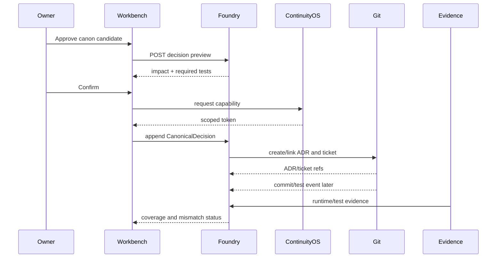

## 19.6 Future LifeOS Integration

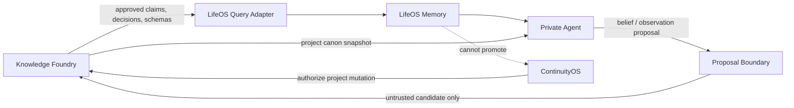


# 20_FAILURE_AND_EVALUATION_TESTS

The MVP acceptance suite contains at least the following scenarios.

| # | Scenario | Expected result |
|---:|---|---|
| 1 | duplicate upload | one raw artifact, two source occurrences, idempotent retry |
| 2 | renamed duplicate | rename event/source metadata change; same bytes and logical candidate |
| 3 | old content with new timestamp | observed time is new; content/version age is not rewritten |
| 4 | same document in DOCX and Markdown | separate raw artifacts; derivative/logical-document candidate |
| 5 | conflicting architecture decisions | `DecisionConflict` with both decision IDs and blocked promotion |
| 6 | poisoned prompt inside PDF | stored as untrusted text; no instruction authority or tool use |
| 7 | fake citations | citation marked unresolved/fabricated candidate; claim not verified |
| 8 | missing source | claim becomes `UNVERIFIABLE` or `SOURCE_UNAVAILABLE`; no silent support |
| 9 | deleted source | tombstone recorded; raw retained under policy |
| 10 | code contradicts documentation | `ImplementationMismatch`, intent and behavior both preserved |
| 11 | documentation describes unimplemented feature | decision/claim shown as not implemented |
| 12 | stale vendor pricing | freshness policy creates stale task; old value retained historically |
| 13 | corrupted file | raw retained, extraction failed, review/retry task created |
| 14 | parser failure | isolated failure; other files continue |
| 15 | extraction retry | same `ExtractionRecord` idempotency key prevents duplicates |
| 16 | connector outage | cursor unchanged; exponential retry; no false deletion |
| 17 | partial upload | `PARTIAL` state; no parse; resumable or expired safely |
| 18 | secret in document | restricted classification before provider route; alert |
| 19 | cross-project access attempt | denied by policy/RLS and audited |
| 20 | unauthorized canonicalization | HTTP 403; no decision event |
| 21 | canonical decision supersession | old event immutable; new current projection and delta |
| 22 | schema conflict | AST/field diff creates `SchemaConflict` |
| 23 | duplicate ticket | duplicate candidate link; original ticket preserved |
| 24 | research result with wrong task | task/prompt hash mismatch; run quarantined from merge |
| 25 | incomplete report | completeness flag and open questions; no full-corpus inference |
| 26 | model-generated unsupported claim | remains `PROPOSED`; review queue |
| 27 | vector index loss and rebuild | exact same source chunk manifest recreated |
| 28 | database restart | leased jobs resume after lease expiration |
| 29 | raw object storage unavailable | intake does not advance connector cursor; retry |
| 30 | human review backlog | priority score and aging alerts; no auto-promotion |
| 31 | migration interrupted and resumed | restarts from checkpoint, no duplicate records |
| 32 | malicious archive path traversal | offending entry rejected/quarantined |
| 33 | zip bomb | expansion limits terminate sandbox |
| 34 | forged source-modified timestamp | preserved as source metadata but not accepted as version proof |
| 35 | embedding poisoning | affected index deleted/rebuilt; authoritative objects unchanged |
| 36 | model fake exact excerpt | locator validation fails; claim rejected |
| 37 | two concurrent workers | `SKIP LOCKED`/lease prevents double execution |
| 38 | canonical decision signature mismatch | decision excluded from current projection and security alert |
| 39 | raw object bit rot | scheduled hash verification detects mismatch and restores/alerts |
| 40 | Drive page processed partially | page token not advanced until all committed |
| 41 | Git force-push | old commit evidence retained; ref movement event recorded |
| 42 | parser version upgrade | new extraction version created; old extraction retained |
| 43 | data class changed to more restrictive | search/provider access revoked and downstream tasks generated |
| 44 | source excerpt moved in new version | old locator preserved; claim-version delta generated |
| 45 | runtime evidence invalidates canon | mismatch blocks verification and opens supersession/rework path |

## 20.1 Evaluation metrics

- raw recovery success: 100%;
- derived-to-source resolvability: 100%;
- idempotency duplicate rate: 0;
- silent overwrite rate: 0;
- unauthorized canonicalization success: 0;
- contradiction benchmark precision target: ≥0.80 at MVP, measured on labeled seed pairs;
- duplicate candidate recall target: ≥0.90 for exact duplicates; near-duplicate target calibrated separately;
- review latency: median <24h for high severity;
- semantic index rebuild completeness: 100%;
- connector cursor loss: 0;
- false deletion from partial exports: 0.

No LLM-only evaluator is accepted as the sole verifier of provenance, contradiction or citation correctness.


# 21_FIRST_20_TICKETS

| ID | Title | Deliverable | Acceptance |
|---|---|---|---|
| KF-001 | Bootstrap monorepo | Python project, CI, config, dev commands | clean clone runs tests |
| KF-002 | Core PostgreSQL schema | object registry, project, source, artifact/version | migration applies/reverts in test DB |
| KF-003 | Content-addressed raw store | streaming SHA-256 write/read/verify | byte recovery test passes |
| KF-004 | Ingestion/event ledger | `IngestionRun`, event hash chain | duplicate request is idempotent |
| KF-005 | Manual file intake API | resumable upload and metadata | partial/full upload tests |
| KF-006 | Local folder connector | watcher + reconciliation + cursor | rename/change/delete fixtures pass |
| KF-007 | Quarantine validator | MIME, size, archive/path limits | malicious fixture suite blocked |
| KF-008 | Sandboxed extraction runner | rootless no-network parser execution | host secrets/network inaccessible |
| KF-009 | Docling adapter | PDF/DOCX/PPTX/XLSX to intermediate JSON | locators preserved in fixtures |
| KF-010 | Extraction/provenance records | parser/prompt/model lineage | every output resolves to raw |
| KF-011 | Duplicate/version engine | exact hash + normalized candidate rules | exact/rename/cross-format fixtures |
| KF-012 | Claim schema and extractor | atomic proposed claims with excerpts | excerpt locator validation |
| KF-013 | Evidence link workflow | support/refute/contextualize links | review action audited |
| KF-014 | Contradiction rules v1 | numeric, ownership, decision/schema conflict | contradictory seed reports surfaced |
| KF-015 | Review inbox UI | artifact, claim, duplicate, conflict queues | owner can complete vertical review |
| KF-016 | Canonical decision preview | evidence and architecture impact package | no decision before preview |
| KF-017 | ContinuityOS authorization adapter | capability token validation | unauthorized request denied |
| KF-018 | Signed decision/supersession ledger | immutable decision events | prior event unchanged after supersession |
| KF-019 | ADR/backlog/implementation links | Git path/ticket/commit/test references | coverage query finds missing link |
| KF-020 | Search and changelog | exact, FTS, pgvector rebuild, snapshot delta | index rebuild and delta tests pass |

Ticket ordering is dependency-driven. KF-001–KF-010 create trustworthy intake. KF-011–KF-015 create knowledge review value. KF-016–KF-020 create governance and implementation value.


# 22_SEVEN_DAY_BUILD_PLAN

Assumption: one experienced developer with AI coding assistance, focused on a narrow vertical slice. The plan is aggressive; security hardening beyond the acceptance fixtures continues after day seven.

## Day 1 — Trustworthy raw intake

- bootstrap repository and CI;
- apply core schema;
- implement streaming SHA-256 CAS;
- create `IngestionRun` and event ledger;
- manual upload CLI/API;
- tests: duplicate, partial, byte recovery.

**Exit:** a file can be stored and recovered without parsing.

## Day 2 — Local incremental intake

- folder connector;
- durable cursor and reconciliation;
- rename/change/delete events;
- job queue with leases and `SKIP LOCKED`;
- kill/restart recovery test.

**Exit:** new files enter automatically and jobs resume.

PostgreSQL documents `SKIP LOCKED` as suitable for queue-like consumers while noting it is not a general-purpose consistent read [S29].

## Day 3 — Quarantine and extraction

- MIME/magic and archive limits;
- rootless network-disabled extraction container;
- Docling adapter;
- intermediate representation and locators;
- parser failure/retry tests.

**Exit:** rich files parse without giving document text instruction authority.

## Day 4 — Identity, duplicates and versions

- exact duplicate reuse;
- logical document/version graph;
- normalized text/structure hashes;
- duplicate/version review view;
- seed corpus ingestion.

**Exit:** duplicate and version clusters are visible.

## Day 5 — Claims and contradictions

- atomic claim schema;
- deterministic segmentation;
- proposed claim extractor;
- evidence links;
- contradiction rules;
- one labeled contradictory pair.

**Exit:** at least one real contradiction reaches review.

## Day 6 — Canonicalization and implementation mapping

- decision preview;
- ContinuityOS token stub/adapter;
- signed decision event;
- supersession;
- ADR/backlog references;
- coverage queries.

**Exit:** one decision links to one ticket and can be superseded.

## Day 7 — Search, workbench and hardening

- exact/metadata/FTS search;
- pgvector derived index and rebuild;
- snapshot delta;
- review priority;
- security/acceptance suite;
- backup and restore drill;
- operator runbook.

**Exit:** all MVP acceptance criteria pass or have explicit blockers.

## Seven-day cut line

Deferred from week one:

- Google Drive sync;
- GitHub webhooks;
- advanced near-duplicate ML;
- OpenSearch/Qdrant;
- Temporal;
- enterprise catalog;
- automated ADR/ticket creation in third-party systems;
- multi-user RBAC beyond owner/service roles.


# 23_30_60_90_ROADMAP

## Day 0–30 — Reliable Foundry

Objectives:

- complete MVP vertical slice;
- ingest seed corpus;
- label duplicate/contradiction benchmark;
- implement Git connector;
- implement sensitive-data queue;
- establish daily raw-store verification and weekly restore test;
- create first five canonical architecture decisions;
- map each to ADR/ticket/test obligations.

Gates:

- 100% raw recovery;
- no unproven canonical promotion;
- one-owner daily operation under 20 minutes excluding substantive review;
- no high-severity unresolved security control gap.

## Day 31–60 — Ongoing research integration

Objectives:

- Google Drive incremental connector;
- ResearchRun/ContextManifest/SourceLedger UI;
- blind independent run support;
- citation resolver;
- schema/OpenAPI diff;
- stale-vendor/source monitoring;
- optional Langfuse or Phoenix for research traces;
- production S3-compatible versioned/WORM storage.

Gates:

- three independent research runs merged through claim-level delta;
- Drive cursor restart test;
- at least 80% of active architecture decisions mapped to implementation objects;
- critical contradictions block promotion automatically.

## Day 61–90 — Architecture control plane

Objectives:

- ContinuityOS production authorization integration;
- signed canonical snapshots;
- deployment/runtime evidence adapter;
- implementation mismatch alerts;
- historical migration batches by priority;
- provider-routing enforcement;
- performance benchmark to decide whether Qdrant/OpenSearch/Temporal is warranted;
- read-only LifeOS approved-object adapter.

Gates:

- 90% active decisions have ADR or explicit exception;
- 80% implementation claims link to passing test/runtime evidence;
- no LifeOS private belief can become canon without normal intake/review;
- measured search and workflow data supports keep/migrate decisions.

## Migration decision thresholds at day 90

- **Temporal:** adopt if >20% jobs are multi-day/branching, manual recovery consumes >2 h/month, or retry/timer logic exceeds 15% of worker code.
- **Qdrant:** adopt if active embeddings exceed ~5M or p95 filtered semantic search remains >500 ms after PostgreSQL tuning.
- **OpenSearch:** adopt if searchable chunks exceed ~10M, language/analyzer requirements cannot be met, or p95 hybrid search target is missed.
- **Graph database:** evaluate if critical workflows routinely require 4+ hop traversals and SQL plans are operationally problematic.
- **DataHub/OpenMetadata:** evaluate only with multiple owners/teams or dozens of heterogeneous data platforms.


# 24_FINAL_VERDICT

## Verdict: NARROW AND BUILD

Build the control plane now, but narrow it to the vertical slice that establishes trustworthy intake, claim-level review, explicit canonicalization and implementation linkage. Do not wait for the full archive. Do not build an enterprise catalog, distributed search cluster or autonomous agent system first.

The architecture is viable because the authoritative responsibilities can be separated cleanly:

- immutable raw bytes in content-addressed object storage;
- structured authoritative state in PostgreSQL;
- implementation truth in Git;
- explicit authorization in ContinuityOS;
- derived retrieval indexes that can be rebuilt;
- human review at the promotion boundary.

The principal risk is not insufficient retrieval sophistication. It is **premature automation of trust**. The MVP must therefore optimize for traceability, review speed, reversibility and explicit decision events rather than autonomous synthesis volume.

## 24.1 Major Decision Register

### D-01 — Authoritative state split

**Decision:** Use PostgreSQL for authoritative metadata/relationships/events, immutable object storage for raw bytes, and Git for code/ADRs/schemas/policies.

**Evidence:** PostgreSQL supports transactional structured state, full-text search and GIN indexing [S01][S02]. Git is content-addressed and parent-linked [S10]. S3-style versioning/Object Lock preserves object versions and can prevent overwrite/deletion [S08][S09].

**Assumptions:** one owner; corpus begins small; implementation already uses Git-compatible repositories.

**Alternatives:** SQLite-only; Git-only knowledge repository; DataHub/OpenMetadata; document platform as master.

**Rejected Alternatives:** Git-only cannot efficiently hold review queues and claim graphs; document platforms cannot enforce immutable decision events; enterprise catalogs add high operational cost and do not model the complete domain.

**Risks:** PostgreSQL schema becomes overly generic; object-store and DB backups drift.

**Confidence:** `0.95`.

**Acceptance Test:** restore PostgreSQL and raw store from backups; every `ArtifactVersion` resolves to exact raw bytes and implementation references resolve to Git.

**Revisit Trigger:** multiple independent owners/teams, >50 heterogeneous data systems, or regulatory catalog requirements.

---

### D-02 — Immutable content-addressed raw storage

**Decision:** Store exact raw bytes under SHA-256 content keys. Production uses versioning/WORM controls; development may use an application-enforced write-once CAS with backups.

**Evidence:** Git demonstrates stable content addressing [S10]. S3 Versioning preserves multiple object variants and Object Lock protects versions against overwrite/deletion [S08][S09].

**Assumptions:** SHA-256 collision risk is negligible for this use; object storage supports integrity checks.

**Alternatives:** mutable folders; database BLOBs; DVC/lakeFS for all artifacts.

**Rejected Alternatives:** mutable folders violate lineage; DB BLOBs increase backup/restore coupling; DVC/lakeFS solve adjacent versioning problems but add workflow/ops complexity before scale.

**Risks:** application-enforced immutability in development is weaker than WORM; encryption-key loss can make locked data unreadable.

**Confidence:** `0.96`.

**Acceptance Test:** duplicate upload reuses raw bytes; overwrite attempt fails; retrieved bytes match stored hash; restore drill succeeds.

**Revisit Trigger:** legal retention requirements, >10 TB corpus or need for cross-region immutable replication.

---

### D-03 — PostgreSQL FTS plus derived pgvector

**Decision:** Use exact SQL, metadata filters and PostgreSQL FTS as baseline. Add pgvector as a rebuildable semantic index. Defer Qdrant/OpenSearch/graph DB.

**Evidence:** PostgreSQL provides full-text functions and GIN indexes [S01][S02]. pgvector supports exact/approximate vector search in PostgreSQL [S03]. Qdrant and OpenSearch provide stronger specialized capabilities but require additional stateful services [S05][S06][S07][S31].

**Assumptions:** initial corpus is well below tens of millions of active chunks; one-owner operations matter more than peak throughput.

**Alternatives:** no vectors; Qdrant; OpenSearch; graph database.

**Rejected Alternatives:** no vectors misses the explicit semantic-rebuild acceptance; Qdrant/OpenSearch are premature operationally; graph DB has no measured multi-hop bottleneck.

**Risks:** filtered vector recall/latency may degrade at scale; PostgreSQL search language tuning may be insufficient.

**Confidence:** `0.91`.

**Acceptance Test:** semantic table can be deleted/rebuilt; search respects project/data-class filters; canonical status remains unchanged after index loss.

**Revisit Trigger:** measured thresholds in section 23.

---

### D-04 — PostgreSQL job queue before Temporal

**Decision:** Use an idempotent `JobQueue` with leases, attempts, checkpoints and `FOR UPDATE SKIP LOCKED` for MVP. Adopt Temporal only after workflow-complexity triggers.

**Evidence:** PostgreSQL explicitly notes `SKIP LOCKED` is suitable for queue-like tables [S29]. Temporal provides durable replay/recovery and configurable retries for long-running workflows [S26].

**Assumptions:** early workflows are short, bounded and primarily sequential; one worker is sufficient initially.

**Alternatives:** Temporal day one; Celery/Redis; synchronous processing.

**Rejected Alternatives:** Temporal adds a service and deterministic-workflow discipline before value; Celery/Redis adds another state system; synchronous processing fails resumability.

**Risks:** custom queue grows into an accidental workflow engine; lease bugs cause duplicate work.

**Confidence:** `0.85`.

**Acceptance Test:** kill worker during each pipeline stage; job resumes or retries idempotently; concurrent workers do not double-commit domain records.

**Revisit Trigger:** multi-day branches/timers, >2 h/month manual recovery, or workflow code exceeds thresholds.

---

### D-05 — Sandboxed Docling-first extraction

**Decision:** Run all rich-document parsing in isolated containers. Use Docling as primary, native parsers for simple formats and Tika/Unstructured as measured fallbacks.

**Evidence:** Docling supports the required document families and structured outputs [S15]. Unstructured and Tika cover broad file types [S16][S17]. OWASP advises strict controls for untrusted uploads [S18].

**Assumptions:** Docling output quality is acceptable on the seed corpus; parser containers can run rootless and offline.

**Alternatives:** in-process parsing; cloud document intelligence only; Tika as universal primary.

**Rejected Alternatives:** in-process parsing expands blast radius; cloud-only violates restricted routing; Tika-primary adds JVM/format breadth without proving layout quality for the target corpus.

**Risks:** parser model upgrades change output; scanned/complex documents need OCR and manual review.

**Confidence:** `0.88`.

**Acceptance Test:** malicious file cannot access network/host secrets; parser version change produces a new extraction record; page/sheet/slide locators survive.

**Revisit Trigger:** benchmark shows material extraction errors or a format family consistently fails.

---

### D-06 — Four-layer artifact identity

**Decision:** Separate raw `Artifact`, source-observed `ArtifactVersion`, `LogicalDocument`, and duplicate/version/derivative relationships.

**Evidence:** Content-addressed identities capture byte equality, while source-native IDs and parent graphs capture history [S10][S22]. Timestamps and filenames alone cannot establish semantic version lineage.

**Assumptions:** some source systems expose stable native IDs; uncertain cases can be reviewed.

**Alternatives:** filename-based identity; one row per file; embedding clusters only.

**Rejected Alternatives:** filenames and timestamps are unstable; one row conflates bytes and source occurrence; embeddings cannot establish legal/provenance identity.

**Risks:** incorrect logical-document merges; branchy histories complicate UI.

**Confidence:** `0.94`.

**Acceptance Test:** renamed exact duplicate, copied duplicate, cross-format derivative and Git branch histories are represented without overwriting.

**Revisit Trigger:** repeated reviewer disagreement indicates relation taxonomy/thresholds need calibration.

---

### D-07 — Atomic claims and proposal-only model output

**Decision:** Extract atomic claims with exact excerpts/locators. Models may propose claims/evidence/conflicts but cannot change accepted or canonical state.

**Evidence:** Indirect prompt injection can arrive through files and websites [S19]. NIST emphasizes transparency, provenance and human oversight across the lifecycle [S20].

**Assumptions:** claims can be normalized while preserving exact source text; owner review focuses on material claims.

**Alternatives:** document-level trust; automatic RAG summaries; agent self-promotion.

**Rejected Alternatives:** document-level truth hides contradictions; summaries lose source granularity; self-promotion violates authority boundaries.

**Risks:** excessive claim volume creates review backlog; atomicity may be inconsistent.

**Confidence:** `0.97`.

**Acceptance Test:** unsupported model claim remains `PROPOSED`; fake excerpt fails locator validation; embedded prompt cannot call tools.

**Revisit Trigger:** review load exceeds capacity; introduce risk-based sampling or improved extraction, not auto-canon.

---

### D-08 — ContinuityOS-mediated signed canonicalization

**Decision:** Canonicalization requires a scoped ContinuityOS capability token and creates a signed immutable event. Supersession creates a new event.

**Evidence:** The required MAWorld boundary assigns authority and mutation audit to ContinuityOS. Provenance and integrity frameworks support verifiable production records [S20][S21].

**Assumptions:** ContinuityOS can expose a minimal authorization interface or stub during MVP.

**Alternatives:** database admin flag; Git merge alone; model vote; mutable canonical document.

**Rejected Alternatives:** flags and documents can be silently overwritten; Git merge does not encode evidence/policy context; models have no legitimate authority.

**Risks:** authorization adapter becomes unavailable; key management failure.

**Confidence:** `0.96`.

**Acceptance Test:** request without valid scoped token fails; signed event verifies; supersession leaves old payload unchanged.

**Revisit Trigger:** multi-owner governance requires organizational approval workflows or hardware-backed signing.

---

### D-09 — Claim-specific multidimensional trust

**Decision:** Store source class plus claim/evidence trust dimensions; never use one global source score.

**Evidence:** Authority varies by claim type: code, runtime evidence, official documentation and vendor marketing answer different questions. NIST frames risk management as context-dependent and lifecycle-wide [S20].

**Assumptions:** the owner can interpret dimensions and source classes; policies can provide defaults.

**Alternatives:** star rating; fixed hierarchy; model confidence alone.

**Rejected Alternatives:** global ratings obscure domain/scope; fixed hierarchy cannot distinguish intent from behavior; model confidence is not evidence quality.

**Risks:** dimensions appear precise without calibration; reviewers may over-rely on aggregate scores.

**Confidence:** `0.93`.

**Acceptance Test:** one artifact can be high-trust for an API contract claim and low-trust for a performance claim; promotion policy uses explicit evidence requirements.

**Revisit Trigger:** labeled review data supports calibrated probabilistic trust models.

---

### D-10 — Minimal connectors first

**Decision:** Build Manual Drop, Local Folder and Git first; Google Drive next; all other connectors are adapters on a common contract.

**Evidence:** This set covers the requested vertical slice, current code and incremental intake. Google Drive provides durable change tokens and export APIs for later incremental sync [S22][S23]. GitHub supports conditional requests and webhook recovery patterns [S24].

**Assumptions:** seed files and selected repositories are locally accessible.

**Alternatives:** build all connectors; Drive first; enterprise integration platform.

**Rejected Alternatives:** all-at-once blocks MVP; Drive-first adds OAuth/revision complexity before proving the domain model; integration platforms do not remove provenance/canonicalization work.

**Risks:** local connector behavior differs across Windows/Linux; later connector semantics expose schema gaps.

**Confidence:** `0.95`.

**Acceptance Test:** owner adds future files without reorganizing; Git commit links to implementation; connector cursor resumes.

**Revisit Trigger:** active work occurs primarily in Drive or another source and manual latency becomes material.

---

### D-11 — Web workbench mandatory, Telegram secondary

**Decision:** Build a small web review interface. Telegram may notify and accept only low-risk actions.

**Evidence:** Required review tasks need side-by-side diffs, provenance, evidence and impact previews that chat callbacks cannot safely represent.

**Assumptions:** owner can use a local/private web interface.

**Alternatives:** CLI only; Telegram only; Notion database.

**Rejected Alternatives:** CLI slows comparative review; Telegram is insufficient for high-risk context; Notion cannot enforce domain events/permissions.

**Risks:** UI work delays backend; owner ignores review queue.

**Confidence:** `0.92`.

**Acceptance Test:** complete seed contradiction and canonical decision entirely in workbench; T2/T3 cannot be finalized only in Telegram.

**Revisit Trigger:** operator analytics show a different interface materially reduces review time without weakening controls.

---

### D-12 — Strict LifeOS boundary

**Decision:** LifeOS receives approved Foundry objects through a read adapter. Private agent memory and beliefs re-enter only as untrusted proposals.

**Evidence:** The stated system boundary prohibits private agent beliefs from becoming project truth and assigns canonicalization authority to ContinuityOS.

**Assumptions:** LifeOS can tag source scope and retain object IDs.

**Alternatives:** shared vector memory; bidirectional automatic sync; one global memory database.

**Rejected Alternatives:** shared memory causes cross-domain contamination and implicit promotion; automatic sync bypasses review.

**Risks:** duplicate representations; stale approved objects cached in LifeOS.

**Confidence:** `0.98`.

**Acceptance Test:** LifeOS write attempt cannot change claim/decision state; approved object includes snapshot/version and invalidation notification.

**Revisit Trigger:** none without an explicit governance redesign.

---

### D-13 — Defer enterprise catalogs and data-lake versioning

**Decision:** Do not adopt DataHub, OpenMetadata, lakeFS or DVC as the Foundry core. Use DVC/lakeFS only for explicit dataset-scale needs.

**Evidence:** DataHub/OpenMetadata focus on data discovery, lineage, domains, glossary and classification [S13][S14]. DVC/lakeFS focus on large data versioning and object-store branching [S11][S12]. These capabilities are useful but do not replace the Foundry's claim/decision model.

**Assumptions:** one owner, small initial corpus, limited platform count.

**Alternatives:** customize one product as monolith.

**Rejected Alternatives:** high operations and conceptual mismatch; difficult exit if canonical semantics become vendor-specific.

**Risks:** custom work duplicates some catalog UI/lineage features.

**Confidence:** `0.90`.

**Acceptance Test:** MVP implements required lifecycle with fewer stateful services and exports portable SQL/JSON/object manifests.

**Revisit Trigger:** multi-owner organization, many warehouse/data-platform connectors, data-lake branching or regulatory catalog requirements.


# 25_FIRST_CONCRETE_ACTION

Create the repository and implement **one command**:

```bash
kf ingest ./00_MASTER.md --project maworld
```

The command must, before any model or broad migration work:

1. stream the file;
2. compute SHA-256;
3. write exact bytes to immutable content-addressed storage;
4. create `SourceSystem`, `IngestionRun`, `Artifact`, `LogicalDocument` and `ArtifactVersion`;
5. create an append-only provenance/event record;
6. verify byte-for-byte recovery;
7. show the artifact in the Inbox as `RAW`.

This action creates immediate value because it establishes the irreversible foundation: recoverable evidence with stable identity and provenance. Every later parser, claim extractor, vector index, research run and canonical decision can be added incrementally without recollecting or reorganizing the corpus.

---

# SOURCES

All sources below are primary or official project documentation unless noted.

- **[S01] PostgreSQL — Text Search Functions and Operators.** https://www.postgresql.org/docs/current/functions-textsearch.html
- **[S02] PostgreSQL — GIN Indexes.** https://www.postgresql.org/docs/current/gin.html
- **[S03] pgvector official repository.** https://github.com/pgvector/pgvector
- **[S04] SQLite — FTS5 Extension.** https://www.sqlite.org/fts5.html
- **[S05] Qdrant — Filtering.** https://qdrant.tech/documentation/search/filtering/
- **[S06] Qdrant — Snapshots / migration and recovery.** https://qdrant.tech/documentation/tutorials-operations/create-snapshot/
- **[S07] OpenSearch — Search methods.** https://docs.opensearch.org/latest/search-plugins/
- **[S08] Amazon S3 — Object Lock.** https://docs.aws.amazon.com/AmazonS3/latest/userguide/object-lock.html
- **[S09] Amazon S3 — Versioning.** https://docs.aws.amazon.com/AmazonS3/latest/userguide/Versioning.html
- **[S10] Git — Data model and content-addressed objects.** https://git-scm.com/docs/gitdatamodel
- **[S11] DVC — Remote Storage.** https://doc.dvc.org/user-guide/data-management/remote-storage
- **[S12] lakeFS — Concepts and Model.** https://docs.lakefs.io/understand/model/
- **[S13] DataHub — Overview and Lineage.** https://docs.datahub.com/docs/introduction
- **[S14] OpenMetadata — Classification and Glossary.** https://docs.open-metadata.org/v1.12.x/how-to-guides/data-governance/classification/classification
- **[S15] Docling — Documentation.** https://docling-project.github.io/docling/
- **[S16] Unstructured — Partitioning and supported types.** https://docs.unstructured.io/open-source/core-functionality/partitioning
- **[S17] Apache Tika — Official project.** https://tika.apache.org/
- **[S18] OWASP — File Upload Cheat Sheet.** https://cheatsheetseries.owasp.org/cheatsheets/File_Upload_Cheat_Sheet.html
- **[S19] OWASP — LLM Prompt Injection Prevention.** https://cheatsheetseries.owasp.org/cheatsheets/LLM_Prompt_Injection_Prevention_Cheat_Sheet.html
- **[S20] NIST — AI Risk Management Framework 1.0 and Generative AI Profile.** https://www.nist.gov/itl/ai-risk-management-framework
- **[S21] SLSA — Provenance.** https://slsa.dev/provenance
- **[S22] Google Drive API — Retrieve changes.** https://developers.google.com/workspace/drive/api/guides/manage-changes
- **[S23] Google Drive API reference — export and file operations.** https://developers.google.com/workspace/drive/api/reference/rest/v3
- **[S24] GitHub REST API — best practices and conditional requests.** https://docs.github.com/en/rest/using-the-rest-api/best-practices-for-using-the-rest-api
- **[S25] Telegram — Data Export Schema.** https://core.telegram.org/import-export
- **[S26] Temporal — Workflow Execution and durable recovery.** https://docs.temporal.io/workflow-execution
- **[S27] Langfuse — Tracing and evaluation documentation.** https://langfuse.com/docs
- **[S28] Arize Phoenix — Datasets, experiments and tracing.** https://arize.com/docs/phoenix/datasets-and-experiments/overview-datasets
- **[S29] PostgreSQL — SELECT / SKIP LOCKED.** https://www.postgresql.org/docs/current/sql-select.html
- **[S30] Qdrant — Hybrid Search.** https://qdrant.tech/documentation/search/text-search/hybrid-search/
- **[S31] OpenSearch — Vector Search.** https://docs.opensearch.org/latest/vector-search/
- **[S32] Git — diff between commits/blobs.** https://git-scm.com/docs/git-diff

