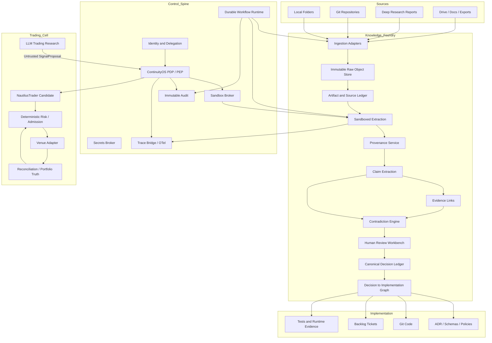

# MAWorld Canonical Synthesis v1.1
## Knowledge Foundry + ContinuityOS Control Spine + Trading Cell

**Status:** Architecture synthesis after three Deep Research reports  
**Date:** 2026-07-15  
**Decision:** **NARROW AND BUILD**  
**Authority:** Human Sovereign  
**Canonicality:** Candidate Canon — requires owner approval before `BUILD_FREEZE_V1`

---

# 0. Source Provenance

This synthesis merges three independent research outputs:

1. `Knowledge Foundry Architecture Design.docx`
2. `Trading System Architecture Analysis.docx`
3. `deep-research-report (2)(1).md` — ContinuityOS Control Spine Delta Study

The reports are not merged literally. Their claims are classified as:

- **ACCEPT** — compatible and sufficiently supported for the current architecture;
- **ADAPT** — useful pattern, but the original implementation or scope is modified;
- **HOLD** — requires benchmark, official verification, or an implementation spike;
- **REJECT** — conflicts with stronger invariants or creates unjustified complexity.

---

# 1. Executive Verdict

MAWorld should be built as three coordinated but separately owned systems:

1. **Knowledge Foundry** — receives chaotic information incrementally, preserves provenance, extracts claims, detects contradictions, and creates explicit canonical decisions.
2. **ContinuityOS Control Spine** — owns identity, delegated authority, policy enforcement, durable workflow mediation, secrets, budgets, audit, sandbox routing, and Safe Mode.
3. **Trading Cell** — uses a deterministic trading engine and venue truth, while all LLM analysis remains off the live hot path.

The combined architecture is viable for a single owner if the first build remains narrow:

```text
Knowledge Intake
→ Claim / Evidence / Contradiction
→ Canonical Decision
→ Durable Controlled Action
→ Verified Artifact
→ Implementation Link
```

The first construction target is **not live trading**. It is a Knowledge Foundry vertical slice integrated with one controlled execution workflow:

```text
Drop File
→ Immutable Raw Storage
→ Parse / Extract
→ Claims / Evidence
→ Human Review
→ Canonical Decision
→ Create Ticket
→ Controlled Tool Execution
→ Verification
→ Audit Trace
```

Trading starts as a separate **paper-only falsification track** after the knowledge and control foundation is operational.

---

# 2. Canonical System Boundaries

## 2.1 Knowledge Foundry

Owns:

- artifact intake;
- immutable raw-object references;
- source observations;
- artifact versions and derivatives;
- extraction records;
- provenance;
- claims;
- evidence links;
- contradiction records;
- open questions;
- canonical decisions;
- supersession records;
- research runs;
- ADR/ticket/code/test/deployment mappings.

Does not own:

- agent private memory;
- workflow execution authority;
- secrets;
- trading positions;
- external side effects.

## 2.2 ContinuityOS Control Spine

Owns:

- human and workload identity;
- delegated authority;
- capability checks;
- ActionSpec validation;
- policy decision and enforcement;
- approvals;
- secret brokering;
- provider routing constraints;
- quota and budget controls;
- external effect registry;
- immutable security/audit events;
- sandbox selection;
- Global Safe Mode.

Does not own:

- the semantic truth of project claims;
- private LifeOS memories;
- exchange truth;
- all durable workflow state as a monolith.

## 2.3 Workflow Runtime

Owns:

- durable task state;
- workflow IDs;
- retries and timeouts;
- checkpoints;
- durable timers;
- task leases;
- recovery;
- non-destructive forks;
- orchestration of external-effect reconciliation.

## 2.4 Evidence Engine

Owns:

- claim verification;
- acceptance criteria;
- regression fixtures;
- reproducible checks;
- evidence-quality status;
- verification results.

Audit answers **what happened**. Evidence answers **whether the claim or result is valid**.

## 2.5 Trading Cell

Owns:

- market data normalization;
- strategy runtime;
- venue adapters;
- execution commands;
- exchange-event ingestion;
- reconciliation;
- portfolio projection;
- deterministic risk state;
- order admission;
- local kill switch.

LLMs may propose research hypotheses but never own order admission, risk, portfolio state, or venue truth.

## 2.6 LifeOS Boundary

LifeOS may own:

- agent identity narrative;
- private and relational memory;
- lifecycle;
- skills;
- routines;
- evolution proposals.

LifeOS may read approved Foundry knowledge. It may not directly promote private beliefs into project canon or bypass ContinuityOS.

---

# 3. Canonical Reference Architecture



---

# 4. Storage and Runtime Decisions

## 4.1 PostgreSQL — ACCEPT

Use PostgreSQL as the primary transactional system for:

- Knowledge Foundry metadata;
- artifact/source observations;
- provenance relations;
- claims and evidence;
- contradictions;
- canonical decisions;
- research-run metadata;
- implementation mappings;
- Control Spine durable metadata;
- DBOS workflow tables if DBOS is selected.

Extensions for MVP:

- `pg_trgm`;
- PostgreSQL full-text search;
- `pgvector` only as a derived semantic index;
- Row Level Security where project isolation is required.

### Correction

The embedding generation step must **not** be coupled into the same database transaction as raw-file ingestion when the embedding is created through an external model call.

Use:

```text
Raw Ingestion Transaction
→ durable extraction job
→ claim transaction
→ embedding/index job
```

The raw artifact and its provenance must succeed even when extraction or embedding fails.

## 4.2 Raw Object Storage — ACCEPT WITH ADAPTER

Use a content-addressed `ObjectStore` interface.

MVP implementations:

- local filesystem CAS for the smallest development setup; or
- MinIO when S3-compatible APIs and object versioning are immediately useful.

Canonical rule:

- the object store holds immutable bytes;
- PostgreSQL holds identity, source observations, relationships, and decisions;
- deletion at the source creates a provenance event, not deletion of the preserved raw artifact.

## 4.3 pgvector — ADAPT

Use pgvector for:

- candidate duplicate search;
- semantic retrieval;
- contradiction candidate generation.

Do not use it for:

- authoritative identity;
- canonical decisions;
- automatic contradiction verdicts.

Thresholds such as `0.98 similarity` are heuristics and must be calibrated, not frozen as universal rules.

## 4.4 Durable Runtime — ACCEPT DBOS AS MVP CANDIDATE

Use a `DurableRuntimeAdapter` with:

- **DBOS + PostgreSQL** as the first implementation candidate;
- **Temporal** as the migration target if workflow complexity or multi-language operation grows;
- Restate retained as an alternative;
- NATS retained only as optional event transport.

The custom MAWorld layer still owns:

- WorkflowBranch;
- ExternalEffectRecord;
- branch comparisons;
- canonical promotion;
- effect reconciliation.

## 4.5 Agent Harness — ACCEPT THIN CUSTOM HARNESS

Use a thin MAWorld harness with provider adapters.

Provider SDKs may be used as adapters, but may not define:

- authority;
- durable state;
- handoff security;
- canonical memory;
- policy semantics.

## 4.6 Observability — ADAPT

Canonical minimum:

- internal stable `TraceContext`;
- OpenTelemetry Collector;
- self-hosted Langfuse as the first operator trace surface.

Phoenix is a later evaluation option.

Do not store or claim access to hidden model chain-of-thought. Store only:

- prompts where policy permits;
- outputs;
- structured decisions;
- tool calls;
- model/provider metadata;
- tokens and cost;
- safe reasoning summaries;
- trace and evidence links.

## 4.7 Secrets — ACCEPT

MVP:

- Infisical for runtime secret brokering;
- SOPS + age for bootstrap and Git-managed encrypted configuration.

Later migration candidates:

- Vault;
- SPIFFE/SPIRE for larger distributed estates.

## 4.8 Sandboxing — ADAPT TIERED MODEL

Canonical tiers:

- Tier 0: no execution;
- Tier 1: restricted process or WASM/WASI;
- Tier 2: rootless OCI + gVisor on Linux;
- Tier 3: Firecracker only after KVM feasibility, or managed E2B;
- Tier 4: dedicated/GPU worker such as Modal.

Knowledge Foundry parsing:

- TXT/Markdown and simple trusted formats may use a restricted low-risk parser path;
- complex or untrusted Office/PDF/archive files route through Tier 2;
- Tier 3 is reserved for high-risk parsers or hostile inputs after feasibility proof.

The Knowledge Foundry report’s blanket “MicroVM for every parser” is narrowed because it adds unnecessary operational burden.

---

# 5. Knowledge Foundry Canonical Design

## 5.1 Artifact Model Correction

Separate four concepts:

### ContentBlob

Immutable byte content, addressed by SHA-256.

### SourceObservation

A statement that a source system exposed this content at a path/ID/time.

### LogicalDocument

A human/project-level concept linking versions and format variants.

### ArtifactVersion

A version or derivative of a LogicalDocument.

This avoids the ambiguity in which an exact duplicate either creates a new artifact or is discarded.

Canonical behavior:

- same hash, same or different source → reuse `ContentBlob`, create/update `SourceObservation`;
- changed bytes → new `ContentBlob`;
- same logical work in DOCX and Markdown → separate blobs linked as derivatives/representations;
- copied old file with new timestamp → new observation, not a new logical version automatically.

## 5.2 Provenance

Adopt W3C PROV concepts pragmatically:

- Entity;
- Activity;
- Agent.

Do not require a full semantic ontology engine in MVP.

Every derived object stores:

- source object IDs;
- activity type;
- parser/model/provider;
- prompt version;
- code version;
- created time;
- content hash;
- data class;
- reviewer and decision.

## 5.3 Claim / Evidence / Decision

Canonical separation:

```text
Document
→ Claim
→ EvidenceLink
→ VerificationResult
→ CanonicalDecision
```

A source can support a claim without making it canonical.

## 5.4 Contradictions

Automated detection creates candidates only.

Contradiction verdicts require:

- deterministic schema checks;
- source excerpts;
- temporal validity checks;
- human or policy review.

Code/document mismatch remains open until the owner chooses:

- update canon to implementation; or
- create a correction ticket for implementation.

## 5.5 Canonicalization

Canonical state machine:

```text
RAW
→ PARSED
→ CLAIMS_EXTRACTED
→ REVIEW_REQUIRED
→ ACCEPTED_AS_EVIDENCE
→ CANDIDATE_CANON
→ CANONICAL
→ SUPERSEDED / STALE / QUARANTINED / ARCHIVED
```

Canonicalization is an explicit signed mutation mediated by ContinuityOS.

## 5.6 ResearchRun

Every Deep Research run becomes a first-class artifact with:

- exact task ID and prompt;
- context manifest;
- attached artifact hashes;
- model/provider;
- raw result;
- source ledger;
- claim extraction;
- task-compliance verdict;
- decision delta;
- unresolved questions;
- review decision.

A wrong-task result is preserved but marked `REJECTED_FOR_TASK`, not deleted.

---

# 6. Control Spine Canonical Design

## 6.1 Identity Layers

Separate:

- HumanIdentity;
- AgentIdentity;
- WorkloadIdentity;
- ProviderBinding;
- DelegationGrant;
- CapabilityToken;
- ArtifactSigningIdentity.

Agent ID or prompt text is not an authorization credential.

## 6.2 Action Path

```text
Intent
→ Task
→ Delegation
→ ActionSpec
→ ContinuityOS Policy Decision
→ Sandbox / Tool Adapter
→ ExternalEffectRecord
→ Verification
→ Audit
```

## 6.3 Policy Semantics

- **ALLOW** — execute within current authority;
- **WARN** — execute and surface warning;
- **HOLD** — no side effect until approval, evidence, or reconciliation;
- **DENY** — reject and audit.

Unknown protocol versions, ambiguous external states, and scope expansion default to HOLD or DENY.

## 6.4 MCP

The report’s future-dated MCP claims remain provisional.

Canonical rule:

- implement protocol-version gating;
- canonicalize headers;
- bind resource/audience/scope to ActionSpec;
- reject unknown or spoofed security-relevant headers;
- persist async task handles;
- reconcile async completion to original authorization.

Do not freeze behavior based on a future or unarchived specification.

## 6.5 Safe Mode

Global Safe Mode:

- blocks new external side effects;
- revokes delegations;
- freezes new workflow leases;
- preserves read-only research;
- preserves Foundry search and audit;
- allows only explicitly authorized protective trading operations.

---

# 7. Trading Cell Canonical Design

## 7.1 NautilusTrader — ADAPT, NOT UNCONDITIONAL ADOPT

NautilusTrader is the leading implementation candidate because the report identifies:

- Rust/Python architecture;
- fixed-point primitives;
- shared backtest/live strategy model;
- adapters;
- execution and reconciliation capabilities.

However, integration must begin with a spike, not immediate full adoption.

Required proof:

1. compile and run the selected current release;
2. implement one paper/testnet venue adapter path;
3. prove crash recovery without duplicate external effects;
4. prove ContinuityOS can remain the final policy boundary;
5. prove MAWorld RiskService can remain authoritative;
6. inspect known reconciliation limitations;
7. measure actual operational burden.

## 7.2 Venue Selection — HOLD

The report recommends Hyperliquid and Binance TH, but several regulatory and accessibility conclusions rely partly on secondary sources.

Canonical decision:

- Hyperliquid Testnet may be evaluated as a paper-testing target;
- no real-money primary venue is selected yet;
- legal availability, terms, API stability, account restrictions, and official venue support require a dedicated current verification before live use;
- VPN-based access is not an accepted production design.

## 7.3 Market Data — ADAPT

ArcticDB is a strong candidate for:

- point-in-time research data;
- versioned DataFrame workflows;
- LLM look-ahead controls.

Nautilus ParquetDataCatalog is a candidate for engine-native backtests.

Before freezing ArcticDB, run a local comparison against:

- Parquet + DuckDB;
- Nautilus DataCatalog;
- PostgreSQL/Timescale where necessary.

The evaluation must include:

- bitemporal semantics;
- corrections;
- replay;
- storage size;
- backup;
- operational recovery;
- actual 100GB-scale behavior.

## 7.4 Look-Ahead Controls — ACCEPT

LLM trading outputs are research hypotheses only.

Required record:

- source data snapshot;
- `as_of` timestamp;
- retrieval cutoff;
- prompt hash;
- model/provider/version;
- code version;
- entity masking configuration;
- walk-forward split;
- evaluation result.

Anonymizing tickers may be tested, not assumed universally sufficient.

## 7.5 TradingAgents — ADAPT

Reuse:

- specialized analyst roles;
- independent analyses;
- Bull/Bear challenge;
- structured outputs.

Reject:

- LLM-owned portfolio management;
- LLM-owned risk approval;
- direct order authority.

## 7.6 Reconciliation — ACCEPT AS CENTRAL INVARIANT

Canonical truth path:

```text
Venue Events
→ Execution Ledger
→ Reconciliation
→ Portfolio Projection
→ Risk Snapshot
→ Order Admission
```

Nautilus reconciliation may implement parts of this, but exchange truth and the MAWorld ExternalEffectRecord remain explicit.

## 7.7 Hot Path — REJECT PREMATURE NATS/SBE LOCK-IN

The Trading report freezes NATS JetStream and SBE too early and even calls NATS a monopoly transport.

Canonical decision:

- inside final order admission: direct in-process calls and atomic kill-switch reads;
- message broker is never authoritative venue/order state;
- NATS may be used outside the local core for control events, telemetry, and asynchronous work;
- JSON is allowed outside bounded hot paths;
- binary serialization is selected only after a real process boundary and benchmark justify it;
- SBE remains a candidate, not a frozen dependency.

## 7.8 Risk Parameter Correction

The report hard-codes `risk_per_trade = 1%`.

Canonical status:

- `maximum_total_drawdown = 10%` — candidate from owner context;
- `maximum_trades_per_day = 20` — candidate;
- `three_consecutive_losses → one-hour pause` — candidate;
- `risk_per_trade` — **OPEN OWNER DECISION**;
- all limits must be configuration values with signed versions, not hard-coded constants.

---

# 8. Contradiction Resolution Matrix

| Topic | Knowledge Foundry | Trading Report | Control Spine | Canonical Resolution |
|---|---|---|---|---|
| Primary database | PostgreSQL + pgvector | domain-specific ArcticDB/Nautilus catalogs | DBOS + PostgreSQL | PostgreSQL for project/control state; trading data may use specialized storage after spike |
| Raw storage | MinIO | not central | not central | ObjectStore adapter; local CAS or MinIO |
| Workflow runtime | generic workflow runtime | trading engine workflows | DBOS now, Temporal later | DBOS candidate behind adapter |
| Parser isolation | MicroVM broadly | containers for research | tiered gVisor/Firecracker/E2B | tiered sandbox; Tier 2 default |
| Observability | Langfuse/Phoenix | SQLite decision logs | OTel + Langfuse | internal TraceContext + OTel + Langfuse |
| Knowledge graph | Postgres recursive CTE | no project graph | Postgres state | Postgres relational graph for MVP |
| NATS | not required | mandatory monopoly bus | optional transport | HOLD; no bus inside admission core |
| SBE | not required | mandatory binary everywhere in Trading | not required | benchmark-gated candidate |
| NautilusTrader | outside scope | unconditional adopt | outside scope | leading candidate requiring integration spike |
| Hyperliquid | outside scope | primary venue | outside scope | Testnet candidate; real venue HOLD |
| ArcticDB | outside scope | unconditional adopt | outside scope | strong candidate; benchmark before freeze |
| Risk 1% | outside scope | hard-coded | policy-configured state | OPEN OWNER DECISION |
| Memory ownership | Foundry canon separate from LifeOS | SQLite audit/provenance references | governed memory + policy | Foundry owns project canon; LifeOS owns private memory |
| Chain-of-thought tracing | report implies visibility | not central | safe OTel traces | hidden CoT must not be stored or required |

---

# 9. Canonical Decision Ledger

## ACCEPT

- immutable raw artifacts;
- source text is untrusted data, not instruction;
- PostgreSQL as the initial transactional core;
- vector index as derived state;
- explicit Claim / Evidence / Decision separation;
- contradiction records;
- canonical decision supersession;
- Decision → ADR → Ticket → Commit → Test mapping;
- DBOS as first workflow-runtime candidate behind adapter;
- thin custom provider harness;
- OTel + Langfuse;
- Infisical + SOPS/age;
- tiered sandboxing;
- NautilusTrader as first Trading engine candidate;
- deterministic reconciliation and order admission;
- paper-only initial trading work.

## ADAPT

- MinIO behind ObjectStore abstraction;
- W3C PROV semantics without full ontology engine;
- FEVER-like claim model;
- pgvector heuristic candidate generation;
- ArcticDB for point-in-time research;
- TradingAgents analyst roles;
- provider SDKs as adapters;
- Firecracker/E2B/Modal by sandbox tier.

## HOLD

- NATS selection;
- SBE selection;
- real-money venue;
- Hyperliquid legal/operational suitability;
- `risk_per_trade`;
- MCP future-spec details;
- full microVM parser default;
- Phoenix addition;
- Temporal migration;
- Daytona;
- exact monthly cost forecast.

## REJECT

- LLM as authoritative state;
- provider response ID as workflow state;
- vector DB as canonical truth;
- document prompt as active instruction;
- automatic canonicalization;
- silent conflict merge;
- exact duplicate blob duplication;
- full-history agent handoff by default;
- custom generic MPMC queue;
- hard-coded risk settings;
- NATS as authoritative live order state;
- mandatory SBE before benchmark;
- storing hidden chain-of-thought.

---

# 10. Integrated MVP

## 10.1 Platform MVP — First Priority

```text
Drop File
→ SHA-256 and Raw Store
→ SourceObservation and Artifact Record
→ Tiered Extraction
→ Claim Extraction
→ Evidence / Contradiction Candidates
→ Human Review
→ CanonicalDecision
→ ADR / Backlog Link
→ Controlled Tool Action
→ VerificationResult
→ Trace + Audit
```

Seed:

- Knowledge Foundry report;
- Trading report;
- Control Spine report;
- one ContinuityOS code file;
- one schema.

The system should surface the contradictions resolved in this document automatically.

## 10.2 Trading Spike — Parallel but Separate

Paper-only:

```text
Point-in-Time Dataset
→ LLM Research Hypothesis
→ deterministic validation
→ Nautilus strategy candidate
→ ContinuityOS / Risk gate
→ testnet or emulator
→ reconciliation
→ evidence report
```

Do not require NATS or SBE for the first spike unless the architecture actually crosses a measured process boundary.

---

# 11. Canonical Monorepo

```text
/maworld
  /apps
    /operator-workbench
    /telegram-gateway

  /services
    /knowledge-foundry-api
    /ingestion-worker
    /extraction-worker
    /claim-engine
    /contradiction-engine
    /canonical-engine
    /evidence-engine
    /workflow-runtime
    /continuity-gateway
    /identity
    /secrets-broker
    /sandbox-broker
    /trace-bridge

  /domain-cells
    /trading
      /research
      /nautilus-adapter
      /risk
      /order-admission
      /venue-adapters
      /reconciliation
      /benchmarks
    /frontier-lab
    /money-forge

  /packages
    /contracts
    /provider-adapters
    /tool-adapters
    /policy-client
    /object-store
    /provenance
    /telemetry
    /test-fixtures

  /infrastructure
    /compose
    /postgres
    /object-store
    /langfuse
    /infisical
    /sandbox-workers

  /docs
    /adr
    /canon
    /research-runs
    /architecture

  /tests
    /e2e
    /security
    /failure-injection
    /regression
```

---

# 12. First 24 Build Tickets

## Foundation

1. `INFRA-001` PostgreSQL + extensions.
2. `INFRA-002` ObjectStore adapter with local CAS and MinIO implementation.
3. `SCHEMA-001` ContentBlob / SourceObservation / LogicalDocument / ArtifactVersion.
4. `SCHEMA-002` ProvenanceRecord / ExtractionRecord.
5. `SCHEMA-003` Claim / EvidenceLink / VerificationResult.
6. `SCHEMA-004` ContradictionRecord / OpenQuestion.
7. `SCHEMA-005` CanonicalDecision / SupersessionRecord.
8. `SCHEMA-006` ImplementationLink / ADRReference / BacklogReference.
9. `SCHEMA-007` ResearchRun / ContextManifest / DecisionDelta.

## Intake

10. `INGEST-001` Local Folder Connector.
11. `INGEST-002` Git Connector.
12. `EXTRACT-001` Tier classifier.
13. `EXTRACT-002` restricted TXT/Markdown parser.
14. `EXTRACT-003` gVisor/OCI document parser.
15. `SEC-001` secret scan before provider routing.

## Knowledge and Review

16. `CLAIM-001` structured claim extraction.
17. `DUP-001` exact duplicate clustering.
18. `DUP-002` near-duplicate candidate generation.
19. `CONFLICT-001` contradiction candidate engine.
20. `CANON-001` explicit canonicalization state machine.
21. `UI-001` Inbox and artifact detail.
22. `UI-002` side-by-side contradiction review.

## Control

23. `WF-001` DurableRuntimeAdapter + DBOS spike.
24. `COS-001` one ActionSpec → ALLOW/HOLD/DENY → verified tool workflow.

Trading tickets begin only after tickets 1–24 produce a working control-and-knowledge vertical slice.

---

# 13. Seven-Day Build Plan

## Day 1

- repository bootstrap;
- PostgreSQL;
- base migrations;
- ObjectStore abstraction;
- raw file hashing.

## Day 2

- Local Folder Connector;
- ContentBlob and SourceObservation;
- idempotent duplicate ingestion.

## Day 3

- restricted extraction worker;
- provenance records;
- one DOCX/PDF parser in Tier 2.

## Day 4

- claim extraction;
- exact excerpts;
- EvidenceLink;
- unsupported claims remain PROPOSED.

## Day 5

- contradiction candidates;
- CanonicalDecision lifecycle;
- one decision linked to an ADR and ticket.

## Day 6

- DBOS runtime spike;
- ContinuityOS ActionSpec gate;
- gVisor tool worker;
- crash recovery test.

## Day 7

- integrated demo;
- Langfuse trace;
- immutable audit;
- seed the three source reports;
- produce automated DecisionDelta.

---

# 14. Acceptance Gates

## Knowledge Foundry

- raw bytes always recoverable;
- exact duplicates reuse ContentBlob;
- every derived claim links to exact source excerpt;
- at least three contradictions from the seed reports are surfaced;
- canon requires explicit approval;
- supersession preserves history;
- semantic index rebuilds from relational state.

## Control Spine

- orchestrator crash does not duplicate side effect;
- secret is not exposed to model context;
- unknown/expired authority is denied;
- tool action has ActionSpec, policy decision, trace, evidence, and audit;
- Safe Mode blocks new side effects.

## Trading Spike

- no live funds;
- no LLM directly creates executable order;
- venue/execution ambiguity produces HOLD;
- risk settings are versioned configuration;
- crash/restart does not duplicate testnet order intent;
- point-in-time inputs are reproducible.

---

# 15. Open Owner Decisions

1. Approve PostgreSQL as the common MAWorld transactional substrate.
2. Local CAS first or MinIO from Day 1.
3. Approve DBOS integration spike.
4. Approve Infisical for runtime secrets.
5. Confirm whether Langfuse self-hosting burden is acceptable for MVP.
6. Define actual `risk_per_trade` policy separately.
7. Decide whether Trading spike runs immediately in parallel or after Foundry vertical slice.
8. Approve Knowledge Foundry as the first product constructed.

---

# 16. Final Build Decision

**NARROW AND BUILD.**

Build order:

```text
Knowledge Foundry Core
→ Control Spine Workflow
→ Evidence and Operator Review
→ Seed Corpus Canonicalization
→ Paper Trading Integration Spike
→ LifeOS
→ Frontier Lab and Money Forge
```

The architecture is coherent enough to begin construction without collecting the whole archive first.

The first repository action:

```bash
mkdir -p maworld/{apps,services,domain-cells,packages,infrastructure,docs/adr,docs/canon,docs/research-runs,tests}
```
