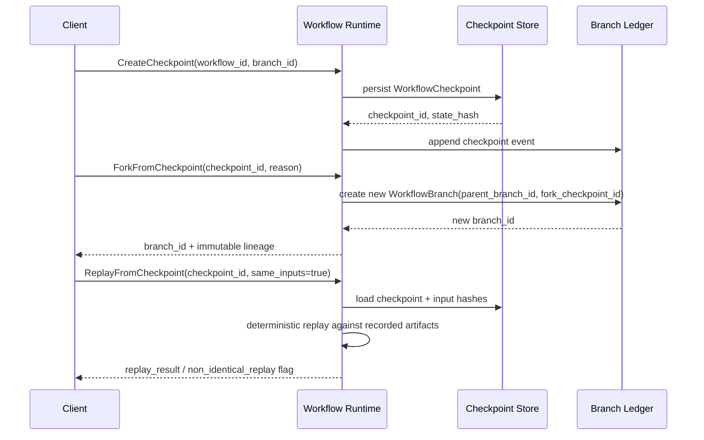
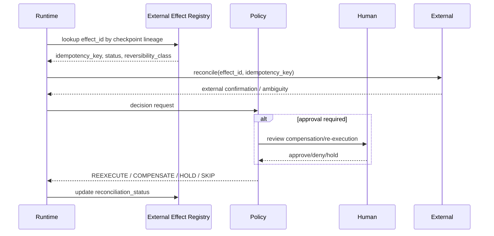
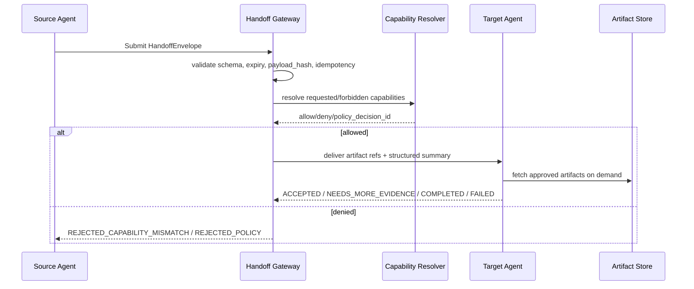
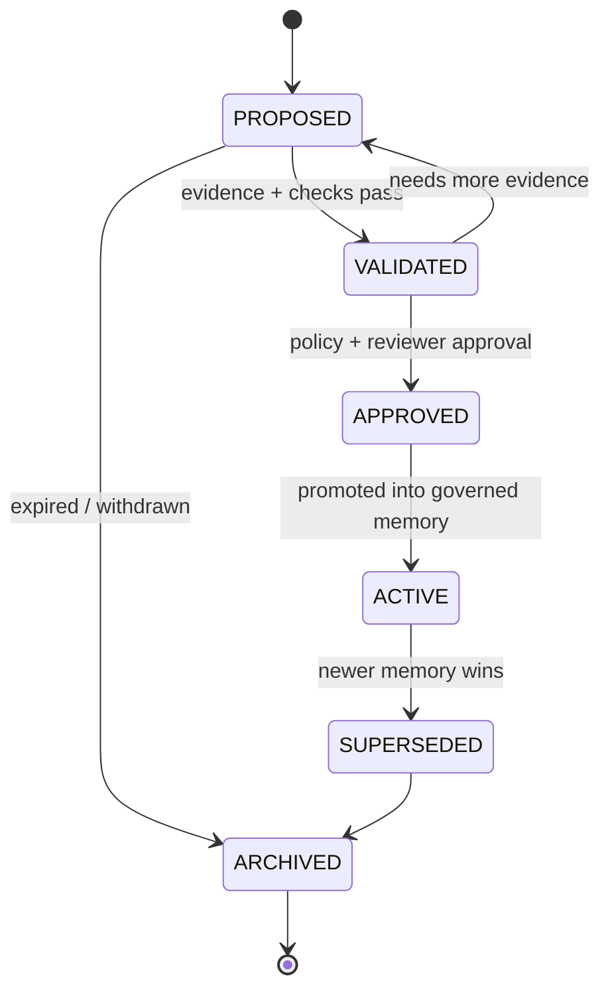
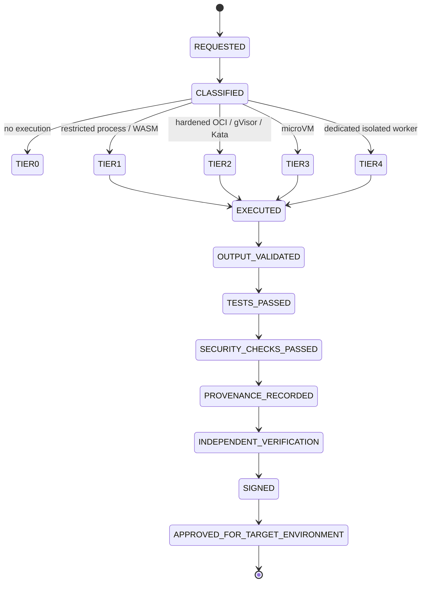
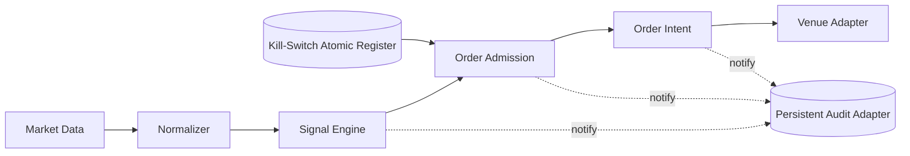
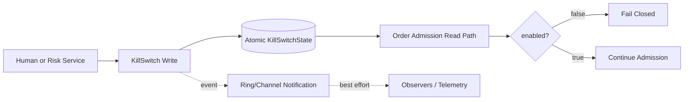

# Competitive Primitives Delta Study

| Claim | Source system | Official evidence | Verified status | Correction | Confidence |
|---|---|---|---|---|---|
| LangGraph checkpointers persist thread-scoped graph state and are intended for conversation continuity, human-in-the-loop, time travel, and fault tolerance; stores are separate cross-thread durable memory. | LangGraph | LangGraph documents persistence as two distinct systems: **checkpointers** for short-term thread state and **stores** for long-term data across threads. citeturn74view0turn74view1 | VERIFIED | Для ContinuityOS это должен быть **двухконтурный primitive**: checkpoint-ledger отдельно от governed memory store. | 0.95 |
| Temporal replay resumes from Event History, while reset resumes a workflow from a chosen point in history; signals are durably written to history. | Temporal | Temporal defines Event History as a durable log used for replay and recovery, describes replay as command checking against existing history, documents `workflow reset`, and writes Signals into History. citeturn68view0turn69view1turn73view1turn73view3 | VERIFIED | В delta-пакете reset допустим только как **non-destructive branch/restart primitive**, а не как rollback внешнего мира. | 0.96 |
| OpenAI handoffs are represented to the model as tools, but “agents as tools” and “handoffs” are different orchestration patterns with different ownership semantics. | OpenAI Agents SDK | OpenAI documents that handoffs are represented as tools, and separately distinguishes **Agents as tools** from **Handoffs** in orchestration patterns. citeturn53view0turn53view1turn54view0 | VERIFIED | Для Capability-Scoped Artifact Handoff authority нельзя выводить из самого факта handoff; нужны отдельные capability/policy checks. | 0.97 |
| Claude subagents start with a fresh isolated context by default; fork is the exception and inherits the parent conversation. | Claude Code | Anthropic states that each subagent runs in its own context window and starts with a fresh, isolated context; a fork inherits the entire conversation. citeturn55view1turn55view0 | VERIFIED | Полный shared chat history не должен быть default-mode handoff; default — artifact pointers + structured summary. | 0.95 |
| A2A is an agent-to-agent interoperability protocol, not an agent-building framework, not a sub-agent protocol, and not a replacement for MCP. | A2A Protocol | A2A official docs state it is an open protocol for agent interoperability, complementary to MCP, and explicitly “not” an agent development kit or sub-agent/tool-call protocol. citeturn76view0 | VERIFIED | A2A годится как **external federation boundary**, но не как внутренняя handoff-semantic core для ContinuityOS. | 0.94 |
| Firecracker is a Linux/KVM microVM VMM with minimal device model, REST control API, seccomp filters, and a jailer that applies cgroup/namespace isolation and drops privileges. | Firecracker | AWS Firecracker’s official site and GitHub repo describe KVM-based microVMs, the minimal device model, REST API, seccomp, and the jailer isolation process. citeturn27view0turn28view1turn28view2turn28view3 | VERIFIED | Firecracker — это **Tier 3 candidate**, но не universal default; он требует Linux host/KVM feasibility. | 0.97 |
| Firecracker improves isolation relative to ordinary containers, but is not a complete answer to side-channel risk; host hardening and placement assumptions matter. | Firecracker | Firecracker positions itself as enhanced isolation over containers, while published security research found limited protection against some Spectre/MDS-style microarchitectural attacks. citeturn27view0turn25academia2 | VERIFIED WITH CAVEAT | В delta-пакете Firecracker нельзя маркировать как “zero-risk sandbox”; требуется risk tiering + host hardening checklist. | 0.84 |
| gVisor is an application-kernel sandbox; Systrap works without hardware virtualization and is suitable inside VMs, while KVM mode requires virtualization support and is slower under nested virtualization. | gVisor | gVisor’s security guide and platform docs describe the Sentry model, Systrap’s seccomp-based interception without virtualization, and KVM mode with nested-virtualization tradeoffs. citeturn32view0turn31view0 | VERIFIED | Для Windows/WSL/VPS mixed estate gVisor — практичнее как Tier 2 adapter, чем обязательный Firecracker everywhere. | 0.96 |
| The Disruptor is a sequencing-based inter-thread messaging framework born from reducing queue contention; its speed claims are real but benchmark-context-specific. | LMAX Disruptor | LMAX’s docs and technical paper describe single-writer/sequencing motivations, queue contention costs, and performance figures relative to queue-based pipelines. citeturn45view0turn45view1 | VERIFIED | Для Trading Cell принимать ring-buffer только **benchmark-gated**, а не как default architecture fashion. | 0.95 |
| MemGPT’s strongest transferable primitive is virtual-context management across memory tiers, not unrestricted self-authoring of truth. | MemGPT | MemGPT frames long-context management as an OS-like hierarchical memory problem and explicitly proposes virtual context management across memory tiers. citeturn59academia2 | VERIFIED | Для governed memory paging надо брать tiering idea, но authoritative state держать вне agent memory. | 0.93 |
| Indexed public evidence for detailed Letta memory-block semantics was incomplete in this pass; available public reporting indicates memory-block style shared updates in production narratives, but not enough to make Letta the primary normative contract source. | Letta | Public reporting describes large-scale agents and shared memory-block updates, but the required indexed official docs for block semantics were not reliably retrievable here. citeturn62news0 | PARTIAL | Использовать Letta only as inspiration; normative contract строить на governed promotion lifecycle, not vendor semantics. | 0.51 |
| Indexed official evidence for specific Google ADK “agent transfer” semantics and Microsoft Agent Framework workflow-transition semantics was insufficient in this pass; neither should be the primary semantic anchor for internal handoffs without repo-level verification. | Google ADK / Microsoft Agent Framework | Publicly accessible indexed material confirms ADK and Microsoft Agent Framework ecosystem relevance, but not enough official, line-level transfer semantics for normative adoption in this pass. citeturn58news1turn77news1turn76view0 | PARTIAL | Treat both as comparison points, not contract sources, until repo/doc verification is completed. | 0.44 |
| Managed sandboxes such as E2B and Daytona should be treated as provider adapters, not as isolation mechanisms in themselves. | E2B / Daytona | Public indexed official docs were not sufficiently retrievable here; independent comparative research references E2B as a system-level baseline, but that does not collapse provider layer and mechanism layer into one thing. citeturn40academia1 | PARTIAL | In the architecture, separate **sandbox mechanism**, **sandbox provider**, and **sandbox adapter** as distinct concerns. | 0.57 |

Проверка по внешним источникам подтверждает базовые primitives у LangGraph, Temporal, OpenAI Agents SDK, Claude Code, A2A, Firecracker, gVisor и LMAX. По Letta, Google ADK, Microsoft Agent Framework, E2B и Daytona публично индексируемой официальной детализации оказалось недостаточно, поэтому ниже они используются только как слабые comparative references, а не как contract sources. citeturn74view0turn68view0turn54view0turn55view1turn76view0turn27view0turn32view0turn45view1

## Primitive adoption matrix and verdicts

| Primitive | Adopt/Adapt/Reject | Plane | MVP status | Dependencies | Main risk | Final status |
|---|---|---|---|---|---|---|
| Immutable Workflow Branching and Replay | **ADAPT** | Control plane + research plane + strategy promotion plane | **MVP** | Checkpoint store, branch ledger, effect registry, policy/version stamps | mistaken rollback semantics for external side effects | **GO** |
| Capability-Scoped Artifact Handoffs | **ADAPT** | Control plane + research/validation collaboration | **MVP** | Agent Registry, Capability Registry, Artifact Store, Policy Engine | handoff envelope accidentally becomes authority token | **GO** |
| Governed Memory Paging | **ADAPT** | Control plane + research plane | **Reduced MVP** | Memory service, validation workflow, policy store, provenance graph | agents self-promote speculation into “truth” | **NARROW** |
| Risk-Tiered Sandbox Execution | **ADAPT** | Control plane + execution plane adapters | **MVP ONLY after feasibility spike** | Sandbox broker, provider adapters, image signing/SBOM, evidence collector | over-trusting one runtime across heterogeneous hosts | **GO with provider HOLD** |
| Benchmark-Gated Hot-Path Transport | **BENCHMARK BEFORE ADOPTION** | **TRADING PLANE ONLY** | **DEFER from first MVP** | topology map, perf harness, kill-switch atomic state, idempotent admission | adopting lock-free complexity without measured bottleneck | **HOLD** |

**Immutable Workflow Branching and Replay**

**Decision:** ADAPT.  
**Evidence:** LangGraph already separates short-term thread checkpoints from long-term stores and explicitly cites time travel and fault tolerance as checkpoint use-cases. Temporal proves the stronger production pattern: recovery and reset are anchored in durable Event History and replay, not destructive rollback. citeturn74view0turn68view0turn69view1turn73view1  
**Assumptions:** ContinuityOS already has a durable workflow/task identity; target planes need reproducibility for research, approvals, and strategy promotion, but not retroactive mutation of reality.  
**Risks:** The main failure mode is semantic drift: operators may read “replay” or “reset” as “undo,” especially after irreversible side effects such as orders, payments, or messages. Temporal’s own model does not make that claim; reset only resumes from history. citeturn73view1turn73view3  
**Alternatives:** ADOPT DIRECTLY from Temporal semantics would be closest operationally, but Temporal’s runtime model is heavier than a minimal branch ledger. LangGraph-like checkpointer alone is too weak, because external side-effect reconciliation is not its core concern.  
**Confidence:** 0.95.  
**Acceptance Test:** `ForkFromCheckpoint` preserves the original branch untouched; `ReplayFromCheckpoint` refuses to re-execute any external side effect unless idempotency, reconciliation, and policy checks all pass.  
**Revisit Trigger:** any evidence that workflow-scale branch storage or branch diffs become a material latency/storage bottleneck in Trading Cell promotion flows.

**Capability-Scoped Artifact Handoffs**

**Decision:** ADAPT.  
**Evidence:** OpenAI’s SDK shows that handoffs are delegation tools, while “agents as tools” is a distinct bounded-subtask pattern where the manager keeps control of the conversation. Claude subagents reinforce the same design lesson from another angle: fresh isolated context is the default, and full-history inheritance is the exceptional fork mode. A2A strengthens the boundary model by treating agents as opaque peers and explicitly refusing to define sub-agent/tool-call semantics. citeturn53view0turn54view0turn55view1turn55view0turn76view0  
**Assumptions:** Internal agents in ContinuityOS are permissioned independently; artifact store supports content hashing and provenance; some handoffs cross model/provider boundaries.  
**Risks:** If the handoff envelope is allowed to smuggle authority, the system will collapse least-privilege boundaries. OpenAI’s docs describe delegation mechanics, not independent authorization; A2A likewise focuses on interoperability, not automatic privilege transfer. citeturn53view0turn54view0turn76view0  
**Alternatives:** Full conversation transfer by default is operationally convenient but context-expensive, privacy-risky, and contradicts the observed strengths of isolated subagent models. A pure stateless RPC handoff also fails because durable task state and provenance matter.  
**Confidence:** 0.96.  
**Acceptance Test:** a target agent with no matching registered capabilities receives `REJECTED_CAPABILITY_MISMATCH`; a target agent can complete a bounded task from artifact pointers plus structured summary without needing source chat history.  
**Revisit Trigger:** repeated `NEEDS_MORE_EVIDENCE` loops above an agreed threshold, indicating the default evidence package is too thin.

**Governed Memory Paging**

**Decision:** ADAPT, reduced MVP.  
**Evidence:** LangGraph sharply separates thread checkpoints from cross-thread stores, which is the correct engineering seam for “working memory” versus durable knowledge. MemGPT contributes the deeper transferable idea: hierarchical or virtual context management that pages information between fast and slow tiers rather than pretending one window is enough. Public reporting around Letta suggests operational use of shared memory-block updates, but the indexed official semantics were not strong enough here to turn that into the normative contract. citeturn74view0turn59academia2turn62news0  
**Assumptions:** authoritative state for portfolio, risk, budget, policy, and approvals already belongs to separate services and should stay there.  
**Risks:** The largest risk is epistemic corruption: speculative notes or weakly sourced recalls being silently promoted into active truth. A second risk is poisoned or stale memory crossing project boundaries. MemGPT’s inspiration is helpful, but it is not by itself a governance model. citeturn59academia2  
**Alternatives:** Let agents write directly to long-term memory for speed. This is attractive for demos and wrong for regulated decision support. Another alternative is “no memory service, only RAG,” which weakens continuity and makes promotion/provenance hard.  
**Confidence:** 0.88.  
**Acceptance Test:** speculative agent output remains `PROPOSED` until validation; cross-project retrieval is denied by policy; expired working memory is excluded from active context but remains audit-addressable if archived.  
**Revisit Trigger:** memory write queue grows faster than validator throughput, or retrieval precision drops below target due to unresolved conflict and freshness scoring.

**Risk-Tiered Sandbox Execution**

**Decision:** ADAPT; MVP adapter first, provider second.  
**Evidence:** Firecracker is a strong Tier 3 candidate when Linux/KVM is available and host hardening is done correctly, but it is explicitly Linux/KVM-based and uses a jailer, seccomp, cgroups, and namespaces. gVisor demonstrates a more portable Tier 2 path: Systrap works without hardware virtualization and is suitable even inside virtual machines, while KVM mode has nested virtualization tradeoffs. Firecracker’s own security posture is not a substitute for side-channel discipline and host risk management. citeturn27view0turn28view1turn28view2turn32view0turn25academia2  
**Assumptions:** the owner estate is mixed across Windows, Windows Server, WSL, Linux VPS, and Docker; bare-metal KVM is not guaranteed locally; some workloads need GPU.  
**Risks:** The architectural trap is choosing one runtime and forcing it onto every workload. Firecracker will fail feasibility on parts of the estate; gVisor or hardened OCI will be insufficient for hostile arbitrary code; managed vendors can hide mechanism details.  
**Alternatives:** Firecracker everywhere; reject. Ordinary OCI everywhere; reject for hostile code. Managed E2B/Daytona as black boxes; only acceptable behind adapters and only after capability/security/latency tests.  
**Confidence:** 0.90 for tiered model, 0.58 for any single provider choice today.  
**Acceptance Test:** sandbox cannot reach host secrets or cloud metadata; egress deny is enforced; timeout, fork-bomb, and disk-exhaustion controls are demonstrated on the chosen adapters; artifact promotion remains blocked until validation, tests, security checks, provenance, and approval all pass.  
**Revisit Trigger:** provider feasibility study shows that required workloads or GPUs cannot be supported under the selected tier map.

**Benchmark-Gated Hot-Path Transport**

**Decision:** BENCHMARK BEFORE ADOPTION; TRADING PLANE ONLY.  
**Evidence:** LMAX’s Disruptor shows why queue contention, locks, and visibility costs can dominate low-latency pipelines, but its performance numbers are inseparable from exact topology, language runtime, cache behavior, and sequencing discipline. The official guidance itself points readers to the technical paper and performance tests, not to a universal “replace queues with ring buffers” rule. citeturn45view0turn45view1  
**Assumptions:** only the Deterministic Trading Plane has a plausible path to needing this complexity; Frontier Research Lab and Money Forge do not currently justify HFT-style local transport primitives.  
**Risks:** The supplied Gemini-style lock-free MPMC concept, as described in the prompt, exhibits the exact class of hazards that Disruptor-style sequencing is designed to avoid: publication-before-write race, no per-slot sequence state, unclear memory ordering, and unsafe generic MPMC semantics. Without proof, tests, and architecture-specific validation, this is a stop sign, not a starting point.  
**Alternatives:** direct in-process calls first; then immutable reads; then bounded channels; then SPSC; only later MPSC/MPMC or shared memory. For many local admission paths, the right answer may simply be “no queue in the decision path.”  
**Confidence:** 0.93 on the decision rule; 0.41 on any custom lock-free implementation without full benchmark/proof package.  
**Acceptance Test:** benchmark shows direct call or channel fails the p99/p99.9 target under burst and CPU contention; selected transport then passes race, wraparound, overflow, stale-data, and kill-switch visibility tests on x86 and ARM where relevant.  
**Revisit Trigger:** measured admission-path latency budget is violated after simplifications and profiling, not before.

## Architecture delta and diagrams

Только новые или изменённые компоненты:

| Component | Change type | Purpose | Plane |
|---|---|---|---|
| Workflow Checkpoint Store | NEW | Immutable checkpoint persistence keyed by `workflow_id`, `branch_id`, `checkpoint_id` | Control plane |
| Workflow Branch Ledger | NEW | Branch lineage, promotion state, supersession, compare metadata | Control plane |
| External Effect Registry | NEW | Side-effect registry with idempotency, reversibility class, reconciliation status | Control plane |
| Branch Comparator | NEW | Structural and semantic diff between parent and forked branches | Control plane |
| Handoff Gateway | NEW | Validates `HandoffEnvelope`, expiry, signatures, hashes, and idempotency | Control plane |
| Capability Resolver | NEW | Resolves requested vs forbidden capabilities against registries and policy | Control plane |
| Memory Governor | NEW | Retrieval budget enforcement, promotion lifecycle, poisoning/conflict screening | Control plane |
| Sandbox Broker | NEW | Risk classification → runtime tier selection → adapter dispatch | Control plane |
| Sandbox Adapter Layer | NEW | Firecracker/gVisor/OCI/managed provider adapters behind one contract | Execution plane |
| Execution Evidence Collector | NEW | Captures output hashes, logs, SBOM, vuln scan, provenance bundle | Control plane |
| Kill-Switch Atomic Register | NEW | Authoritative in-process trading stop state read directly by admission path | Trading plane |
| Persistent Audit Adapter | NEW | Asynchronous audit/log/telemetry out of hot path | Control plane |
| Hot-Path Benchmark Harness | NEW | Reproducible perf validation for transport topologies and wakeup policies | Trading plane |

Эта delta-структура следует доказанным разделениям у LangGraph между checkpoints и stores, у Temporal между Event History и side effects, у OpenAI/Anthropic между delegation semantics и context ownership, и у Firecracker/gVisor между isolation mechanism и host/runtime feasibility. citeturn74view0turn68view0turn54view0turn55view1turn27view0turn32view0















## Data contracts and API contracts

Ниже — build-ready logical contracts. Это не переписывание master architecture, а минимальный delta-layer, который покрывает новые primitives.

**WorkflowCheckpoint**
```yaml
WorkflowCheckpoint:
  checkpoint_id: string
  workflow_id: string
  branch_id: string
  event_history_cursor: int64
  state_hash: string
  input_artifact_hashes: [string]
  policy_version: string
  schema_version: string
  code_version: string
  model_binding: string
  model_version: string
  prompt_version: string
  tool_versions: {string: string}
  configuration_hash: string
  creator: string
  reason: string
  created_at: timestamp
  metadata:
    deterministic_replay_expected: bool
    replay_identity_class: enum[IDENTICAL, NON_IDENTICAL, UNKNOWN]
```

**WorkflowBranch**
```yaml
WorkflowBranch:
  branch_id: string
  parent_branch_id: string|null
  fork_checkpoint_id: string|null
  workflow_id: string
  head_checkpoint_id: string|null
  event_history_cursor: int64
  state_hash: string
  input_artifact_hashes: [string]
  policy_version: string
  schema_version: string
  code_version: string
  model_binding: string
  model_version: string
  prompt_version: string
  tool_versions: {string: string}
  configuration_hash: string
  creator: string
  reason: string
  created_at: timestamp
  status: enum[ACTIVE, SUPERSEDED, ABANDONED, INVALID_FOR_PROMOTION, PROMOTED]
```

**ExternalEffectRecord**
```yaml
ExternalEffectRecord:
  effect_id: string
  workflow_id: string
  branch_id: string
  checkpoint_id: string
  action_spec_id: string
  idempotency_key: string
  external_system: string
  execution_status: enum[PENDING, SENT, CONFIRMED, FAILED, UNKNOWN]
  external_confirmation: string|null
  reversibility_class: enum[REVERSIBLE, COMPENSATABLE, IRREVERSIBLE, UNKNOWN]
  compensation_action: string|null
  compensation_status: enum[NOT_REQUIRED, PENDING, EXECUTED, FAILED, HOLD]
  executed_at: timestamp|null
  reconciled_at: timestamp|null
```

**CompensationPlan**
```yaml
CompensationPlan:
  compensation_plan_id: string
  effect_id: string
  workflow_id: string
  branch_id: string
  eligibility: enum[ELIGIBLE, NOT_ELIGIBLE, NEEDS_REVIEW]
  steps:
    - step_id: string
      action: string
      target_system: string
      idempotency_key: string
      approval_required: bool
  created_by: string
  created_at: timestamp
```

**HandoffEnvelope**
```yaml
HandoffEnvelope:
  schema_version: string
  handoff_id: string
  event_id: string
  correlation_id: string
  causation_id: string
  trace_id: string
  workflow_id: string
  branch_id: string
  task_id: string
  source_agent_id: string
  source_role: string
  target_role: string
  requested_capabilities: [string]
  forbidden_capabilities: [string]
  objective: string
  acceptance_criteria: [string]
  artifact_references:
    - artifact_id: string
      content_hash: string
      media_type: string
  evidence_references: [string]
  relevant_decision_references: [string]
  context_budget:
    max_tokens: int32
    max_artifacts: int32
    mode: enum[ARTIFACT_POINTER_ONLY, MINIMAL_EVIDENCE_BUNDLE, STRUCTURED_TASK_SUMMARY, SELECTED_EXCERPTS, FULL_HISTORY]
  data_class: enum[PUBLIC, INTERNAL, CONFIDENTIAL, RESTRICTED]
  priority: enum[LOW, NORMAL, HIGH, URGENT]
  risk_class: enum[LOW, MEDIUM, HIGH, CRITICAL]
  expires_at: timestamp
  idempotency_key: string
  payload_hash: string
  workflow_signature: string
  policy_decision_id: string
```

**HandoffResponse**
```yaml
HandoffResponse:
  handoff_id: string
  target_agent_id: string
  status: enum[ACCEPTED, REJECTED_CAPABILITY_MISMATCH, REJECTED_POLICY, REJECTED_EXPIRED, NEEDS_MORE_EVIDENCE, NEEDS_HUMAN_APPROVAL, COMPLETED, FAILED]
  requested_additional_artifacts: [string]
  result_artifact_references: [string]
  decision_note: string
  responded_at: timestamp
```

**MemoryMutationProposal**
```yaml
MemoryMutationProposal:
  proposal_id: string
  memory_id: string|null
  project_id: string
  scope: enum[PINNED_CORE, WORKING, ARCHIVAL]
  data_class: enum[PUBLIC, INTERNAL, CONFIDENTIAL, RESTRICTED]
  source: string
  provenance: [string]
  creator: string
  confidence: float
  validation_state: enum[PROPOSED, VALIDATED, APPROVED, ACTIVE, SUPERSEDED, ARCHIVED, QUARANTINED]
  content_hash: string
  created_at: timestamp
  expires_at: timestamp|null
  supersedes: [string]
  policy_version: string
  access_control:
    readers: [string]
    writers: [string]
    project_boundary: string
  mutation_type: enum[WRITE, UPDATE, SUPERSEDE, PROMOTION_REQUEST]
  payload: object
```

**MemoryPromotionDecision**
```yaml
MemoryPromotionDecision:
  decision_id: string
  proposal_id: string
  memory_id: string
  result: enum[APPROVED, REJECTED, HOLD, QUARANTINED]
  reviewer: string
  reasoning_code: string
  conflicts: [string]
  approved_scope: enum[PINNED_CORE, WORKING, ARCHIVAL]
  effective_at: timestamp|null
```

**SandboxExecutionSpec**
```yaml
SandboxExecutionSpec:
  execution_id: string
  artifact_id: string
  source_hash: string
  sandbox_tier: enum[TIER0, TIER1, TIER2, TIER3, TIER4]
  image_digest: string|null
  kernel_version: string|null
  rootfs_digest: string|null
  cpu_limit: string
  memory_limit: string
  disk_limit: string
  process_limit: int32
  timeout: duration
  filesystem_mounts: [string]
  read_only_inputs: [string]
  writable_output_path: string
  network_policy: enum[DENY_ALL, ALLOWLIST, OFFLINE]
  egress_allowlist: [string]
  dns_policy: enum[DISABLED, INTERNAL_ONLY, ALLOWLIST]
  secret_references: [string]
  allowed_syscalls: [string]
  environment_variables: {string: string}
  expected_outputs: [string]
  output_size_limit: string
  cleanup_policy: enum[DESTROY, CRYPTO_ERASE, SNAPSHOT_AND_DESTROY]
  evidence_requirements: [string]
```

**SandboxExecutionResult**
```yaml
SandboxExecutionResult:
  execution_id: string
  status: enum[QUEUED, RUNNING, SUCCEEDED, FAILED, TIMED_OUT, POLICY_BLOCKED]
  started_at: timestamp|null
  finished_at: timestamp|null
  exit_code: int32|null
  output_hashes: [string]
  sbom_ref: string|null
  vuln_scan_ref: string|null
  provenance_ref: string|null
  output_validation: enum[PASSED, FAILED, NOT_RUN]
  tests_status: enum[PASSED, FAILED, NOT_RUN]
  security_checks_status: enum[PASSED, FAILED, NOT_RUN]
  promotion_eligibility: enum[ELIGIBLE, INELIGIBLE, HOLD]
```

**HotPathEvent**
```yaml
HotPathEvent:
  event_id: string
  event_class: enum[MARKET_DATA, TRADING_SIGNAL, ORDER_INTENT, KILL_SWITCH_NOTIFICATION]
  sequence: uint64
  producer_id: string
  created_at_mono_ns: uint64
  instrument_id: string|null
  price_fp: int64|null
  qty_fp: int64|null
  money_scale: int32|null
  idempotency_key: string|null
  payload_ref: string|null
```

**KillSwitchState**
```yaml
KillSwitchState:
  state_version: uint64
  enabled: bool
  reason_code: string
  source: string
  effective_at_mono_ns: uint64
  effective_at_wall: timestamp
```

**gRPC surface**
```proto
service WorkflowBranchingService {
  rpc CreateCheckpoint(CreateCheckpointRequest) returns (CreateCheckpointResponse);
  rpc GetCheckpoint(GetCheckpointRequest) returns (WorkflowCheckpoint);
  rpc ListBranchHistory(ListBranchHistoryRequest) returns (ListBranchHistoryResponse);
  rpc ForkFromCheckpoint(ForkRequest) returns (WorkflowBranch);
  rpc ReplayFromCheckpoint(ReplayRequest) returns (ReplayResponse);
  rpc CompareBranches(CompareBranchesRequest) returns (BranchComparison);
  rpc PromoteBranch(PromoteBranchRequest) returns (PromoteBranchResponse);
  rpc SupersedeBranch(SupersedeBranchRequest) returns (MutationAck);
  rpc AbandonBranch(AbandonBranchRequest) returns (MutationAck);
  rpc ReconcileExternalEffects(ReconcileExternalEffectsRequest) returns (ReconcileExternalEffectsResponse);
  rpc ExecuteCompensation(ExecuteCompensationRequest) returns (ExecuteCompensationResponse);
}

service HandoffService {
  rpc SubmitHandoff(HandoffEnvelope) returns (HandoffResponse);
  rpc GetHandoff(GetHandoffRequest) returns (HandoffEnvelope);
  rpc RespondHandoff(HandoffResponse) returns (MutationAck);
}

service GovernedMemoryService {
  rpc RetrieveMemory(MemoryRetrievalRequest) returns (MemoryRetrievalResult);
  rpc ProposeMemoryMutation(MemoryMutationProposal) returns (MutationAck);
  rpc ValidateMemory(ValidateMemoryRequest) returns (MemoryValidationResult);
  rpc DecidePromotion(MemoryPromotionDecision) returns (MutationAck);
}

service SandboxBrokerService {
  rpc ExecuteSandbox(SandboxExecutionSpec) returns (SandboxExecutionResult);
  rpc GetExecution(GetExecutionRequest) returns (SandboxExecutionResult);
}

service TradingControlService {
  rpc SetKillSwitch(SetKillSwitchRequest) returns (KillSwitchState);
  rpc GetKillSwitch(GetKillSwitchRequest) returns (KillSwitchState);
}
```

**Error model**

| Code | Meaning | Idempotency behavior | Timeout behavior | Authorization |
|---|---|---|---|---|
| `INVALID_ARGUMENT` | schema/field/hash/acceptance validation failure | safe to retry only after payload change | immediate fail | caller authenticated, request invalid |
| `FAILED_PRECONDITION` | missing artifact, version mismatch, branch state forbids action | same idempotency key returns same failure until state changes | immediate fail | policy and state checked |
| `ALREADY_EXISTS` | duplicate create with same idempotency key | must return original success/failure envelope | immediate return | authorized caller only |
| `PERMISSION_DENIED` | capability/policy/tenant boundary rejects | retry pointless without auth/policy change | immediate fail | mandatory |
| `ABORTED` | optimistic concurrency or competing promotion | retry allowed with same semantic request, new request_id | short retry/backoff | mandatory |
| `DEADLINE_EXCEEDED` | operation exceeded SLA | read-before-retry; do not assume non-execution | caller decides | mandatory |
| `HOLD` | reconciliation/promotion/security ambiguity | never auto-retry into side effect | human or policy gate | mandatory |

**Versioning**

`schema_version` on every contract is mandatory. Major changes require new endpoint namespace, or gRPC package version. Minor additive fields must be backward-compatible and ignored by older consumers. `policy_version`, `code_version`, `prompt_version`, `tool_versions`, and `configuration_hash` are promotion gates, not decorative metadata.

**Authorization**

Workflow and handoff operations require authenticated service identity plus project/workflow scope; capability resolution is evaluated separately from identity. A valid signature does not bypass policy. This aligns with the separation implied by OpenAI handoff mechanics, Anthropic’s isolated subagent model, and A2A’s opaque-peer boundary. citeturn53view0turn55view1turn76view0

## Security delta and benchmark plan

| Primitive | Threat | Required control | Evidence basis |
|---|---|---|---|
| Workflow branching | “Time travel” interpreted as undo of real-world side effect | ExternalEffectRegistry + reconciliation gate + compensation plan + immutable audit event | Temporal reset/replay operates over Event History, not external-world undo. citeturn69view1turn73view1 |
| Handoffs | privilege expansion via envelope | separate authn, authz, policy decision, artifact integrity, expiry, idempotency | OpenAI handoffs are delegation mechanics, not an authorization model; Claude isolation argues for minimal context transfer. citeturn53view0turn54view0turn55view1 |
| Governed memory | poisoned or stale memory promoted as truth | validation state machine, freshness threshold, source-quality threshold, conflict return, quarantine path | LangGraph stores and MemGPT both imply tiering, but not governance; governance is an added delta requirement. citeturn74view0turn59academia2 |
| Sandboxes | host escape, metadata theft, secret bleed, output trust inflation | deny egress by default, no Docker socket, no prod creds, metadata block, readonly rootfs where practical, cgroups/namespaces/seccomp, signed base images, SBOM, vuln scan, destroy/erase | Firecracker/gVisor official security models and Firecracker caveat research. citeturn27view0turn28view1turn32view0turn25academia2 |
| Hot path transport | race corruption, silent drop of order intent, queue-only kill switch, jitter from naive scheduling | topology-first design, fixed-point money, class-specific overflow policy, direct atomic kill switch, benchmarked wait strategy | LMAX’s sequencing/visibility lessons and queue-cost analysis. citeturn45view1 |

**Audit of the supplied Gemini Go lock-free queue concept**

По присланному описанию нужно вынести жёсткий verdict: **REJECT as generic MPMC hot-path primitive**. Даже без line-by-line code review здесь уже запрещающий набор дефектов: publication-before-write race; отсутствие per-slot sequence state; unsafe MPMC semantics; wraparound risk; no memory-order model; ambiguous cache padding; `float64` financial fields; unspecified overflow policy; scheduler-yield jitter; no crash recovery; no audit linkage. Это не косметические баги, а `algorithm-class` defects. Они противоречат базовым sequencing principles, которые и привели LMAX к Disruptor-pattern вместо наивной очереди. citeturn45view1

**Recommended replacement path**

Для первого trading prototype рекомендую не писать custom lock-free MPMC code. Правильная лестница принятия такая:

1. direct in-process call для local order admission;  
2. bounded channel only if same-thread call fails measured needs;  
3. proven SPSC design for one producer → one consumer path;  
4. only then evaluated library/pattern for higher fan-in.

На текущем evidence set лучший build-ready выбор — **direct in-process calls + atomic kill-switch + persistent audit adapter out of hot path**. Если benchmark покажет pressure, следующий шаг — **tested SPSC ring**, а не generic MPMC. Это соответствует LMAX’s own “separate concerns + sequencing first” lesson and avoids importing speculative lock-free complexity into the admission path. citeturn45view0turn45view1

**Exact benchmark harnesses**

| Harness | Topology | Metrics | Pass condition |
|---|---|---|---|
| Checkpoint creation | single workflow thread, Postgres-backed store | p50/p95/p99, bytes/checkpoint, CPU, write amplification | p99 under agreed orchestration SLA; no hash mismatch |
| Branch replay | same inputs vs modified fork | p50/p95/p99, replay identity rate, side-effect duplicate count | zero duplicate side effects; explicit non-identical marking |
| Handoff payload size | artifact-pointer vs evidence bundle vs excerpts | bytes, tokens, completion quality, rejection rate | default mode under context budget with no permission expansion |
| Sandbox cold start | TIER2/TIER3 candidates | p50/p95/p99 cold start, CPU, memory overhead | meets SLA for intended workload class |
| Sandbox warm start | snapshot/cache reuse where allowed | warm delta vs cold, security invariants rechecked | warm gain without snapshot-secret bleed |
| Sandbox teardown | all sandbox tiers | teardown latency, residual files, leaked mounts/procs | zero residual secrets/resources |
| Direct function call | same thread | p50/p95/p99/p99.9/max, allocs, CPU | baseline |
| Channel | same process, different thread | same metrics + queue depth/context switches | only adopt if materially better than required bound |
| SPSC ring | same process, pinned threads | same metrics + dropped events/wraparound correctness | candidate only if better than channel at target percentile |
| Selected alternative | e.g. Disruptor-style or Aeron-style adapter | same metrics + architecture notes | only if it beats simpler options on target hardware |
| Kill-switch visibility | writer thread + admission reader | visibility latency max, stale reads, fail-closed behavior | no stale permit after switch-off event |

**Benchmark recording requirements**

Every benchmark record must include CPU model, NUMA topology, OS, kernel, compiler, runtime, thread pinning, power governor, SMT status, event size, buffer size, and whether tracing/audit was enabled. LMAX’s published performance claims are useful because they are specific; you need the same specificity to trust your own results. citeturn45view0turn45view1

## Build or buy, backlog, and MVP decision

**Build or buy matrix**

| Capability | Native implementation | Managed service | Open-source component | Hybrid adapter | Recommendation |
|---|---|---|---|---|---|
| Workflow branching ledger | Strong fit | Weak | LangGraph gives checkpoint/store ideas; Temporal gives replay/reset ideas | Yes | **Hybrid build** around internal ledger contracts |
| Artifact handoff gateway | Strong fit | Weak | OpenAI/Claude/A2A are semantic references, not complete internal control layers | Yes | **Build** |
| Governed memory | Medium fit | Medium | LangGraph stores + MemGPT concepts are strong references | Yes | **Build with external store adapter** |
| Sandbox tiering | Weak as one-size build | Medium–strong | Firecracker, gVisor, OCI are strong mechanism options | **Essential** | **Hybrid adapter** |
| Hot-path transport | Strong fit only after proven need | Weak | Disruptor ideas useful; direct call/SPSC often simpler | Yes | **Defer build until bottleneck proven** |

**Backlog delta**

| Title | Component | Rationale | Dependencies | Acceptance criteria | Security test | Benchmark | Recommended executor | Verifier | Evidence artifact |
|---|---|---|---|---|---|---|---|---|---|
| Immutable Branch Ledger | Workflow Runtime | Add non-destructive fork/replay primitive | Checkpoint Store | original branch preserved; promotion emits immutable audit event | replay cannot re-fire effect without reconciliation | checkpoint/replay harness | Platform engineer | Staff architect | branch-ledger ADR |
| External Effect Registry | Workflow Runtime | Separate real-world effects from workflow history | Branch Ledger | effect record includes reversibility/idempotency/confirmation | duplicate side effect blocked | replay duplicate test | Backend engineer | Risk engineer | effect-registry schema |
| Branch Comparison API | Workflow Runtime | Needed for promotion and review | Branch Ledger | diff exposes state/input/policy/model deltas | no hidden branch mutation | compare latency benchmark | Backend engineer | QA lead | compare-branches spec |
| Capability Handoff Gateway | Agent Runtime | Make delegation safe and minimal | Agent Registry, Capability Registry | expired, duplicate, checksum mismatch cases handled | target permissions never expand | payload-size harness | Agent platform engineer | Security engineer | handoff protocol ADR |
| Artifact Capability Resolver | Agent Runtime | Resolve artifact/provider routing safely | Handoff Gateway | confidential artifact blocked to unapproved provider | policy rejection enforced | resolution latency benchmark | Security platform engineer | Privacy lead | policy routing test pack |
| Governed Memory Service MVP | Memory | Separate pinned/working/archival memory from authoritative state | Policy Store | speculation stays PROPOSED; cross-project retrieval denied | poisoned memory quarantined | retrieval precision benchmark | Knowledge infra engineer | Applied AI lead | memory lifecycle spec |
| Memory Validation Pipeline | Memory | Prevent unsafe promotions | Governed Memory MVP | PROPOSED→VALIDATED→APPROVED→ACTIVE enforced | stale fact not injected as current | validation throughput benchmark | Backend engineer | Reviewer panel | validation test suite |
| Sandbox Broker | Execution | Risk-tier routing across heterogeneous estate | Provider adapters | workload classified into TIER0-4 | metadata/secret/egress tests pass | cold/warm/teardown harness | Infrastructure engineer | Security engineer | sandbox-broker ADR |
| Linux Worker Feasibility Spike | Execution | Decide Firecracker practicality | Sandbox Broker | yes/no matrix for Linux host/KVM/nested virt/GPU | host-hardening checklist executed | startup/teardown benchmark | DevOps engineer | Principal infra architect | feasibility report |
| gVisor Tier 2 Adapter | Execution | Portable hardened execution path | Sandbox Broker | ordinary tests/builds run reproducibly | no host secret access | TIER2 latency benchmark | Infra engineer | Security engineer | adapter test log |
| Audit-Evidence Collector | Control Plane | Prevent “execution succeeded => trusted” anti-pattern | Sandbox Broker | outputs hash, SBOM, vuln scan, provenance linked | unsigned/unvalidated output cannot promote | overhead benchmark | Platform engineer | Compliance lead | provenance schema |
| Trading Kill-Switch Atomic Register | Trading Plane | Queue cannot be sole authority | Trading Control Service | admission path reads atomic state directly | stale visibility test passes | visibility latency benchmark | Trading systems engineer | Risk lead | kill-switch ADR |
| Hot-Path Topology Profiler | Trading Plane | Determine whether queue is needed at all | Trading Kill-Switch | topology map completed for same-thread / same-process / shared-mem / network | no unsafe transport inserted pre-benchmark | profiling harness | Performance engineer | Trading architect | topology report |
| SPSC Candidate Evaluation | Trading Plane | Evaluate simplest low-latency transport | Topology Profiler | SPSC passes race/wraparound/overflow tests | no silent order-intent drop | SPSC harness | Performance engineer | External reviewer | perf notebook |
| Reject Generic MPMC Queue | Trading Plane | Prevent adoption of unsafe Gemini concept | Topology Profiler | ADR explicitly bans unproven custom MPMC in local order admission | code review gate blocks pattern | N/A | Trading architect | CTO delegate | rejection ADR |

**MVP decision**

Базовая гипотеза из задания в целом подтверждается, но с одним важным сужением. В первый MVP должны войти:

- **Workflow branching** — да, как control-plane/research primitive, c обязательным External Effect Registry.  
- **Artifact handoffs** — да, как default collaboration primitive между analysts / validators / specialist agents.  
- **Governed memory paging** — да, но только reduced MVP: pinned core + working memory + archival memory with proposals and approval; без “smart self-editing truth”.  
- **Sandbox adapter** — да, но provider choice только после feasibility spike; shipping decision should be adapter-first, not vendor-first.  
- **Lock-free hot-path transport** — нет в первый MVP; only benchmark harness, topology map, kill-switch atomic register, and rejection of unsafe generic MPMC.  

Это соответствует observed production semantics from LangGraph, Temporal, OpenAI Agents/Claude, and Firecracker/gVisor, while refusing to import the unproven queue into the deterministic trading path without evidence. citeturn74view0turn68view0turn54view0turn55view1turn27view0turn32view0turn45view1

## Final verdict and system passport

**Primitive final verdicts**

| Primitive | Verdict | Why |
|---|---|---|
| Immutable Workflow Branching and Replay | **GO** | Strong external evidence; integrates cleanly if external effects stay separate from rewind semantics. |
| Capability-Scoped Artifact Handoffs | **GO** | Best-supported multi-agent primitive; needs internal authz/policy separation. |
| Governed Memory Paging | **NARROW** | Valuable, but only with strict promotion lifecycle and authoritative-state exclusion. |
| Risk-Tiered Sandbox Execution | **GO** | The tiering model is ready; specific provider/runtime selection still needs feasibility proof. |
| Benchmark-Gated Hot-Path Transport | **HOLD** | The decision rule is clear, but adoption is unjustified before local profiling and percentile benchmarks. |

**Smallest falsification spike**

Самый маленький implementation spike, который может быстро опровергнуть неправильные adoption decisions, выглядит так:

1. Реализовать `CreateCheckpoint`, `ForkFromCheckpoint`, `ReplayFromCheckpoint` и `ExternalEffectRecord` на одном простом workflow.  
2. Реализовать один `HandoffEnvelope` path с artifact pointers, expiry, idempotency и capability check.  
3. Реализовать reduced memory service: `PROPOSED -> VALIDATED -> APPROVED -> ACTIVE` без agent self-promotion.  
4. Поднять два sandbox adapters: `gVisor Tier 2` и один `managed-or-microVM Tier 3 feasibility probe`.  
5. На Trading Cell admission path измерить: direct function call vs bounded channel vs SPSC candidate; параллельно добавить atomic kill-switch.  

Если direct call уже держит целевой p99/p99.9 на вашем железе, adoption ring-buffer primitive можно сразу сузить или остановить. Если sandbox spike показывает KVM/Windows/nested-virt blockers, provider choice тоже должен быть narrowed before wider rollout. Если handoff path требует full chat history, envelope design too weak and should be revised before MVP freeze. Это и есть минимальный falsification package. citeturn45view1turn32view0turn27view0turn54view0turn55view1

```text
ASCII MAP
✅ A: Branching/Replay
✅ B: Artifact Handoffs
⏳ C: Governed Memory MVP
⏳ D: Sandbox Provider Choice
📋 E: Hot-Path Benchmark Harness
❌ Generic custom MPMC queue in MVP
```

| Passport field | Value |
|---|---|
| Pattern | Delta study, not master-plan rewrite |
| Fidelity | High on LangGraph / Temporal / OpenAI / Claude / A2A / Firecracker / gVisor / LMAX; partial on Letta / Google ADK / Microsoft Agent Framework / E2B / Daytona |
| Entropy | Reduced by separating mechanism, provider, authority, and audit concerns |
| Nodes | Branch ledger, effect registry, handoff gateway, capability resolver, memory governor, sandbox broker, kill-switch atomic register, benchmark harness |