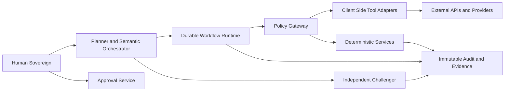

# Research Brief for an Unspecified Topic

## Executive summary

Because the request itself does not name a topic, the strongest evidence of likely intent is the uploaded prompt, which is not generic: it asks for a source-backed, build-ready research and architecture design for a **personal multi-agent operating environment** spanning three linked domains—an algorithmic and event-driven trading cell, a frontier research lab, and a revenue-generation pipeline called “Money Forge.” It also explicitly emphasizes provider neutrality, durable workflow state, a mandatory governance boundary (“ContinuityOS”), live verification of current APIs/models/policies, and a sharp separation between LLM reasoning and deterministic control services. fileciteturn0file0

On that basis, the best recommendation is to research **the operating environment as the primary topic**, rather than starting with a narrower subdomain such as trading, governance, or research operations in isolation. That top-level topic subsumes the other likely interpretations and is most likely to produce decisions that remain reusable across the rest of the stack. The sample brief below therefore focuses on **provider-neutral multi-agent architecture with deterministic state, governance, and tool-boundary controls**. This recommendation is also reinforced by current product realities: OpenAI’s Responses API exposes stateful responses, function calling, built-in tools, and background execution controls; xAI’s current docs position `grok-4.5` as a flagship model with configurable reasoning, tool calling, and optional real-time search; Temporal provides durable workflow execution with deterministic replay and event history as source of truth; NATS JetStream adds persistence, replay, replication, and deduplication-oriented delivery semantics; and MCP standardizes tool/context interoperability over JSON-RPC with capability negotiation. citeturn3view0turn4view0turn4view3turn7view0turn4view4turn4view5turn4view6

The practical implication is straightforward: if only one deep-research track should start now, it should be the one that answers **how roles, state, policies, tool calls, and provider bindings fit together safely and durably**. Everything else becomes a second-order specialization after that. fileciteturn0file0

## Assumptions and likely interpretations

The following assumptions shape this brief.

| Assumption | Why it is reasonable |
|---|---|
| No explicit topic was named in the request | The user asked for research on an unspecified topic, then asked the assistant to infer likely interpretations. |
| The uploaded prompt is the strongest evidence of intent | The file is a detailed architecture-and-research specification, not a neutral placeholder. fileciteturn0file0 |
| No budget, timing, or domain limits were imposed | The user explicitly asked to assume no constraints unless stated otherwise. |
| English is the requested output language | The user explicitly specified en-US. |

The uploaded brief makes five interpretations especially plausible. The first is the broadest and most likely.

| Likely topic | Why this is likely | Recommendation |
|---|---|---|
| Personal multi-agent operating environment architecture | The uploaded brief is dominated by role topology, governance, workflow state, provider bindings, audit, and control-plane design. fileciteturn0file0 | **Top recommendation** |
| Governance and policy boundary for agent side effects | The brief repeatedly centers a mandatory “ContinuityOS” gate, policy decisions, approvals, budget/quota control, and prevention of direct tool-side effects. fileciteturn0file0 | Very high |
| Deterministic trading cell with low-latency safety path | The brief devotes a large section to deterministic trading, risk ownership, promotion states, replay, kill switches, and reconciliation. fileciteturn0file0 | High |
| Frontier research lab for reproducible AI and technology research | The prompt explicitly asks for evidence graphs, contradiction tracking, replication, falsification, and source provenance. fileciteturn0file0 | High |
| Automated venture pipeline called Money Forge | The prompt defines a pipeline from opportunity discovery through payment and retention evidence. fileciteturn0file0 | Medium-high |

My recommendation is to start with the **operating environment architecture** because it is the parent problem. Researching only trading or only governance first would answer narrower questions while leaving unresolved how identities, workflows, storage, tool mediation, evidence, escalation, and degraded modes actually compose across the full system. That parent-first reading best matches the uploaded brief. fileciteturn0file0

## Research design for each likely topic

The table below keeps the plan deliberately operational. “Effort” is a planning estimate by the assistant, not a measured benchmark.

| Topic | Scope | Key questions | Methodology | Prioritized sources to consult | Expected deliverables | Estimated effort |
|---|---|---|---|---|---|---|
| Personal multi-agent operating environment architecture | End-to-end role topology, workflow runtime, eventing, state ownership, provider bindings, audit, degraded modes, deployment model | What must be deterministic? What state is authoritative? How should models be routed? What can fail open vs fail closed? How does provider-neutrality survive vendor changes? | Live vendor verification; official docs review; architecture option analysis; threat modeling; state-ownership matrix; benchmark plan; build-handoff outline | Official docs for OpenAI, xAI, Temporal, NATS, Telegram, MCP; protocol specs; official SDK docs; official pricing/rate-limit pages; primary papers only when docs are insufficient | Executive memo; role-to-binding matrix; trust-boundary map; state-ownership table; backlog; benchmark plan; diagrams | **8–12 business days; 45–70 analyst hours** |
| Governance and policy boundary for agent side effects | Authorization, action specs, approval flow, budget/quota controls, provider tool boundary, audit immutability | How is side-effect authority represented? What prevents stale approvals and confused deputy failures? How are hosted tools treated? | Commit-boundary modeling; policy-as-code review; threat model; approval lifecycle design; action-spec schema design | Official provider docs for tools/function calling and storage; identity/auth docs; security documentation; primary security papers | Policy model; ActionSpec schema; approval lifecycle; audit schema; red-team scenarios | 6–8 business days; 30–45 hours |
| Deterministic trading cell | Market-data ingestion, risk engine, order admission, execution, reconciliation, promotion ladder, kill switches | What belongs in the latency-critical path? What protections prevent duplicate or ambiguous orders? Which services own each state domain? | Exchange/API documentation review; deterministic-path decomposition; failure-mode analysis; promotion-state criteria; replay design | Official exchange docs; market-data APIs; risk-engine references; official networking/runtime docs | Trading service map; risk policy draft; order-admission flow; degraded-mode matrix; replay fixture spec | 10–15 business days; 60–90 hours |
| Frontier research lab | Research object schema, contradiction tracking, source provenance, replication, memory promotion controls | How do multiple agents produce verifiable research rather than correlated hallucinations? What gets promoted to shared memory? | Primary-source-first research workflow; evidence and contradiction registry design; replication and falsification playbooks | Original papers; official technical reports; model cards; protocol specs; repos | Research workflow spec; evidence graph schema; verification rubric; memory-promotion policy | 7–10 business days; 35–55 hours |
| Money Forge | Opportunity discovery, problem validation, experiments, prototype testing, payment/retention evidence | How are market signals converted into evidence-backed product decisions rather than vanity metrics? | Opportunity scoring model; experiment design; funnel instrumentation; payment/retention evidence definitions | Official market/platform docs; analytics/payment provider docs; customer interview evidence; original sector reports | Opportunity scorecard; validation workflow; experiment backlog; portfolio review format | 5–7 business days; 25–40 hours |

If the goal is maximum strategic leverage, topic one is still the best place to start because it creates reusable constraints for the others: state ownership, message contracts, provider routing, audit boundaries, and safety posture. fileciteturn0file0

## Decision framework and recommended next steps

A good selection framework for this situation is not “which topic is most interesting?” but “which topic reduces the most future uncertainty across all dependent work?” That favors platform questions over subdomain questions.

### Recommended selection criteria

| Criterion | Weight | What to ask |
|---|---:|---|
| Cross-domain leverage | 30% | Will this research unlock decisions for trading, research, and product workflows at once? |
| Decision urgency | 20% | Are important implementation choices blocked until this is resolved? |
| Reusability of outputs | 20% | Will the resulting artifacts become templates, policies, schemas, and interfaces used repeatedly? |
| Evidence accessibility | 15% | Can the topic be grounded in official docs, source code, and original papers now? |
| Implementation readiness | 15% | Can the research hand directly into engineering tasks and benchmarks? |

### Scored recommendation

| Topic | Cross-domain leverage | Urgency | Reusability | Evidence accessibility | Implementation readiness | Weighted result |
|---|---:|---:|---:|---:|---:|---:|
| Personal multi-agent operating environment architecture | 5 | 5 | 5 | 4 | 5 | **4.85 / 5** |
| Governance and policy boundary | 5 | 5 | 5 | 4 | 4 | 4.70 / 5 |
| Deterministic trading cell | 3 | 4 | 4 | 4 | 4 | 3.75 / 5 |
| Frontier research lab | 4 | 3 | 4 | 5 | 4 | 3.95 / 5 |
| Money Forge | 3 | 3 | 3 | 4 | 4 | 3.30 / 5 |

### Recommended next steps

Start with a **single deep-research program on the operating environment architecture**, then branch the follow-on work in this order:

1. **Architecture and state ownership**
2. **Governance and policy boundary**
3. **Deterministic trading cell**
4. **Frontier research lab**
5. **Money Forge**

That sequence mirrors the dependency graph implied by the uploaded prompt: the platform and policy boundary come first, because they govern how all later agents, tools, and services can safely operate. fileciteturn0file0

## Sample research brief for the top recommended topic

### Executive summary

The most useful interpretation of the uploaded request is: **design a provider-neutral, build-ready operating environment for many AI agents and deterministic services, such that LLMs plan and critique while durable services own state, policy, authorization, idempotency, budgets, and side effects**. The current product landscape supports that direction. OpenAI’s Responses API supports stateful interaction, built-in tools, function calling, configurable reasoning, and an explicit `background` flag; it also exposes a `store` parameter, which defaults to true unless changed. xAI’s current model documentation presents `grok-4.5` as a flagship model with configurable reasoning, agentic tool calling, and a 500k-token context window, while also stating that real-time knowledge requires enabled search tools. Temporal’s workflow model provides deterministic replay from event history and explicitly treats activities as the right place for external calls such as APIs, databases, LLM invocations, and file I/O. NATS JetStream provides persistence, replay, immediate consistency via RAFT, and support for deduplication-based “exactly once” quality of service. MCP supplies a standardized JSON-RPC-based tool/context protocol with stateful connections and capability negotiation. citeturn3view0turn4view0turn4view3turn7view0turn4view4turn4view5turn4view6

### Background

The uploaded brief is unusually specific. It does **not** ask for a generic multi-agent essay; it asks for a source-backed, technically verifiable architecture that can be handed to engineering agents. It explicitly separates three domains—trading, frontier research, and venture generation—and repeatedly insists that no LLM should become the owner of workflow state, financial state, permissions, approvals, quotas, budgets, or kill-switch authority. It also requires a mandatory governance boundary (“ContinuityOS”) between agent intent and external side effects. fileciteturn0file0

That orientation is consistent with what the underlying tools can and cannot safely do today. OpenAI and xAI both expose rich model-side tool surfaces; that is powerful for research and drafting, but it makes trust boundaries more important, not less important. Temporal and JetStream, by contrast, are designed for durable execution and replayable messaging, which are closer to the properties needed for authoritative task state and operational resilience. citeturn3view0turn4view3turn7view0turn4view4

### Key findings

**Finding one: the stable architecture should be role-first, not model-first.**  
The uploaded brief already leans this way, and current vendor capabilities reinforce it. Both OpenAI and xAI expose model interfaces with tools and state-like affordances, but those are product features, not a substitute for authoritative runtime state. The durable boundary should therefore sit in workflow, policy, and audit services, not in chats, response IDs, or provider-hosted memory. This is an architectural inference grounded in the uploaded requirements and in the documented model APIs. fileciteturn0file0turn3view0turn4view0

**Finding two: a durable workflow runtime is a better owner of task state than a message broker or an LLM.**  
Temporal documents that workflows can keep running for years, recreate pre-failure state after crashes, and rebuild execution from ordered event history; it also states that event history is the source of truth for what happened in a workflow. That makes it a strong candidate for durable task orchestration. NATS JetStream is valuable, but its strength is persisted, replayable messaging with replication and deduplication-oriented semantics rather than authoritative workflow history. citeturn7view0turn4view4turn4view5

**Finding three: provider-hosted search and tool use should be treated as high-value but untrusted inputs.**  
OpenAI’s Responses API and xAI’s tool docs both expose built-in or server-side tooling, including web search and file/tool integrations. xAI explicitly states that real-time information requires enabled search tools, and OpenAI documents built-in web/file search plus function calling. Those features are useful for discovery, but the uploaded brief is correct to demand a separate client-side authorization boundary before any side effects occur. citeturn3view0turn4view3turn4view0turn0file0

**Finding four: open interoperability protocols matter, but they do not replace orchestration.**  
MCP standardizes how applications and services share context and expose tools using JSON-RPC 2.0 with stateful connections and capability negotiation. That makes it well-suited as a tool/context protocol. It does not, by itself, become a durable task runtime, policy engine, or authoritative state store. citeturn4view6

### Data table

| Architecture concern | Likely best-fit pattern | Why it fits | Evidence |
|---|---|---|---|
| Authoritative task state | Durable workflow runtime | Temporal replay builds state from ordered event history and requires deterministic workflow logic. | citeturn7view0 |
| Replayable messaging and decoupled events | NATS JetStream | JetStream stores and replays messages, replicates with RAFT-backed persistence, and supports dedup-related “exactly once” QoS patterns. | citeturn4view4turn4view5 |
| Model-side research and drafting | OpenAI Responses API and xAI `grok-4.5` | Both expose tool use; OpenAI documents function calling and background execution; xAI documents configurable reasoning and real-time search when tools are enabled. | citeturn3view0turn4view0turn4view3 |
| Tool interoperability | MCP | JSON-RPC 2.0, stateful connections, capability negotiation. | citeturn4view6 |
| Governance boundary | Local client-side policy gateway | Best matches the uploaded requirement that agents must not perform direct external side effects without mediated approval and audit. | fileciteturn0file0 |

### Planning budget and timeline

The table below is a **planning estimate**, not a quoted vendor budget.

| Work package | Duration | Typical staffing assumption | Planning estimate |
|---|---:|---|---:|
| Live vendor verification and source pack | 2–3 days | 1 researcher | Low |
| Logical role topology and state ownership matrices | 2–4 days | 1 researcher / architect | Low |
| Governance boundary and ActionSpec design | 2–3 days | 1 architect + 1 security reviewer | Low–medium |
| Technology selection and ADR set | 2–3 days | 1 architect | Low |
| MVP vertical slice and backlog | 2–4 days | 1 architect + 1 implementation reviewer | Medium |
| Total brief to handoff package | **8–12 business days** | Small single-owner team with AI assistance | **Medium** |

### Suggested visuals

**Recommended visual A: logical role topology**  
Use a Mermaid diagram showing the separation between human authority, planners, challengers, workflow runtime, policy gateway, tool adapters, and deterministic services.

**Recommended visual B: provider trust boundary**  
A layered box diagram with models and provider-hosted tools on the outside, and client-side ActionSpec, approvals, audit, and execution control on the inside.

**Recommended visual C: state ownership heatmap**  
A matrix that maps each state domain—workflow, approvals, budget, risk, positions, artifacts, evidence, audit—to its single authoritative owner.

> Placeholder for visual A: role-to-binding topology  
> Placeholder for visual B: provider-hosted tool boundary  
> Placeholder for visual C: state ownership matrix

### Concise references

The sources below are the minimum high-value pack for the recommended topic:

- Uploaded architecture prompt defining the operating environment, the three domains, and the mandatory ContinuityOS-style governance boundary. fileciteturn0file0
- OpenAI Responses API reference for stateful responses, tools, background execution, storage controls, and function calling. citeturn3view0
- xAI model docs for `grok-4.5`, reasoning/tooling, context window, and real-time-search caveat. citeturn4view0
- xAI web-search tool docs for real-time browsing/search behavior and server-side tool parameters. citeturn4view3
- Temporal workflow docs for durable execution, determinism, replay, and event history as source of truth. citeturn7view0
- NATS JetStream docs for persistence, replay, immediate consistency, and deduplication-oriented QoS. citeturn4view4turn4view5
- MCP specification for JSON-RPC, stateful connections, and capability negotiation. citeturn4view6

## Closing recommendation

If one topic must be chosen now, choose **provider-neutral multi-agent operating environment architecture**. It is the best-supported interpretation of the uploaded material, it resolves the highest-leverage design uncertainties first, and it creates reusable outputs for the narrower trading, research, and venture-generation tracks that follow. fileciteturn0file0turn3view0turn4view0turn7view0turn4view4turn4view6