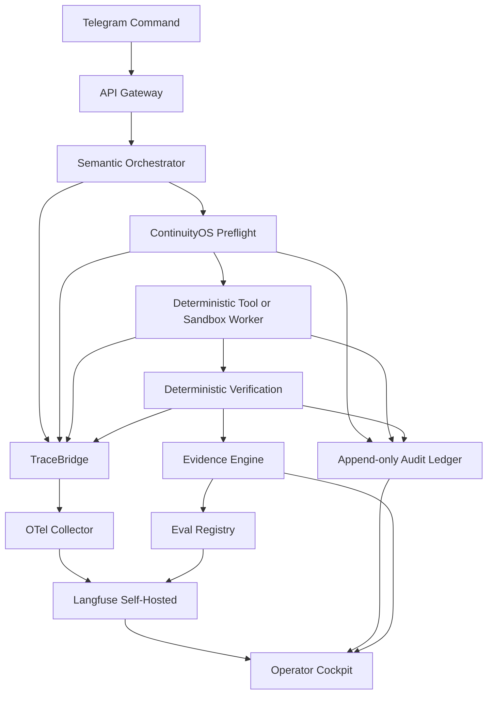
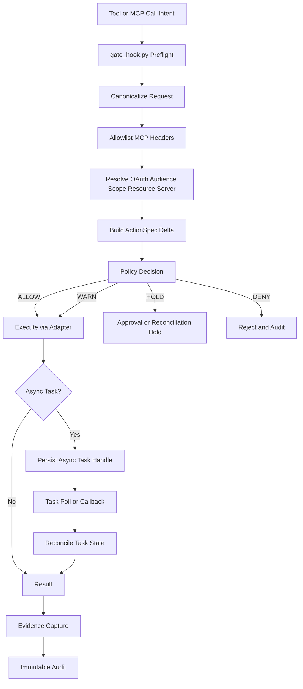

# ContinuityOS Control Spine Delta Study

## Evidence Audit

| Claim | Source | Official evidence | Verified status | Correction | Confidence |
|---|---|---|---|---|---|
| Temporal gives durable workflow execution, event history replay, and recovery after worker/process failure. | Temporal | Temporal states that a Workflow Execution is “durable,” “fully recoverable after a failure,” and replays by checking generated commands against existing Event History. citeturn64view1 | **VERIFIED FACT** | None. | 0.95 |
| Temporal natively matches your immutable branch ledger and fork-from-checkpoint contract. | Temporal | Temporal documents replay and workflow chains, but the inspected official pages do **not** show a first-class immutable branch ledger with parent/child branch metadata matching your contract. citeturn64view1turn64view3 | **INFERENCE** | Temporal is a strong durable runtime, but your Branch Ledger remains a custom layer above it. | 0.78 |
| DBOS uses Postgres-backed durable workflows with resumability, workflow IDs as idempotency keys, durable timers, and exactly-once transactions. | DBOS | DBOS docs say workflows resume from the last completed step, workflow IDs act as idempotency keys, timeouts/sleeps are durable, completed steps are not re-executed, and transactions commit exactly once. citeturn68view0 | **VERIFIED FACT** | None. | 0.96 |
| Restate provides durable execution, built-in state, durable timers, and exactly-once semantics. | Restate | Restate docs explicitly describe durable execution, built-in state, durable timers, and “exactly-once semantics” for communication/event processing. citeturn69view0 | **VERIFIED FACT** | None. | 0.92 |
| LangGraph persistence provides thread-scoped checkpoints, long-term stores, PostgresSaver for production, and supports time travel. | LangGraph | LangGraph docs say checkpointers persist thread graph state for conversation continuity, time travel, and fault tolerance; stores persist cross-thread data; PostgresSaver is the persistent production option. citeturn74view3 | **VERIFIED FACT** | None. | 0.94 |
| OpenAI Agents SDK handoffs preserve conversation history by default; `input_filter` can change it; `Agent.as_tool()` is the better fit when you want structured sub-agent input without a full handoff. | OpenAI Agents SDK | OpenAI docs say the receiving agent sees the conversation history unless changed by `input_filter`, and explicitly recommend `Agent.as_tool()` when you want structured input without transferring the conversation. citeturn74view0turn74view1turn74view2 | **VERIFIED FACT** | None. | 0.97 |
| Google ADK has a first-class secure authority-preserving “agent transfer” primitive equivalent to your `HandoffEnvelope`. | Google ADK | I verified official ADK surfaces for collaborative workflows, graph-based workflows, sessions/state/events, artifacts, and A2A, but in the retrieved lines I did **not** find a normative secure transfer primitive equivalent to your envelope semantics. citeturn75view0turn75view1 | **UNRESOLVED** | Treat ADK transfer semantics as application-level orchestration until a stricter official primitive is proven. | 0.52 |
| Microsoft Agent Framework has explicit workflow transitions with typed `executors` and `edges`, checkpoints, and multi-agent hand-off patterns. | Microsoft Agent Framework | Microsoft docs describe graph-based workflows with `executors` and `edges`, checkpointing, and multi-agent orchestration patterns including sequential, concurrent, and hand-off. Edge docs show direct, conditional, switch-case, fan-out, and fan-in routing. citeturn75view2turn75view3 | **VERIFIED FACT** | None. | 0.93 |
| The claimed MCP 2026-07-28 revision adds OAuth 2.1 resource servers, audience-bound tokens, incremental scope consent, `MCP-*` HTTP headers, async tasks, and a deprecation lifecycle. | MCP 2026-07-28 | In this pass I could not retrieve the normative 2026-07-28 MCP spec text from the official spec site through the browser tool. OpenAI docs confirm MCP support in platform tooling, but not the specific revision details listed above. citeturn46view0 | **SOURCE CLAIM** | Treat these new MCP features as provisionally true for migration design, but do not mark them fully verified until the normative spec text is archived in your evidence store. | 0.45 |
| OpenTelemetry GenAI semantic conventions are live but have moved out of the main semconv repo into a dedicated repository, so schema churn risk remains real. | OpenTelemetry | The OTel page explicitly says GenAI semantic conventions have moved to a dedicated repository and the old page is no longer maintained. citeturn39view0 | **VERIFIED FACT** | Use an internal stable adapter schema instead of binding audit storage directly to raw upstream semconv names. | 0.94 |
| Langfuse is self-hostable and OTel-based; Phoenix is self-hostable and free; LangSmith docs in the captured material show hosted onboarding rather than self-host deployment. | Langfuse / Phoenix / LangSmith | Langfuse docs describe self-hosting with Docker and OTel compatibility; Phoenix docs state it is free to self-host and fully air-gapped; captured LangSmith docs focus on SaaS signup/API keys and do not show self-host deployment in the retrieved material. citeturn39view1turn41view0turn39view2turn41view1turn39view3 | **VERIFIED FACT** for Langfuse/Phoenix; **INFERENCE** for LangSmith self-host absence | For a single-owner stack, prefer self-hosted Langfuse first; add Phoenix only if evaluator depth becomes the bottleneck. | 0.86 |
| OpenAI Batch gives 50% discount and prompt caching has explicit cached-input pricing; Anthropic prompt caching has 5m/1h write multipliers and 0.1x cache-read pricing. | OpenAI / Anthropic | OpenAI docs say Batch is asynchronous, 50% cheaper, and uses model token rates; OpenAI pricing shows cached-input prices. Anthropic docs show 5m cache writes at 1.25x base input, 1h at 2x, and cache reads at 0.1x. citeturn45view2turn47view0turn47view1turn48view0turn48view1turn49view1 | **VERIFIED FACT** | None. | 0.97 |
| OpenRouter can route by provider, disable fallbacks, deny data-collection providers, and enforce per-request ZDR, but retention policies still vary by provider. | OpenRouter | OpenRouter docs show provider ordering/fallback controls, `data_collection`, and per-request `zdr`; separate privacy docs say provider retention policies vary and are not automatically routed on retention policy alone. citeturn51view0turn52view0turn52view1 | **VERIFIED FACT** | Use OpenRouter only for `PUBLIC`/`INTERNAL` classes, never as the sole control surface for `FINANCIAL_SENSITIVE`. | 0.92 |
| Vault is feature-rich but operationally heavier; Infisical is easier to self-host for a single owner; SOPS+age is best for GitOps/static secrets, not dynamic runtime brokering. | Vault / Infisical / SOPS | Vault docs emphasize central secret management, rotation, on-demand credentials, audit logging, and workload identity federation. Infisical docs emphasize self-hosting, machine identities, service tokens, and flexible deployment. SOPS docs confirm file-level secrets operations rather than an online runtime broker. citeturn57view0turn57view1turn57view2 | **INFERENCE** | Use Infisical for runtime secrets in MVP; keep SOPS+age for repo/bootstrap secrets. | 0.88 |
| Telegram webhook hardening can use `secret_token`, webhook-only ingestion, and `update_id` sequencing to reduce spoofing/replay. | Telegram Bot API | Telegram docs state `setWebhook` can include `secret_token`, which is then sent as `X-Telegram-Bot-Api-Secret-Token`; `update_id` is sequential and `getUpdates` requires offset advancement to avoid duplicates. citeturn60view0turn60view2turn60view3 | **VERIFIED FACT** | Pair Telegram-native controls with an internal signed Approval nonce and short expiry. | 0.95 |
| gVisor is a userspace application kernel with OCI runtime compatibility; Firecracker requires Linux KVM and `/dev/kvm`; E2B exposes persistence/snapshots/auto-resume and per-second billing; Modal provides per-second GPU/CPU pricing. | gVisor / Firecracker / E2B / Modal | gVisor docs describe a userspace application kernel and OCI runtime `runsc`; Firecracker docs require KVM and `/dev/kvm`, and recommend the `jailer` for production; E2B docs expose persistence/snapshots/auto-resume and pricing per second; Modal pricing is per-second for CPU/GPU. citeturn70view0turn73view2turn73view3turn73view0turn73view1turn72view0turn72view1 | **VERIFIED FACT** | Daytona remains **UNRESOLVED** in this pass because I did not retrieve official architecture/isolation docs. | 0.90 |

## Verdicts

**Workflow runtime choice — ADAPT DBOS now; keep Temporal as the first migration target.**  
**Decision:** Use **DBOS + Postgres** as the first durable substrate for `Branch Ledger`, `Checkpoint Store`, and `External Effect Registry`. Keep branching/fork comparison as a custom ContinuityOS layer on top of DBOS workflow IDs, durable steps, sleep, and exactly-once transaction semantics. Temporal remains the first migration target if you outgrow single-owner operational simplicity.  
**Evidence:** DBOS gives resumability from the last completed step, workflow ID idempotency, durable sleeps/timeouts, non-reexecution of completed steps, and exactly-once DB transactions. Temporal is richer on event history, replay, signals, workflow chains, and failure recovery, but the inspected docs still do not give your exact immutable branch object and fork metadata natively. LangGraph gives useful checkpointers/time travel, but its persistence is graph-centric and is a poor place to let the semantic orchestrator “own” durable task state. Restate is strong technically, but it is still a separate runtime to operate. citeturn68view0turn64view1turn64view3turn74view3turn69view0  
**Assumptions:** You accept adding Postgres beside SQLite; durable task state can live outside the semantic orchestrator; Linux VPS production is available.  
**Alternatives:** **Temporal self-hosted** if you need stronger cross-language worker support, richer workflow ops, or more mature human-in-the-loop/event history tooling; **Restate** if you prefer dedicated durable runtime semantics over a library-embedded model.  
**Risks:** DBOS does not remove the need to build branch lineage, external-effect reconciliation, or promotion logic yourself. Temporal would reduce some workflow engineering risk but materially increase operational surface.  
**Confidence:** 0.88.  
**Acceptance Test:** Kill the semantic orchestrator mid-tool call, restart the process, recover the workflow, confirm that a completed external side effect is not re-fired, and confirm that the final artifact plus immutable audit trace are produced from persisted state.  
**Revisit Trigger:** Switch to Temporal when you need multi-language workers, deep event-history inspection for operators, or when your custom branch/reconciliation shim becomes more code than your business logic.  

**Agent harness — ADOPT a thin custom harness; ADAPT provider SDKs behind adapters, not as the authority boundary.**  
**Decision:** The primary harness should be a **thin custom runtime over raw APIs + LiteLLM/OpenRouter routing**, with provider SDKs used only as optional adapters. Wrap OpenAI Agents SDK as a **provider adapter** for experiments with `handoff()` and `Agent.as_tool()`, but do **not** let any provider SDK define authority, handoff trust, or durable state.  
**Evidence:** OpenAI handoffs pass conversation history by default unless filtered, while `Agent.as_tool()` is explicitly the better fit when you want structured sub-agent calls without a full conversation transfer. Microsoft Agent Framework officially supports typed workflow transitions via `executors` and `edges` plus checkpoints, which makes it a good reference for graph-level transitions but not a replacement for your policy boundary. Google ADK official pages confirm collaborative workflows, graph workflows, sessions/state/events, artifacts, and A2A surfaces, but I did not retrieve a normative secure “authority-preserving transfer” primitive in this pass. citeturn74view0turn74view1turn74view2turn75view2turn75view3turn75view0turn75view1  
**Assumptions:** Multi-provider portability matters more than SDK convenience; your `HandoffEnvelope` and ContinuityOS already exist as external contracts.  
**Alternatives:** **LangGraph/deepagents** for research-plane orchestration only; **Microsoft Agent Framework** for typed graph transitions if you later want stronger workflow composition inside the control plane.  
**Risks:** A thin custom harness raises integration maintenance cost. Provider SDK features will continue to evolve faster than your adapters.  
**Confidence:** 0.90.  
**Acceptance Test:** A planner agent hands an artifact-pointer package to a validator; the validator receives only approved artifact refs and structured summary; target permissions are resolved fresh via ContinuityOS; no prompt-level handoff can expand authority.  
**Revisit Trigger:** Reconsider a framework-led harness only if your adapter layer becomes the dominant maintenance cost or if one vendor’s graph/handoff framework proves materially better for deterministic control-plane routing.  

**MCP 2026 audit — ADAPT the gate immediately, but treat the named 2026-07-28 features as provisional until the normative spec text is archived.**  
**Decision:** Update `gate_hook.py` and `ActionSpec` now for an MCP era with OAuth resource servers, audience-bound tokens, incremental scope, explicit protocol headers, and async tasks. However, mark the 2026-07-28 feature list as **SOURCE CLAIM** until the exact normative spec text is stored in your evidence archive.  
**Evidence:** OpenAI’s docs already expose MCP as a first-class integration surface in the API docs navigation; the claimed 2026-07-28 changes were not independently retrievable from the official spec pages in this pass. That means your migration should be coded defensively, with explicit version-gating and a “spec unknown” hold path. citeturn46view0  
**Assumptions:** The spec revision will formalize more of what you currently do manually: token audience binding, consent expansion, async task handles, and deprecation signaling.  
**Alternatives:** Freeze your existing MCP integration until the normative spec is archived; or support only hosted/provider-vetted MCP surfaces in the first MVP.  
**Risks:** Header desynchronization, accidental logging of `MCP-*` header values, async-task orphaning, and scope drift between consent state and recorded `ActionSpec`.  
**Confidence:** 0.72.  
**Acceptance Test:** A request with user-supplied spoofed `MCP-*` headers is rejected; a request with an audience mismatch is denied; a scope increment without fresh policy decision enters `HOLD`; an async task cannot complete unless its `action_id`, `task_id`, and `trace_id` reconcile to the same original authorization record.  
**Revisit Trigger:** Re-run this audit the day you store the normative MCP 2026-07-28 spec snapshot in your evidence repository.  

**Observability and evals — ADOPT OTel + self-hosted Langfuse as the minimum stack; keep Phoenix as the eval expansion path.**  
**Decision:** Use **OpenTelemetry traces + internal trace context + self-hosted Langfuse** for MVP. Add **Phoenix** only when offline eval depth and experiment workflows become a clear bottleneck. Do not adopt LangSmith as the primary stack for this single-owner first slice.  
**Evidence:** OTel’s old GenAI semconv page now points to a dedicated repository, which means upstream naming can change and you should version your own adapter schema. Langfuse is self-hostable, OTel-based, and includes traces, sessions, agent graphs, prompts, experiments, and eval hooks. Phoenix is also self-hostable and free, with strong tracing, evals, datasets, and experiments. The captured LangSmith docs emphasize hosted signup/API-key flow rather than self-host deployment. citeturn39view0turn39view1turn41view0turn39view2turn41view1turn39view3  
**Assumptions:** You want one owner-operated stack, not a SaaS-first eval platform.  
**Alternatives:** Phoenix-first if your primary pain is evaluator science rather than operational tracing; LangSmith if you later accept hosted dependency and want deep LangChain-native ergonomics.  
**Risks:** Langfuse self-hosting adds ClickHouse/Redis/object storage complexity. OTel GenAI conventions may change upstream.  
**Confidence:** 0.91.  
**Acceptance Test:** One Telegram-initiated run emits a single correlated trace spanning orchestrator planning, ContinuityOS policy decision, tool preflight, deterministic verification, evidence collection, and final audit append. A prompt regression run must compare prompt/model versions on a fixed golden dataset and produce a machine-readable drift verdict.  
**Revisit Trigger:** Add Phoenix when evaluator iteration becomes slower than product iteration, or when you need more advanced experiment/dataset workflows than Langfuse comfortably provides.  

**Cost engineering — ADAPT to direct APIs for sensitive roles, OpenRouter for non-sensitive fallback routing, and batch/caching aggressively.**  
**Decision:** Route **orchestrator** traffic directly to OpenAI, **supervisor** traffic directly to Anthropic, and use **OpenRouter only for `PUBLIC`/`INTERNAL` challenger/executor traffic** with `data_collection: "deny"` and `zdr: true` where supported. Use prompt caching for stable prefixes and OpenAI Batch for non-urgent background work.  
**Evidence:** OpenAI documents Batch as asynchronous with 50% lower cost and shows explicit cached-input pricing. Anthropic documents 5-minute and 1-hour cache write multipliers and 0.1x cache-read pricing. OpenRouter documents provider ordering, fallback control, `data_collection`, and per-request `zdr`, but also notes that provider retention policies vary and are not automatically enforced by retention-policy routing alone. citeturn45view2turn47view0turn47view1turn48view0turn48view1turn49view1turn51view0turn52view0turn52view1  
**Assumptions:** Challenger and background executors can tolerate router indirection because they are restricted to non-sensitive classes; verified pricing for Grok/GLM/Nemotron was not fully captured in this pass.  
**Alternatives:** All-direct APIs if you want maximum data-governance clarity; router-first only for research-plane traffic.  
**Risks:** OpenRouter convenience can mask provider drift, retention differences, or fallback destination changes. Provider-specific features may not be uniformly supported.  
**Confidence:** 0.84.  
**Acceptance Test:** For a repeated planning prefix, OpenAI cached-input share exceeds 30%; Anthropic supervisor hits cache refreshes rather than full rewrites on repeated system context; low-priority executor jobs run through Batch; budget circuit breakers stop non-critical jobs before P0/P1 reserves are touched.  
**Revisit Trigger:** Move more traffic direct when router overhead, privacy complexity, or provider divergence causes repeated operational incidents.  

**Preliminary monthly cost bands — HYPOTHESIS anchored to verified OpenAI and Anthropic pricing, with unresolved challenger/executor model pricing folded into the range.**  
**Decision:** Plan for **light** usage at **$60–$180/month**, **medium** at **$250–$900/month**, and **heavy** at **$1,200–$4,000/month**.  
**Evidence:** These bands are grounded by verified OpenAI GPT-5.6 and Anthropic Claude pricing plus batch/caching discounts, but the exact direct pricing for your intended Grok/GLM/Nemotron challenger/executor mix was not fully verified in this pass, so the aggregate band remains a **HYPOTHESIS** rather than a verified budget. OpenAI’s short-context prices for GPT-5.6 Sol are currently listed at $5/M input, $0.50/M cached input, and $30/M output; Anthropic lists Claude Fable 5 at $10/M input, $1/M cache hits, and $50/M output. citeturn47view1turn49view1  
**Assumptions:** Stable-prefix caching, batch usage for background jobs, and challenger/executors materially cheaper than the orchestrator/supervisor pair.  
**Alternatives:** Produce a tighter budget after capturing model-page pricing snapshots for Grok/GLM/Nemotron into the evidence store.  
**Risks:** The unresolved portion of the range is currently dominated by challenger/executor vendor-price uncertainty.  
**Confidence:** 0.63.  
**Acceptance Test:** After one week of instrumented runs, actual spend variance vs. forecast is below 25% on the same workload mix.  
**Revisit Trigger:** Immediate recalibration after the first 1,000 production-grade runs or after any model-provider switch.  

**Secrets and identity — ADOPT Infisical for runtime secrets, SOPS+age for repo/bootstrap, and an internal signed delegation model for agent identity.**  
**Decision:** Use **Infisical** as the single-owner runtime secrets backend, **SOPS+age** for repo/bootstrap secrets, and **per-agent service identity** as an internal ContinuityOS-issued identity plus short-lived provider/API credentials scoped by role and data class. Keep Vault out of the MVP critical path.  
**Evidence:** Vault is a broad central secret-management system with audit logs, workload identity federation, and dynamic credentials; Infisical is self-hostable, supports machine identities and service tokens, and is simpler to deploy on your own infrastructure; SOPS is file-centric secrets operations, not a runtime brokering service. Telegram supports webhook `secret_token` and replay-safe `update_id` sequencing patterns. SPIFFE/SPIRE remain the long-term reference model for workload identity with short-lived SVIDs, but they are excessive for this single-owner MVP. citeturn57view0turn57view1turn57view2turn60view0turn60view2turn60view3turn61view0  
**Assumptions:** Your first production estate is small enough that “identity as internal signed metadata + short-lived scoped provider keys” is good enough before rolling out SPIFFE/SPIRE.  
**Alternatives:** Vault if you later need dynamic cloud creds, PKI issuance, or enterprise auth integration; SPIFFE/SPIRE if you add more worker nodes and stricter workload attestation.  
**Risks:** Secret sprawl if role/data-class scoping is not automated from `ActionSpec`; Telegram approvals can still be socially spoofed unless you bind them to nonce + signer + expiry.  
**Confidence:** 0.90.  
**Acceptance Test:** A `FINANCIAL_SENSITIVE` run cannot access a non-ZDR provider key; a Telegram approval without the current nonce/signature is rejected; rotating one agent’s provider key does not break other roles.  
**Revisit Trigger:** Introduce Vault or SPIFFE/SPIRE when you move from one owner + a few workers to a truly distributed execution estate.  

**Sandbox provider decision — ADOPT local gVisor/rootless OCI for Tier 2, HOLD Daytona, ADAPT E2B for Tier 3 when KVM is unavailable, ADOPT Modal for Tier 4 GPU.**  
**Decision:**  
Tier 2: **ADOPT local Linux rootless OCI + gVisor** as the default deterministic sandbox.  
Tier 3: **ADAPT Firecracker only on a Linux host with verified KVM**; otherwise use **E2B** as the managed high-isolation alternative for untrusted code until local KVM feasibility is proven.  
Tier 4: **ADOPT Modal** for GPU workloads.  
**Evidence:** gVisor is a userspace application kernel with OCI runtime compatibility and a stronger isolation model than ordinary containers. Firecracker explicitly requires Linux KVM and `/dev/kvm`, and its production posture expects the `jailer`. E2B documents persistence, snapshots, auto-resume, OTel export, and per-second pricing; Modal exposes per-second CPU and GPU pricing. I did **not** retrieve official Daytona isolation docs in this pass, so Daytona should not be made a security boundary yet. citeturn70view0turn73view2turn73view3turn73view0turn73view1turn72view0turn72view1  
**Assumptions:** WSL is a developer convenience layer, not a trusted security boundary; Linux VPS is available for production-grade Tier 2 and possible Tier 3.  
**Alternatives:** Dedicated Linux KVM host for all Tier 3 work if you later want to eliminate managed sandbox dependencies.  
**Risks:** On Windows/WSL, nested virtualization and `/dev/kvm` availability are the main practical blockers. E2B’s underlying isolation mechanism was not proven in the captured docs, so treat it as a managed service boundary, not as a proven Firecracker-equivalent until separately verified.  
**Confidence:** 0.87.  
**Acceptance Test:** Tier 2 blocks host socket/secret access and enforces egress deny via local network policy; Tier 3 runs untrusted code either on a KVM-capable Firecracker host or on E2B with explicit outbound restrictions; Tier 4 GPU runs never receive production credentials.  
**Revisit Trigger:** Promote Firecracker to default Tier 3 only after you verify KVM on the Linux VPS and pass the fork-bomb, metadata-access, and egress-deny tests.  

**Illustrative per-1000 execution cost formulas — VERIFIED where price sheets exist; HYPOTHESIS where execution shape is assumed.**  
**Decision:** Use provider formulas, not single headline numbers, in budgeting. For a 60-second execution shape:  
- **E2B default 2 vCPU + 4 GiB RAM** is roughly **$2.76 / 1,000 executions**. This is a calculation from official per-second CPU and RAM prices, not a vendor-quoted bundle. citeturn72view0  
- **Modal Sandbox CPU 1 core + 4 GiB RAM** is roughly **$3.97 / 1,000 executions** for 60 seconds, again assuming that shape from official per-second pricing. citeturn72view1  
- **Modal L4 GPU + 1 core + 8 GiB RAM** is roughly **$18.89 / 1,000 executions** for 60 seconds. citeturn72view1  
- **gVisor** and **Firecracker** have no vendor per-exec software fee in the captured material; their cost is host amortization plus operations. citeturn70view0turn73view2  
**Assumptions:** 60-second average duration; no storage surcharge beyond the included baseline; no premium egress pricing.  
**Alternatives:** Maintain a benchmark-derived cost sheet by workload class rather than a single blended number.  
**Risks:** Cold-start-heavy or long-running jobs will diverge quickly from the 60-second assumption.  
**Confidence:** 0.82.  
**Acceptance Test:** Real provider bills stay within 15% of your benchmark-based execution-cost sheet over the first 500 sandbox runs.  
**Revisit Trigger:** Recompute all unit economics after the first production benchmark sweep.  

## Architecture Delta

Only the new or changed pieces are shown below.

| New or changed component | Plane | Why it is needed now | Decision |
|---|---|---|---|
| `DurableRuntimeAdapter` | Control | Abstraction over DBOS now, Temporal later; keeps Branch Ledger and External Effect Registry runtime-agnostic. | **ADOPT** |
| `ProviderHarness` | Intelligence / Control | Thin multi-provider execution wrapper that emits `HandoffEnvelope`, `TraceContext`, and `BudgetPolicy` decisions without letting SDKs smuggle authority. | **ADOPT** |
| `MCPPreflightAdapter` | Control | Canonicalizes MCP requests, strips/highlights unsafe headers, binds OAuth audience/scope/resource-server to `ActionSpec`. | **ADOPT** |
| `TraceBridge` | Control | Emits OTel/OpenInference-compatible spans while preserving internal `trace_id`/`correlation_id`/`causation_id`. | **ADOPT** |
| `EvalRegistry` | Control | Stores golden sets, prompt/model versions, adjudication outcomes, and restart-safe regression fixtures. | **ADOPT** |
| `BudgetEnforcer` | Control | Enforces per-role fallback chains, cache policy, batch eligibility, and P0/P1 reserve circuit breakers. | **ADOPT** |
| `SecretsBroker` | Control | Central runtime secret resolution by role + data class + provider restriction; blocks prompt-level secret smuggling. | **ADOPT** |
| `SandboxBroker` | Control | Tier routing: gVisor/rootless OCI → Firecracker/E2B → Modal, with policy-based egress and promotion gates. | **ADOPT** |



The observability delta adds an internal trace bridge, OTel export, Langfuse as the primary self-hosted trace/cost surface, and a separate Eval Registry for regression datasets and adjudication. This avoids coupling your immutable audit schema directly to the upstream, still-moving GenAI semantic-convention namespace. citeturn39view0turn39view1turn41view0turn39view2turn41view1



This revised gate flow assumes the MCP-era threat model is header-rich, OAuth-aware, and async-task-aware. Because the exact 2026-07-28 normative spec text was not retrieved in this pass, the flow should be implemented with **strict version checks** and a **default HOLD** for unknown protocol versions or unrecognized `MCP-*` headers. citeturn46view0

## Contracts

```yaml
ActionSpec:
  add:
    protocol:
      type: string
      allowed: [native_tool, mcp, provider_hosted_tool, http_api, sandbox_exec]
    protocol_version:
      type: string
    mcp:
      server_id: string
      transport: string
      resource_server: string
      oauth_audience: string
      oauth_scope_set: [string]
      consent_scope_delta: [string]
      header_allowlist: [string]
      header_hash: string
      async_task:
        is_async: boolean
        task_handle: string
        parent_action_id: string
        callback_expected: boolean
        terminality_required: boolean
      deprecation_state:
        spec_version: string
        endpoint_state: string
    authority_binding:
      delegation_grant_id: string
      capability_token_id: string
      policy_decision_id: string
    provider_constraints:
      data_class: string
      zero_data_retention_required: boolean
      provider_route_mode: string
      fallback_allowed: boolean
```

```yaml
TraceContext:
  schema_version: "delta-2026-07"
  trace_id: string
  span_id: string
  parent_span_id: string
  correlation_id: string
  causation_id: string
  workflow_id: string
  branch_id: string
  task_id: string
  action_id: string
  external_effect_id: string
  handoff_id: string
  eval_run_id: string
  source_plane: string
  source_component: string
  timestamp: string
```

```yaml
EvalRecord:
  schema_version: "delta-2026-07"
  eval_id: string
  dataset_id: string
  fixture_id: string
  role: string
  prompt_version: string
  model_binding: string
  model_version: string
  provider: string
  judge_mode: string
  adjudication_policy_version: string
  input_hash: string
  output_hash: string
  result:
    verdict: string
    score: number
    failure_class: string
    regression: boolean
  evidence_refs: [string]
  trace_id: string
  created_at: string
```

```yaml
BudgetPolicy:
  schema_version: "delta-2026-07"
  policy_id: string
  role: string
  data_class: string
  monthly_cap_usd: number
  p0_reserve_usd: number
  p1_reserve_usd: number
  cache_policy:
    openai_prompt_cache: boolean
    anthropic_prompt_cache_ttl: string
  batch_policy:
    openai_batch_allowed: boolean
    executor_async_only: boolean
  provider_order:
    primary: string
    secondary: string
    tertiary: string
  provider_constraints:
    openrouter_allowed: boolean
    openrouter_zdr_required: boolean
    direct_api_required: boolean
  circuit_breakers:
    hard_deny_above_cap: boolean
    hold_when_reserve_crossed: boolean
    supervisor_override_required: boolean
```

These deltas are directly motivated by the verified behavior of OpenAI handoffs/tools, OTel’s evolving GenAI schema location, OpenRouter provider-routing controls, and the need to absorb MCP-era audience/scope/header/async semantics without making provider SDK state authoritative. citeturn74view0turn74view1turn39view0turn51view0turn52view0

## Backlog

| Title | Component | Rationale | Dependencies | Acceptance criteria | Security test | Benchmark |
|---|---|---|---|---|---|---|
| Implement `DurableRuntimeAdapter` on DBOS | Control runtime | Lowest-ops durable substrate that still gives resumability, idempotency, durable timers, and exactly-once transactions. | Postgres, Branch Ledger schemas | Crash mid-run, restart, resume from last completed step, no duplicate side effect. | Duplicate external-effect replay test. | Recovery latency after crash. |
| Build `ExternalEffectRegistry` shim over DBOS workflow IDs | Control runtime | DBOS does not natively provide your immutable external-effect model. | DurableRuntimeAdapter | Side-effect write, reconcile, and replay block are enforced by registry. | Idempotency-key and reconciliation ambiguity test. | Registry write/read p95 under concurrent runs. |
| Add `ProviderHarness` with adapter model | Intelligence runtime | Prevent provider SDKs from defining authority or persistence semantics. | ContinuityOS policy API | Handoff uses artifact refs + summary, never auto-transfers permissions. | Prompt-level authority smuggling test. | p95 handoff envelope serialization cost. |
| Add OpenAI adapter with `Agent.as_tool()` mode only | Provider adapter | Structured nesting without full-history handoff by default. | ProviderHarness | Tool-agent calls emit `HandoffEnvelope` and preserve capability checks. | Full-conversation leakage regression. | Nested call overhead. |
| Add `MCPPreflightAdapter` and strict header canonicalization | Policy gateway | MCP-era headers/audience/scope/async handles must become part of authorization input. | ContinuityOS preflight hook | Unknown `MCP-*` headers → HOLD; header allowlist enforced; audience mismatch → DENY. | Header injection and audience-confusion test. | Preflight overhead p95. |
| Add `TraceBridge` and self-hosted Langfuse deployment | Observability | Minimal end-to-end traceability with self-hosted stack. | OTel collector, object storage, ClickHouse, Redis | One run produces correlated spans across plan, preflight, execution, verification, audit. | Trace redaction of secrets and `MCP-*` sensitive headers. | Span ingest latency and dropped-span rate. |
| Create `EvalRegistry` with golden-set runner | Evals | Prompt/model upgrades need deterministic regression evidence. | TraceBridge, artifact store | Golden set can compare prompt versions and model upgrades with adjudication output. | Judge prompt tampering test. | Eval throughput in batch mode. |
| Implement `BudgetEnforcer` with cache/batch/fallback rules | Cost control | Budget service exists conceptually but needs executable routing policy. | ProviderHarness, pricing config | P0/P1 reserves enforced; Batch and cache policy applied by role. | Overspend breaker test. | Cost prediction accuracy vs. actual invoice. |
| Deploy Infisical and role/data-class secret scopes | Secrets | Simplest runtime secret manager for single owner. | SecretsBroker | Per-role secrets issued and rotated independently; `FINANCIAL_SENSITIVE` keys are isolated. | Cross-role key access denial test. | Secret fetch latency p95. |
| Harden Telegram approvals with webhook secret + signed nonce | Control ingress | Reduce spoofing and replay in human approval loop. | SecretsBroker, Approval service | Approval is accepted only with correct user/chat binding, nonce, expiry, and secret-verified webhook. | Replay old approval payload test. | Approval round-trip latency. |
| Stand up Tier 2 gVisor worker | Sandbox | Practical production sandbox on Linux VPS without KVM dependency. | Linux VPS, rootless OCI tooling | Rootless/gVisor execution works with read-only rootfs and egress deny policy. | Host secret/socket breakout test. | Cold start and teardown times. |
| Run Firecracker feasibility spike | Sandbox | Determine if Tier 3 local microVM is possible on current estate. | Linux VPS with KVM candidate | `/dev/kvm` available, jailer launch works, guest boots, teardown succeeds. | Metadata/egress/fork-bomb test. | Boot time and per-run overhead. |
| Add E2B managed Tier 3 adapter | Sandbox | Managed fallback when local KVM is unavailable. | SandboxBroker | High-risk workloads can route to E2B with explicit outbound restrictions and artifact capture. | Secret injection and network-policy test. | Cost per successful execution. |
| Add Modal GPU worker adapter | Sandbox | Clean Tier 4 path for GPU without expanding local infra. | SandboxBroker | GPU workload runs with no production credentials and returns signed artifact metadata. | Secret isolation test. | GPU cold start and total job cost. |

## MVP Decision

**Minimal first vertical slice — GO, but narrow the scope.**  
The smallest credible stack is:

- **Runtime:** `DBOS + Postgres` for durable workflow execution, with your existing SQLite/WAL-backed ContinuityOS remaining the policy/audit/memory boundary. citeturn68view0  
- **Harness:** **thin custom harness** with direct OpenAI and Anthropic adapters, plus optional OpenRouter only for `PUBLIC`/`INTERNAL` challenger/executor traffic. citeturn74view0turn74view1turn51view0turn52view0  
- **Observability:** **OTel Collector + self-hosted Langfuse** as the only mandatory external telemetry surface. citeturn39view0turn41view0  
- **Secrets:** **Infisical runtime + SOPS+age bootstrap**. citeturn57view1turn57view2  
- **Sandbox:** **Tier 2 rootless OCI + gVisor** on Linux VPS; defer local Firecracker until KVM is proven; keep E2B as fallback path. citeturn70view0turn73view2turn72view0  
- **Ingress/Approval:** **Telegram webhook with `secret_token`**, nonce-bound approvals, and immutable audit append. citeturn60view0turn60view2turn60view3  

**Operator-visible first path:** `Telegram → API Gateway → Orchestrator Plan → ContinuityOS Preflight → Deterministic Tool/Verifier → Evidence → Audit Trace → Cockpit`. This is the smallest path that can prove initiator, executor, authority source, allowed tool/data scope, policy version, actual side effect, verification result, and replay-safe state recovery. citeturn64view1turn68view0turn39view1

**Final task verdicts**

| Task | Verdict | Confidence | Revisit trigger |
|---|---|---:|---|
| Workflow runtime choice | **ADAPT** DBOS now | 0.88 | When custom branch/reconciliation logic outgrows DBOS simplicity |
| Agent harness | **ADOPT** thin custom harness | 0.90 | When adapter maintenance exceeds framework gain |
| MCP 2026 audit | **ADAPT** gate now, but spec details remain provisional | 0.72 | When normative MCP 2026-07-28 spec text is archived |
| Observability & evals | **ADOPT** OTel + Langfuse | 0.91 | When eval science needs exceed Langfuse-only workflow |
| Cost engineering | **ADAPT** direct APIs + router only for non-sensitive fallback | 0.84 | After first real invoice and 1,000-run spend sample |
| Secrets & identity | **ADOPT** Infisical + SOPS+age | 0.90 | When estate becomes multi-node and needs SPIFFE/Vault-level complexity |
| Sandbox provider decision | **ADOPT / HOLD / ADAPT** by tier as specified | 0.87 | After KVM feasibility spike and outbound-control validation |

**Smallest falsification spike you can start today**

Build exactly one workflow:

1. Telegram command arrives through webhook with `secret_token`.  
2. API Gateway authenticates owner and starts a **DBOS** workflow with a fixed workflow ID.  
3. Orchestrator produces a plan, but every side-effecting step goes through `gate_hook.py`.  
4. `gate_hook.py` emits `ActionSpec + TraceContext`, writes the policy decision, and either blocks or allows a single deterministic tool call.  
5. The tool runs inside **gVisor/rootless OCI** on Linux VPS.  
6. Verification writes one `Claim`, one `Evidence`, one `VerificationResult`, and one immutable audit event.  
7. Kill the orchestrator process once during execution, restart it, and prove that the workflow resumes without duplicating the side effect.  
8. Emit the full trace into **Langfuse** and compare the final audit event against the trace/span IDs.

If this spike fails on crash recovery, authority binding, or trace/audit correlation, your current control spine is not yet production-ready. If it passes, you have a real MVP control path rather than a paper design.