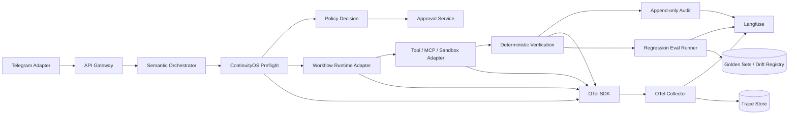
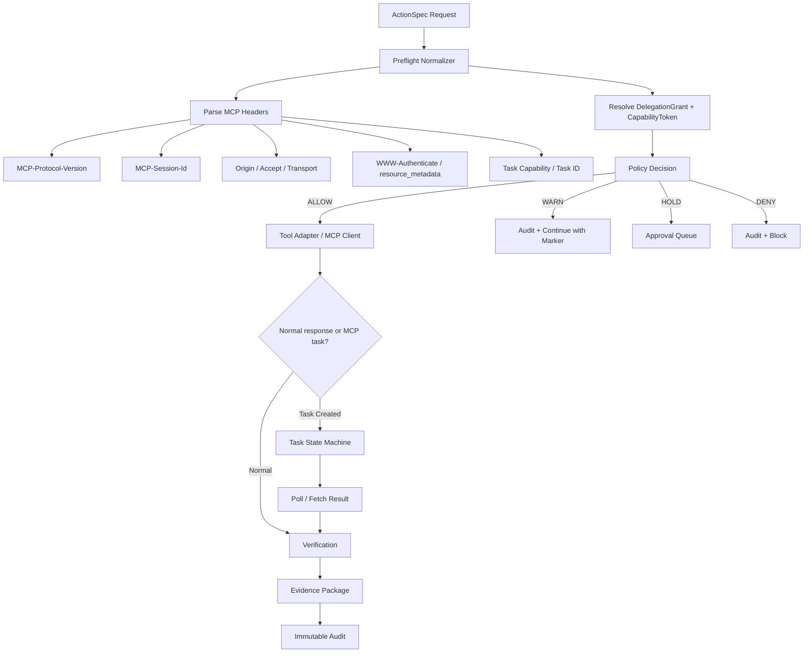

# ContinuityOS Control Spine Delta Study

## Evidence Audit

| Claim | Source system | Official evidence | Verified status | Correction | Confidence |
|---|---|---|---|---|---|
| Temporal has official concepts/pages for `Event History`, `Replay`, and `Reset`, so it natively covers durable execution primitives that map to replayable workflows. | Temporal | Temporal official docs expose workflow execution, event history, replay, and reset as first-class documentation surfaces. citeturn3view0turn3view4turn3view5 | VERIFIED FACT | This does **not** mean Temporal natively implements your immutable `BranchLedger`; branch governance still has to be built above Temporal state and histories. | 0.90 |
| DBOS positions workflows as code backed by Postgres and recovery-oriented execution, which is operationally lighter than a separate workflow cluster. | DBOS | Official DBOS docs and repos provide workflow/programming guides and Postgres-embedded libraries for Python and TypeScript. citeturn5view0turn5view1turn5view3turn5view4 | SOURCE CLAIM | I did **not** verify first-class immutable branching/fork promotion in DBOS docs; that part remains a custom ContinuityOS layer. | 0.76 |
| Restate provides official durable execution and workflow concepts, making it a viable substrate for replay-safe business logic. | Restate | Restate official docs expose durable execution, services, workflows, and self-hosting surfaces. citeturn8view0turn8view1turn8view2turn8view3turn8view4 | SOURCE CLAIM | I did **not** verify native immutable branch lineage comparable to your `CheckpointStore` + `BranchLedger`; treat that as custom. | 0.77 |
| LangGraph officially exposes persistence and time-travel concepts, but I did not verify first-class immutable branch promotion semantics in the inspected docs. | LangGraph | Official LangGraph docs expose persistence, overview, and time-travel surfaces. citeturn11view0turn11view1turn11view2turn11view3 | UNRESOLVED | For ContinuityOS, LangGraph persistence should be treated as agent-runtime state support, not as authoritative control-plane branching until verified by a narrower implementation test. | 0.64 |
| NATS JetStream gives durable streams/consumers, but not workflow branching/replay semantics by itself. | NATS | Official JetStream docs focus on streams, consumers, acknowledgements, and persistence. citeturn13view0turn13view1turn13view2 | VERIFIED FACT | A `JetStream + Postgres` runtime would shift exactly-once intent, branch lineage, and effect reconciliation correctness into your codebase. | 0.92 |
| OpenAI Agents SDK handoffs are represented as tools, and the receiving agent sees prior conversation history by default unless you use `input_filter` or nested handoff history controls. | OpenAI Agents SDK | Official handoff docs say handoffs are represented as tools and that the receiving agent still sees conversation history unless changed with `input_filter` or handoff history settings. citeturn30view3turn30view4 | VERIFIED FACT | This default conflicts with your control-spine requirement to avoid authority smuggling and full-history transfer by default. | 0.97 |
| OpenAI Agents SDK supports `Agents as tools`, structured input schemas, and approval gates for tool-agents. | OpenAI Agents SDK | Official tools docs describe `Agents as tools`, `Agent.as_tool()`, structured `parameters`, and `needs_approval`. citeturn30view0turn30view1turn30view2 | VERIFIED FACT | Useful for capability-scoped subwork, but only if ContinuityOS remains the authority source and the nested agent receives artifact pointers rather than inherited power. | 0.97 |
| Claude Code subagents run in their own isolated context window with independent permissions; a `fork` is the explicit exception that inherits the parent conversation. | Anthropic Claude Code | Official subagent docs state that each subagent runs in its own context window with specific tool access and independent permissions, while a fork inherits the parent conversation. citeturn31view0turn31view1turn31view3 | VERIFIED FACT | Strong fit for evidence-minimizing delegation, but this is a product/runtime pattern, not a neutral control-plane contract. | 0.96 |
| Google ADK collaborative workflows auto-generate delegation tools for subagents; task/single-turn agents can auto-return to the caller, and parallel task/single-turn agents operate in isolated session branches. | Google ADK | Official ADK docs say `SubAgents` auto-generate delegation tools, distinguish workflow-node vs `LlmAgent` transfer behavior, and state that task/single-turn parallel agents operate in isolated session branches. citeturn29view0turn29view1turn29view2turn29view3 | VERIFIED FACT | The needed correction is that ADK transfer is **runtime behavior**, not proof of delegated authority; capability resolution still must happen in ContinuityOS. | 0.95 |
| Google ADK Python v2.0.0 disables `task` collaborative mode in graph-based workflows. | Google ADK | Official collaborative workflow docs explicitly note that `task` mode is disabled for graph-based workflows in ADK Python v2.0.0. citeturn29view5 | VERIFIED FACT | This reduces confidence in ADK as the primary workflow substrate for your first control-spine slice. | 0.95 |
| Microsoft Agent Framework workflows are graph-based, validate edges/types, and use a superstep execution model with deterministic routing and checkpointing at superstep boundaries. | Microsoft Agent Framework | Official Microsoft Learn docs and the corresponding GitHub docs page describe graph-based workflows, conditional edges, supersteps, deterministic execution, and reliable checkpointing. citeturn25view0turn25view4turn25view5turn33view1 | VERIFIED FACT | This is the strongest official resolution of the earlier “workflow transitions” partial verification. It still does not replace a dedicated authority/policy layer. | 0.95 |
| The latest **officially published** MCP spec directory visible in the repo is `2025-11-25`, plus `draft`; I did **not** verify an official `2026-07-28` spec revision in the inspected primary sources. | MCP | Official MCP repo shows spec directories `2024-11-05`, `2025-03-26`, `2025-06-18`, `2025-11-25`, and `draft`. citeturn41view0 | VERIFIED FACT | Treat “MCP 2026-07-28” as **UNRESOLVED** unless you have an internal or unreleased draft outside public primary sources. | 0.98 |
| In current official MCP `2025-11-25`, Streamable HTTP replaces the older `HTTP+SSE`; clients must send `MCP-Protocol-Version`, and sessions may use `MCP-Session-Id`. | MCP | Official transport spec says Streamable HTTP replaces HTTP+SSE, defines `MCP-Protocol-Version`, and defines `MCP-Session-Id` session handling. citeturn46view0turn46view2turn47view0 | VERIFIED FACT | Your gate must now reason about protocol-version and session headers explicitly rather than relying on opaque transport assumptions. | 0.98 |
| MCP now requires OAuth Protected Resource Metadata discovery, supports incremental scope consent via `WWW-Authenticate`, and requires resource-bound token audience validation; token passthrough is explicitly forbidden. | MCP | Official authorization and changelog docs require RFC 9728 discovery, document `WWW-Authenticate` scope guidance, require the `resource` parameter / audience validation, and state that token passthrough is forbidden. citeturn45view0turn51view1turn51view2turn51view3turn51view4 | VERIFIED FACT | Several older ContinuityOS mitigations become spec-native, but the gate still has to enforce them locally and log mismatches. | 0.99 |
| MCP `tasks` are experimental in `2025-11-25`; they are durable state machines for polling/deferred result retrieval and are capability-negotiated. | MCP | Official `tasks` spec marks tasks experimental and defines them as durable state machines with negotiated `tasks` capabilities. citeturn45view0turn49view0 | VERIFIED FACT | This creates a new async-state confusion risk for `gate_hook.py` and ActionSpec unless you bind task IDs to authority, approval, and idempotency. | 0.97 |
| OpenTelemetry 1.43.0 includes official Generative AI semantic conventions and an MCP semantic-convention surface. | OpenTelemetry | Official OTel semantic conventions page shows semantic conventions `1.43.0` and includes Generative AI and MCP entries. citeturn53view0turn59view7 | VERIFIED FACT | Good enough to standardize trace keys now; do **not** wait for a perfect future schema. | 0.93 |
| Langfuse is open source and self-hostable with Docker; Phoenix is open-source/Otel-based and accepts OTLP traces; LangSmith supports cloud, hybrid, or self-hosted deployment and both offline and online evaluations. | Langfuse / Phoenix / LangSmith | Official docs support self-hosted Langfuse, OTLP/OpenInference-based Phoenix tracing, and LangSmith observability/evaluation deployment models. citeturn59view0turn59view1turn59view2turn59view3turn59view4turn59view5turn59view6 | VERIFIED FACT | For a single owner, the design question is now operations burden, not capability availability. | 0.94 |
| gVisor is a user-space application kernel with an OCI runtime (`runsc`); Firecracker uses KVM and hardware virtualization for microVMs. | gVisor / Firecracker | Official docs describe gVisor as a userspace application kernel with OCI runtime integration and Firecracker as a KVM-based microVM VMM. citeturn56view0turn56view1 | VERIFIED FACT | This makes gVisor the more practical Tier 2 baseline and Firecracker a Linux/KVM-only Tier 3 option. | 0.98 |
| E2B publicly exposes subscription pricing plus separate usage costs, while Modal publishes per-second CPU/GPU pricing; Daytona docs show sandbox creation APIs, but I did not verify its isolation boundary from official docs. | E2B / Modal / Daytona | Official pages expose E2B subscription pricing with separate usage costs, Modal per-second compute pricing, and Daytona sandbox APIs. citeturn58view0turn58view2turn58view3turn58view4 | VERIFIED FACT / UNRESOLVED | Daytona should not be treated as a security isolation primitive until its isolation and network-control guarantees are verified from primary sources. | 0.90 |
| Vault is a full secrets/identity/audit platform; SOPS supports encrypted files with `age`. Telegram webhooks support a `secret_token` header, and `update_id` helps replay/order handling. | Vault / SOPS / Telegram | Official docs describe Vault secret/identity/audit capabilities, SOPS encrypted file support with `age`, and Telegram `secret_token` plus `update_id` behavior. citeturn57view0turn57view2turn58view6turn58view7 | VERIFIED FACT | For a single-owner estate, SOPS+age is likely the better first step; Telegram approvals must be nonce-bound and monotonic-update checked. | 0.95 |

## Verdicts

| Task | Verdict | Confidence | Revisit trigger |
|---|---|---:|---|
| Workflow Runtime Choice | **ADAPT DBOS first; HOLD Temporal as migration target** | 0.82 | Revisit if workflows become multi-service, long-running, timer/signal-heavy, or require high-availability worker pools beyond one Linux VPS. |
| Agent Harness | **ADOPT thin custom harness; ADAPT OpenAI Agents SDK for bounded internal tool-agents; HOLD ADK/Microsoft as primary harnesses** | 0.88 | Revisit if one SDK proves stable, provider-neutral, and externalizes history by default without authority coupling. |
| MCP spec audit and migration | **ADOPT immediate gate/schema migration against MCP 2025-11-25; HOLD 2026-07-28 claims as unresolved** | 0.94 | Revisit when an official public spec folder or signed release actually appears for `2026-07-28`. |
| Observability & evals | **ADOPT OpenTelemetry + self-host Langfuse; keep Phoenix as local lab option; REJECT LangSmith for first slice unless external SaaS is acceptable** | 0.83 | Revisit if self-host ops exceed tolerance or if online eval automation becomes the limiting factor. |
| Cost engineering | **ADAPT routing policy now; HOLD exact dollar guardrails until automated provider-price ingestion exists** | 0.69 | Revisit when official token-price cards are machine-ingested daily and prompt-cache hit rates are measured in production. |
| Secrets & identity | **ADOPT SOPS+age + OS keychain bootstrap; HOLD Vault for later; REJECT prompt-held authority** | 0.91 | Revisit if you add multiple human operators, ephemeral workers across hosts, or compliance requirements demanding centralized secret issuance. |
| Sandbox providers | **Tier 2 GO with local gVisor/rootless OCI on Linux worker; Tier 3 NARROW to E2B first and Firecracker only on verified Linux/KVM host; Tier 4 GO with Modal GPU** | 0.86 | Revisit when you obtain a KVM-capable Linux node and benchmark cold-starts, egress controls, and cost against E2B/Modal. |

**Workflow Runtime Choice**

**Decision.** Для первого vertical slice я рекомендую **DBOS as execution substrate**, а ваши `BranchLedger`, `CheckpointStore` и `ExternalEffectRegistry` оставить как явные ContinuityOS-компоненты в Postgres. **Temporal** оставить как заранее спланированный migration target, а **LangGraph persistence** не использовать как authoritative durable state, потому что это нарушает ваше требование “semantic orchestrator must not own durable task state”. Official docs confirm that Temporal has explicit workflow event history/replay/reset surfaces, while DBOS and Restate expose durable workflow libraries/services, and JetStream remains a lower-level streaming substrate. citeturn3view0turn3view4turn3view5turn5view0turn5view1turn8view1turn13view0

**Evidence.** Temporal is the strongest official match on durable workflow mechanics because its docs explicitly cover workflow execution history, replay, and reset. DBOS’ value is operational: workflow logic lives as library code next to your app and Postgres, which is a good single-owner fit. Restate is also credible on durable execution, but it adds another runtime tier. LangGraph clearly has persistence/time-travel surfaces, but in the inspected official materials I did not verify first-class immutable branch governance that matches your already-decided contracts. JetStream gives durability and consumers, but not branch lineage or external-effect reconciliation semantics out of the box. citeturn3view0turn3view4turn3view5turn5view0turn5view3turn8view0turn8view1turn11view0turn13view0turn13view1

**Assumptions.** I am assuming a single Linux VPS in production, WSL for local development, modest concurrency, and a desire to keep the authority/control path debuggable by one operator. I am also assuming you are willing to run Postgres in addition to SQLite WAL, because SQLite is already your control-plane canonical store while the durable workflow substrate benefits from row-level concurrency and more straightforward replay indexing. This is an **INFERENCE**, not a vendor claim. citeturn5view0turn5view3turn57view4

**Alternatives.** If you decide that “maximum workflow semantics now” matters more than ops weight, choose **Temporal self-hosted**. If you decide “execution journal first” matters more than Pythonic embedding, choose **Restate**. If you want zero external runtime and accept correctness burden, build **custom Postgres + JetStream**, but that should be treated as a deliberate engineering bet rather than a faster path. LangGraph persistence remains acceptable for Intelligence-plane prototyping, not for Control-plane truth. citeturn3view0turn8view1turn13view0turn11view0

**Risks.** DBOS has the best ops profile here, but the public evidence I inspected does not prove native immutable branch/fork/promote semantics. So the risk is not durability; the risk is that you still need to author the ContinuityOS branch/effect layer yourself. Temporal reduces that risk on raw workflow mechanics, but raises platform burden. A custom JetStream ledger maximizes design freedom and maximizes correctness liability. citeturn5view0turn3view0turn13view0

**Confidence:** 0.82

**Acceptance Test.** Build one crash-recovery experiment exactly on your required path: `Telegram command -> auth -> goal -> task DAG -> preflight -> one side-effecting tool call -> kill semantic orchestrator mid-flight -> restart runtime -> recover state -> do not duplicate side effect -> produce artifact + immutable audit`. The `"no duplicate side effect"` check must key off `external_effect.idempotency_key` plus reconciliation before resume.

**Revisit Trigger.** Migrate toward Temporal when you hit any of these: multi-day timers/signals across many concurrent workflows; multiple workers/services handling the same execution simultaneously; operator need for mature operational tooling around replay/reset; or backlog evidence that custom branch/effect plumbing in DBOS is becoming the main source of incidents.

**Agent Harness**

**Decision.** Для Control Spine я рекомендую **thin custom harness over raw provider APIs plus LiteLLM/OpenRouter-style routing**, because it is the only option in this comparison that cleanly preserves your rule: **handoff must not smuggle authority**. Then selectively **ADAPT OpenAI Agents SDK** only for bounded nested specialists where `Agents as tools`, approval pauses, and input filtering are useful. I would **not** make Google ADK, Microsoft Agent Framework, Claude Code subagents, or LangGraph the primary cross-provider harness for the first slice. citeturn30view0turn30view1turn30view3turn32view2turn32view3turn29view0turn25view4

**Evidence.** OpenAI Agents SDK is strong on modern agent primitives: handoffs represented as tools; receiving agent sees history by default unless filtered; `Agent.as_tool()` supports structured inputs and approval pauses. That is useful, but the default history behavior is the opposite of your desired default. Claude subagents are also powerful because each runs in its own isolated context window and independent permissions, while a fork explicitly inherits the parent conversation. Google ADK’s current official docs are now sufficiently clear to resolve the earlier partial verification: subagents become delegation tools automatically; task/single-turn modes auto-return; parallel branches are isolated; and `task` mode is disabled in graph-based workflows for Python v2.0.0. Microsoft Agent Framework’s official workflow docs are also clear: routing is graph-based with conditional edges and superstep barriers. All of these are useful patterns. None of them is itself a delegated-authority system. citeturn30view0turn30view1turn30view3turn30view4turn31view0turn31view1turn29view0turn29view1turn29view2turn29view3turn29view5turn25view0turn25view4turn33view1

**Assumptions.** I am assuming your “model binding” layer is independent from your “authority” layer, and that `HandoffEnvelope` stays an application contract carried through whichever harness you use. I am also assuming you want one common artifact-pointer and evidence-reference shape across OpenAI, Anthropic, xAI, GLM, and Nemotron bindings. That is an architectural **INFERENCE** from your provided context.

**Alternatives.** If you want a heavier off-the-shelf orchestration layer, **OpenAI Agents SDK** is the best current official candidate because it already has `handoffs`, `agents as tools`, `guardrails`, tracing, sessions, and third-party adapters. If you want a deterministic graph runtime for bounded orchestration, **Microsoft Agent Framework workflows** are the most clearly documented in the inspected sources. If you want built-in isolated branches and automatic parent-return semantics, **Google ADK** is the most interesting research-plane comparator. citeturn32view0turn32view2turn32view4turn25view4turn29view0turn29view3

**Risks.** A thin custom harness pushes more code into your repo. The upside is that it keeps provider-specific agent abstractions out of the trust boundary. The main risk is implementation drift: you must own retry, tracing adapters, normalized tool schema, response coercion, and evaluation fixtures. The alternative risk, if you adopt a rich SDK too early, is “control-path capture,” where runtime defaults like shared history or implicit delegation quietly violate your policy semantics. citeturn30view3turn30view4turn31view1

**Confidence:** 0.88

**Acceptance Test.** A target agent must be able to complete a delegated task from `artifact_references + structured summary + acceptance_criteria` **without** receiving full chat history, and ContinuityOS must reject completion if the target tries to use a capability not minted for its `workload_id`.

**Revisit Trigger.** Revisit the primary harness choice if one framework adds first-class artifact-pointer handoffs, externalized authorization hooks, and provider-neutral execution without default transcript inheritance.

**MCP spec audit and migration**

**Decision.** I recommend **immediate migration of `gate_hook.py` and `ActionSpec` to the currently official MCP `2025-11-25` transport/authorization model**. I do **not** recommend designing to a purported `2026-07-28` revision as a fact, because I could not verify that revision from primary official sources; the latest publicly visible spec folder is `2025-11-25`, plus `draft`. citeturn41view0turn45view0

**Evidence.** The current MCP transport spec introduces **Streamable HTTP** as the replacement for the older `HTTP+SSE` transport, requires the client to send `MCP-Protocol-Version`, and may assign `MCP-Session-Id` that must be echoed on later requests. It also requires `Origin` validation to defend against DNS rebinding and uses `Accept` negotiation for JSON vs SSE. On the auth side, MCP now requires OAuth 2.0 Protected Resource Metadata discovery, recommends or requires `WWW-Authenticate`-driven scope guidance, requires `resource` parameters for audience binding, and explicitly forbids token passthrough. The `tasks` utility is now experimental and turns eligible requests into durable task state machines for deferred result retrieval. citeturn46view0turn46view2turn47view0turn47view1turn47view4turn51view1turn51view2turn51view3turn51view4turn49view0

**What old mitigations become native.** First, your old “token passthrough bans” are now aligned with the MCP spec itself because servers must validate that tokens are audience-bound for themselves and token passthrough is explicitly forbidden. Second, your old “session guard” intuition is partially native because `MCP-Session-Id` is now formalized. Third, incremental scope consent is now first-class through `WWW-Authenticate` scope guidance, so your preflight can lean on sanctioned scope escalation rather than custom ad hoc prompts. citeturn51view0turn51view2turn46view2

**What new risks appear.** The first new risk is **header desynchronization**: `MCP-Protocol-Version` or `MCP-Session-Id` can diverge from local task state, producing silent state skew. The second is **session fixation / hijack** if a foreign or stale `MCP-Session-Id` is replayed into a resumed workflow. The third is **async-task confusion**: a tool call can now become an experimental MCP `task`, so the gate must treat “accepted and task-created” as neither “completed” nor “approved to mutate downstream” until result verification arrives. The fourth is **downgrade ambiguity** around backwards compatibility with the deprecated HTTP+SSE transport. The fifth is **header leakage**: if you log MCP headers indiscriminately, you may spill session IDs or auth-challenge metadata into audit traces that were meant to be lower sensitivity. All of those are direct or necessary consequences of the official transport/auth changes. citeturn47view0turn46view2turn47view3turn47view4turn49view0

**Concrete migration checklist.**  
В `gate_hook.py`:

1. Parse and normalize incoming/outgoing MCP metadata into a typed preflight object: `protocol_version`, `session_id`, `transport_mode`, `accepts_sse`, `origin`, `resource_metadata_url`, `oauth_scope_challenge`, `task_support`, `task_id`, `task_ttl_ms`. Reject unknown untrusted `MCP-*` headers rather than forwarding them blindly. citeturn47view0turn46view2turn51view2turn49view0  
2. Enforce `MCP-Protocol-Version` allowlist and explicit downgrade policy: allow `2025-11-25`; optionally allow older versions only behind a compatibility adapter; record downgrade reason in audit. citeturn47view0  
3. Bind `MCP-Session-Id` to local `workflow_id + branch_id + action_id + provider_endpoint_hash`; reject mismatches or stale reuse. citeturn46view2turn47view3  
4. Require `Origin` validation and fail closed on missing/invalid origins for browser-exposed local MCP bridges. citeturn47view1  
5. On `401`/`403`, parse `WWW-Authenticate` and convert scope escalation into `HOLD`, not silent retry; require a new policy decision and, where needed, human approval. citeturn51view2  
6. Reject token passthrough by construction: the gate must mint or inject the correct resource-bound token for the concrete MCP server; downstream tool adapters never receive operator bearer tokens directly. citeturn51view0turn51view4  
7. Treat MCP `tasks` as a separate state machine: `REQUESTED -> TASK_CREATED -> TASK_RUNNING -> TASK_RESULT_FETCHED -> VERIFIED/FAILED`. Do not mark success on task creation. citeturn49view0  
8. Store minimal header evidence only: hash or redact session ID in audit; keep raw auth challenge in sealed evidence if needed for forensics. This is an implementation **INFERENCE** from the sensitivity of these headers.  
9. Disable automatic fallback to deprecated HTTP+SSE in first MVP unless a compatibility requirement is explicit and covered by tests. citeturn46view0turn47view0

В `ActionSpec`:

- add `mcp.protocol_version`
- add `mcp.session_id_hash`
- add `mcp.transport_mode`
- add `mcp.origin`
- add `mcp.resource_server_uri`
- add `mcp.resource_metadata_uri`
- add `mcp.oauth.resource`
- add `mcp.oauth.scope_challenge`
- add `mcp.oauth.audience_validated`
- add `mcp.task.mode` = `none | optional | required`
- add `mcp.task.id`
- add `mcp.task.ttl_ms`
- add `mcp.compat.deprecated_transport_allowed`
- add `mcp.compat.downgrade_reason`

**Alternatives.** You can keep the older MCP gate and patch individual incidents as they appear. I strongly recommend against that. The spec has now moved enough of auth/transport semantics into explicit headers and discovery steps that ad hoc “tool-call wrapping” will become brittle. citeturn47view0turn51view1turn51view2

**Risks.** The biggest migration risk is false confidence: because more auth semantics are now native to MCP, it becomes tempting to trust the transport too much. Your gate still has to decide authority, budget, approval, and evidence. MCP solves standardized transport/auth behavior; it does not solve your policy semantics. citeturn51view1turn51view4

**Confidence:** 0.94

**Acceptance Test.** Run four protocol tests: stale `MCP-Session-Id`, invalid `MCP-Protocol-Version`, `401` with incremental scope challenge, and experimental `tasks` flow where task creation is acknowledged but never produces a verified result. All four must leave side effects blocked or held until explicit verification passes.

**Revisit Trigger.** Revisit when an official public MCP spec newer than `2025-11-25` is published, especially if it changes session semantics, deprecation rules, or task lifecycle.

**Observability, evals, cost, identity, and sandboxing**

**Decision.** For the first slice, use **OpenTelemetry OTLP as the telemetry spine**, **self-host Langfuse** as the primary trace/cost UI, **custom regression-eval runner** for offline golden sets, and optionally **Phoenix** as a local lab/debugging tool. Do **not** make LangSmith the first dependency unless you are explicitly comfortable with cloud/hybrid/self-host product coupling. For secrets, use **SOPS+age** as the default local source of truth plus OS keychain bootstrap. For sandboxes, standardize on **Tier 2 = gVisor/rootless OCI on Linux worker**, **Tier 3 = E2B first, Firecracker only on verified Linux/KVM host**, **Tier 4 = Modal for GPU**. citeturn53view0turn59view0turn59view1turn59view2turn59view3turn59view4turn59view5turn59view6turn56view0turn56view1turn58view0turn58view2turn58view3turn57view2

**Evidence.** OpenTelemetry now has official Generative AI and MCP semantic-convention surfaces, which gives you a standards-based place to put `trace_id`, provider data, tool spans, and MCP transport metadata. Langfuse is open source and self-hostable with Docker. Phoenix is open-source, built on OpenTelemetry/OpenInference, and accepts OTLP traces. LangSmith clearly supports both offline and online evaluations and can be deployed in cloud, hybrid, or self-hosted modes, but that is more platform than you need for a single-owner first slice. On sandboxing, gVisor is explicitly a userspace application kernel with OCI integration, while Firecracker explicitly requires Linux KVM/hardware virtualization. E2B public pricing is plan-plus-usage and does not fully expose granular usage prices in the inspected page. Modal does expose per-second CPU/GPU prices publicly. Daytona docs prove “sandbox creation and code run” APIs, but not the security-isolation guarantees needed to trust it as a Tier 2 security boundary. citeturn53view0turn59view0turn59view1turn59view2turn59view3turn59view4turn59view5turn59view6turn56view0turn56view1turn58view0turn58view2turn58view3turn58view4

**Assumptions.** I am assuming the first MVP is a single-owner control path where observability must help debug real decisions, not just show spans. I am also assuming you prefer self-hosted truth for traces linked to audit and policy. For cost engineering, I am assuming prompt caching is worth exploiting where provider docs expose it, and that background work should be routed to cheaper executors with aggressive batching only after price cards are machine-ingested daily. Anthropic’s official prompt-caching docs confirm first-class support there; OpenAI’s currently accessible public pricing page in this session exposed business-plan surfaces and model availability, but I did **not** extract stable API token prices from primary pages in the available snapshot, so exact hard-budget price cards remain **UNRESOLVED** here. citeturn54view0turn54view1

**Alternatives.** If you want the simplest possible observability proof, Phoenix alone is enough to inspect OTLP traces. If you want richer cost/trace UI with self-hosting, Langfuse is the better operational center. If you want managed evaluation/observability quickly and are comfortable with external dependency, LangSmith is the fastest path. For secrets, Vault is the enterprise-grade option, but it is overpowered for a single-owner first slice when SOPS+age already gives encrypted config-as-code with simple local ergonomics. For GPU jobs, Modal is easier than self-managed GPU workers because it already publishes a transparent serverless price surface. citeturn59view2turn59view3turn59view0turn59view4turn57view0turn57view2turn58view2turn58view3

**Risks.** Langfuse adds infra components; Phoenix may be lighter but is less of an end-to-end operator console. LangSmith adds vendor coupling around observability and eval workflows. SOPS+age is operationally elegant but lacks centralized dynamic secret issuance unless you add another layer later. Firecracker on Windows/WSL estates is risky because the official requirement is Linux KVM/hardware virtualization; therefore local Firecracker should be treated as Linux-worker-only until proven on your exact host. E2B and Daytona also need explicit outbound-control validation before they sit on an execution trust boundary, because the pricing/docs pages I inspected did not prove “deny egress by default.” citeturn56view1turn58view0turn58view4turn57view2

**Confidence:** 0.83 for observability, 0.69 for exact LLM cost bands, 0.91 for secrets, 0.86 for sandbox tiering.

**Acceptance Test.**  
For observability: one full run must produce linked spans for `plan`, `preflight`, `policy decision`, `approval`, `tool invocation`, `verification`, and `audit append`, all sharing `trace_id`, `correlation_id`, and `causation_id`.  
For evals: a golden set of at least 25 role-prompt cases must run in CI on model-binding or prompt-version change, with regression diffs recorded.  
For secrets: rotate one provider key without code changes and prove that no raw secret appears in audit/event logs.  
For Telegram: require webhook `secret_token`, bind approvals to nonce + action hash, and reject duplicate `update_id` or stale approval windows. Official Telegram docs support both the webhook secret header and monotonic `update_id` handling. citeturn58view6turn58view7  
For sandboxes: prove `egress deny`, `timeout kill`, `output-path confinement`, and `no host secret access` for the chosen Tier 2 and Tier 3 adapters before any artifact promotion. This last part is an implementation requirement derived from your adopted sandbox primitive and the provider docs.

**Revisit Trigger.** Revisit the observability stack if self-hosting costs more time than it saves, or if online eval automation becomes your dominant failure mode. Revisit secret tooling when you introduce multiple humans or ephemeral workers across hosts. Revisit the sandbox map when you obtain a KVM-capable Linux node or when provider docs publish stronger isolation/networking guarantees.

## Architecture Delta

**Only the new or changed components are shown below.** The delta is not a restatement of the full architecture; it is the missing production control spine needed to make the current design auditable, replayable, and commercially provable. The main additions are a **Workflow Runtime Adapter**, **MCP-aware Preflight Normalizer**, **Trace/Eval Spine**, **Price Catalog + Budget Router**, **Secret Bootstrap Layer**, and **Sandbox Provider Router**. These changes are directly driven by the verified MCP transport/auth changes, the verified handoff/history defaults in modern agent SDKs, and the verified availability of OTLP-centric observability stacks. citeturn47view0turn51view2turn30view3turn59view0turn59view3



The revised MCP-era gate must normalize transport/auth metadata before policy evaluation. The key change is that `gate_hook.py` now becomes both a **policy preflight** and an **MCP transport/auth normalizer**, but it still does **not** become the authority issuer; capabilities, delegations, and budgets remain ContinuityOS services. citeturn47view0turn46view2turn51view1turn49view0



## Contracts

Below are **YAML deltas only**. They assume your previously adopted primitives remain intact.

```yaml
ActionSpec:
  version: 1.2
  add:
    trace:
      trace_id: string
      correlation_id: string
      causation_id: string
      parent_span_id: string
    mcp:
      protocol_version: string
      transport_mode: enum[streamable_http, stdio, sse_compat, unknown]
      session_id_hash: string
      origin: string
      resource_server_uri: string
      resource_metadata_uri: string
      accept_header: [string]
      oauth:
        resource: string
        challenged_scopes: [string]
        audience_validated: boolean
        token_passthrough_forbidden: true
      task:
        mode: enum[none, optional, required]
        task_id: string
        ttl_ms: integer
        state: enum[none, created, running, result_ready, verified, failed, cancelled]
      compatibility:
        deprecated_transport_allowed: boolean
        downgrade_reason: string
    execution:
      sandbox_tier: enum[tier0, tier1, tier2, tier3, tier4]
      provider: enum[local_gvisor, local_rootless_oci, e2b, firecracker, modal, unknown]
      egress_policy: enum[deny_all, allowlist, provider_default_unverified]
```

```yaml
TraceContext:
  version: 1.0
  fields:
    trace_id: string
    span_id: string
    parent_span_id: string
    workflow_id: string
    branch_id: string
    task_id: string
    action_id: string
    external_effect_id: string
    workload_id: string
    agent_id: string
    provider: string
    model_binding: string
    prompt_version: string
    policy_version: string
    sandbox_execution_id: string
    mcp_session_id_hash: string
    data_class: enum[PUBLIC, INTERNAL, CONFIDENTIAL, CREDENTIAL, FINANCIAL_SENSITIVE]
    risk_class: enum[LOW, MEDIUM, HIGH, CRITICAL]
    budget_policy_id: string
```

```yaml
EvalRecord:
  version: 1.0
  fields:
    eval_id: string
    target_type: enum[prompt, model_binding, tool_adapter, workflow_slice]
    target_id: string
    dataset_id: string
    dataset_version: string
    split: enum[smoke, regression, release_gate, drift_watch]
    evaluator_type: enum[deterministic, rubric_model, human, hybrid]
    run_count: integer
    metrics:
      pass_rate: float
      policy_violation_rate: float
      evidence_sufficiency_rate: float
      mean_cost_usd: float
      p95_latency_ms: integer
    drift:
      baseline_id: string
      delta_summary: string
      significant: boolean
    evidence_artifacts:
      - artifact_id: string
    created_at: datetime
```

```yaml
BudgetPolicy:
  version: 1.0
  fields:
    policy_id: string
    role: enum[orchestrator, supervisor, challenger, executor]
    model_routes:
      primary: string
      secondary: string
      tertiary: string
    routing_rules:
      use_prompt_cache_when:
        - stable_system_prompt: true
        - repeated_context_prefix: true
      use_batch_when:
        - async_background_work: true
        - interactive_deadline_ms_gt: 30000
      forbid_router_when:
        - data_class_in: [CREDENTIAL, FINANCIAL_SENSITIVE]
    token_limits:
      request_input_max: integer
      request_output_max: integer
      daily_budget_usd_soft: float
      daily_budget_usd_hard: float
      reserve_p0_usd: float
      reserve_p1_usd: float
    circuit_breakers:
      on_soft_limit: enum[warn, degrade_model, require_approval]
      on_hard_limit: enum[deny, hold]
      on_price_catalog_stale: enum[hold_noncritical, continue_with_cached_prices]
    price_catalog:
      source_of_truth: enum[official_price_ingest, manual_override]
      freshness_sla_hours: integer
```

The practical schema conclusion is straightforward: **MCP metadata becomes part of ActionSpec**, **trace correlation becomes a formal contract**, **evaluation becomes a versioned artifact**, and **budgeting becomes policy, not convention**. This is the smallest schema delta that closes the source-backed production gap created by modern MCP and multi-provider agent runtimes. citeturn47view0turn51view2turn49view0turn53view0turn59view6

## Backlog

| Title | Component | Rationale | Dependencies | Acceptance criteria | Security test | Benchmark |
|---|---|---|---|---|---|---|
| Add DBOS runtime adapter with external-effect registry binding | Workflow Runtime | Smallest durable substrate that keeps branch/effect semantics in app-owned code | Postgres, BranchLedger schema | Crash-recovery experiment passes without duplicate side effects | Replay with stale `idempotency_key` is blocked | Recovery time after orchestrator kill |
| Implement MCP preflight normalizer in `gate_hook.py` | ContinuityOS Gateway | Current MCP transport/auth model now includes protocol/session/auth discovery metadata that must be normalized pre-policy | ActionSpec v1.2 | Unknown `MCP-*` headers rejected; known headers normalized and audited | Session fixation, downgrade, and header-injection tests | Preflight p50/p95 overhead |
| Add OAuth resource-server audience validation adapter for MCP tools | MCP Tool Adapter | Token passthrough is explicitly forbidden and audience binding is required | Secret bootstrap, capability minting | Tool call fails closed on wrong audience or stale metadata | Cross-resource token replay | Token validation latency |
| Add async MCP task state machine | Tool Runtime | Experimental MCP tasks introduce a second completion state distinct from request acceptance | MCP normalizer, Workflow Runtime | `TASK_CREATED` never marks action complete until verified result fetched | Task-result spoofing / orphaned task replay | Poll cadence vs completion latency |
| Build OTel instrumentation package for control-plane spans | Observability | Need uniform spans for policy, approvals, side effects, evidence, and audit | TraceContext schema | One run emits linked spans end-to-end | Sensitive attributes redacted | Span overhead per action |
| Deploy self-host Langfuse and link audit IDs to traces | Observability UI | Fastest self-hosted trace + cost operator view from official evidence set | OTel exporter, Postgres/infra | Trace click-through to audit event works | No raw secrets in trace payloads | Ingest throughput and query latency |
| Create offline regression-eval harness for role prompts | Evals | Missing quality gate for orchestrator/supervisor/challenger prompt changes | EvalRecord, golden datasets | CI blocks regressions on 25-seed suite | Prompt-injected dataset row quarantined | Eval runtime per suite |
| Build price-catalog ingester and stale-price circuit breaker | Cost Engine | Exact monthly budgeting is unsafe without machine-ingested provider price cards | BudgetPolicy | Catalog stamped with source URL + freshness | Tampered manual override rejected | Catalog refresh latency |
| Introduce SOPS+age secret repo and OS keychain bootstrap loader | Secrets | Lowest-ops secure baseline for single owner | Age key management | Provider secrets decrypt only at runtime bootstrap | Raw secret never reaches audit/trace | Startup latency |
| Add Telegram approval nonce and webhook secret-token enforcement | Human Control | Prevent spoofed approvals and replay | Telegram webhook mode | Approval requires valid secret header + action nonce + time window | Duplicate `update_id` rejected | Approval round-trip latency |
| Build Linux worker with rootless OCI + gVisor profile | Sandbox Tier 2 | Most practical verified isolation baseline | Linux node, sandbox adapter | Tier 2 runs succeed with read-only mounts and constrained output path | Host secret access denied; egress deny enforced | Cold start / warm start / teardown |
| Add E2B adapter for remote Tier 3 execution | Sandbox Tier 3 | Managed path when local KVM is not feasible | Secret bootstrap, provider account | Untrusted code executes remotely with provenance recorded | Network allowlist and artifact confinement verified | Cost per 1000 short executions |
| Create Firecracker feasibility spike on dedicated Linux/KVM host | Sandbox Tier 3 | Needed only if E2B cost/control is insufficient | Linux KVM host | Boot microVM, run workload, destroy cleanly | KVM availability, snapshot hygiene, no unintended resume | Cold boot / snapshot resume |
| Add Modal GPU adapter for Tier 4 | Sandbox Tier 4 | Cleanest GPU escape hatch with public pricing and serverless ops | Modal account, secret bootstrap | GPU job produces signed artifact provenance | No prod credentials in worker | GPU job cost / latency |
| Add sandbox-promotion pipeline | Artifact Trust | Execution exit alone must not imply trust | Verification, SBOM/provenance hooks | `EXECUTED` artifact cannot promote without tests, checks, and signature | Unsigned artifact blocked | Promotion latency |
| Add build-time support for supply-chain evidence bundle | Supply Chain | Needed for canary promotion proof | CI, signing stack | Artifact bundle includes commit, lockfile, digest, SBOM, provenance | Mutable tag rejected | Build-to-attestation time |

The backlog is intentionally biased toward **control-path closure**, not UI polish. Mission Control screens should come only after the path `request -> authority -> policy -> execution -> evidence -> audit` is working. That is consistent with your quality gates and with the official evidence gathered for policy, transport, and observability primitives. citeturn51view2turn59view6turn56view0turn56view1

## MVP Decision

**Minimal runtime + observability stack for the first vertical slice**

The first build-ready slice should be:

`Telegram -> API Gateway -> Semantic Orchestrator -> ContinuityOS preflight -> DBOS runtime adapter -> deterministic verifier -> append-only audit -> OTel Collector -> self-host Langfuse`

This is the narrowest stack that proves the product wedge: you can show what the agent intended to do, what policy decided, what happened externally, and what evidence verified the result. It also avoids two premature commitments: full Temporal operations and full Firecracker rollout. Official sources support the pieces needed for this slice: verified Telegram webhook hardening surfaces, verified MCP transport/auth semantics, verified OTel GenAI/MCP semantic-convention surfaces, and verified self-host Langfuse availability. citeturn58view6turn58view7turn47view0turn51view2turn53view0turn59view0turn59view1

**Decision.**  
- **GO** for DBOS-adapted workflow runtime.  
- **GO** for thin custom multi-provider harness.  
- **GO** for MCP-aware preflight migration now.  
- **GO** for OTel + self-host Langfuse.  
- **NARROW** for cost engineering until official price ingestion is automated.  
- **GO** for SOPS+age + Telegram hardening.  
- **NARROW** for sandboxing: Tier 2 local gVisor now, Tier 3 E2B first, Firecracker only after host feasibility proof, Tier 4 Modal for GPU. citeturn56view0turn56view1turn58view0turn58view2turn58view3turn57view2turn58view6

**Expected monthly cost bands**

I can give a routing policy now, but the **exact monthly dollar bands remain only partially defensible from the accessible official snapshots** because the OpenAI page available in this session exposed business-plan/model-availability information rather than stable API token price cards, while Anthropic prompt-caching mechanics were clear, and E2B usage pricing was separated behind a calculator. Therefore the right engineering move is:

- keep **interactive critical roles** on direct provider APIs;
- use prompt caching whenever the system prompt and long prefix are stable and officially supported;
- use cheaper executors for async/background work only after cached price cards are ingested;
- treat OpenRouter as a routing convenience for non-sensitive workloads, not the source of truth for sensitive budget policy;
- gate all cost breakers on a daily refreshed `official_price_ingest` table. citeturn54view0turn54view1turn54view4turn58view0

Because of that evidence gap, my cost bands are deliberately marked as **HYPOTHESIS** rather than fact:

| Usage band | Working hypothesis | Status |
|---|---|---|
| Light | **$150–$400 / month** for one orchestrator, one supervisor, one challenger, two light executors if cache hits are good and batchable executor work dominates | HYPOTHESIS |
| Medium | **$400–$1,500 / month** once interactive orchestration is frequent and challenger/supervisor calls are routine | HYPOTHESIS |
| Heavy | **$1,500–$6,000+ / month** if long contexts, repeated retries, and expensive supervision remain in the hot loop | HYPOTHESIS |

Those ranges are intentionally wide. They are good enough for backlog prioritization, not for committed budgeting. The acceptance gate should be: “price ingester exists, route-specific price vectors are fresh, and observed cache hit rates are measured.” Until then, treat any monthly estimate as a planning placeholder, not as finance-grade truth. citeturn54view0turn54view1

**Smallest falsification spike**

Start **today** with one spike only:

> Build a single `tools/call` path that goes through `gate_hook.py`, normalizes MCP headers, gets a policy decision, executes a side-effecting call behind an idempotency key, survives orchestrator crash, fetches/records verification evidence, and emits one linked OTel trace visible in Langfuse.

If that spike fails on any of the following, the current adoption choices should be reconsidered immediately:

1. resumed execution duplicates a side effect;  
2. MCP session/protocol metadata cannot be normalized deterministically;  
3. end-to-end trace cannot be correlated back to audit/evidence;  
4. the sandbox/provider boundary cannot prove basic containment;  
5. the operator cannot inspect “who requested, who executed, why allowed, what evidence verified” from one run. citeturn47view0turn46view2turn51view2turn59view3turn59view0turn56view0